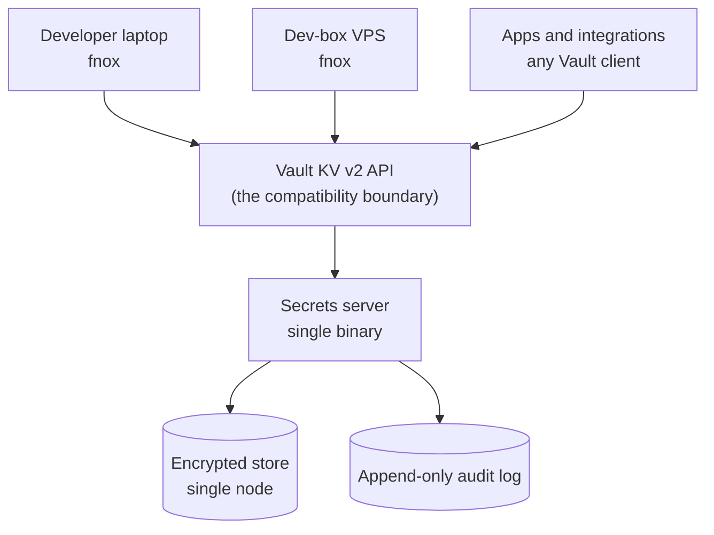

# Ops-Light Secrets Server - Plan

## Goal Capsule

- **Objective:** Build an ops-light, self-hosted secrets server in Rust that speaks the Vault KV v2 API, so fnox and existing Vault clients work against it unmodified. Open source, professional quality, built primarily as a professional-development project.
- **Product authority:** The Product Contract below is canonical. It supersedes the framing in the originating conversation.
- **Open blockers:** None. Production is decoupled, crypto depth is settled on `age`, and the fnox-native protocol question gates phase 2 rather than v0.1. Planning can proceed.

---

## Product Contract

### Summary

A self-hosted secrets server in Rust — single binary, no platform team — that serves the Vault KV v2 API so fnox and every existing Vault client work against it on day one. Open source under an OSI license with no held-back tier. A fnox-native protocol and AI agent support are later phases.

### Problem Frame

API keys and tokens come straight from wherever they were minted and land in `.env` files on developer laptops and dev-box VPSes, or get passed around in 1Password. Teammates and integrations routinely share the same key, so nobody can rotate one without first finding every consumer — and nobody has that list. The `lx_data_lake` repo's `fnox.toml` is the current best case: `age`-encrypted values committed to git under a single recipient. Safe on disk, but not shareable with a second developer and not rotatable without a commit.

The pain is rotation, not storage. Research on leaked credentials puts 64% of secrets exposed in 2022 as still active — storage was never the part that failed. The vaults that solve rotation properly are built for organizations with a platform team, and this is a small dev team at a non-profit where cost is a real constraint. Vault's operational surface — unseal ceremony, HA topology, storage backends, a policy DSL — exceeds the problem by a wide margin. The feature those tools lead with, dynamic secrets, covers Database, Kubernetes, and AWS credential minting; it does not cover static third-party SaaS keys, which is the entire workload here.

Separately and honestly: the operator has never built a system in this class and wants to. Understanding how sealing, identity, audit chaining, and envelope encryption fit together is a goal in its own right, and Rust is a language the operator has wanted to work in.

### Key Decisions

- **Ops-light is the product, not a shortcut.** What the server refuses — HA, clustering, an unseal ceremony, a policy language — is the wedge. Every one of those could be added later, and adding any of them early turns this back into Vault, which is the thing being routed around. The single-node ceiling is a positioning decision.

- **Compose the Rust ecosystem rather than build from scratch.** (session-settled: user-directed — chosen over hand-building subsystems for their learning value: confidence is higher wiring proven crates together than reimplementing them, and the learning target is architecture and integration, not primitive construction.) This governs every subsystem, not only crypto: where a maintained crate covers the need, it wins. It relocates the design work rather than removing it — no crate ships a Vault KV v2 surface, an identity and token model, or a tamper-evident audit chain, so those get assembled here, and that assembly is where the learning lands.

- **`age`'s recipient model over a hand-built key hierarchy.** (session-settled: user-directed — chosen over designing root-key/KEK/DEK wrapping and a seal state machine by hand: `age` is envelope encryption already, fnox depends on the same crate, and one shared crypto model on both sides makes the phase-2 native provider cheaper.) The server holds an `age` identity supplied at boot rather than running an unseal ceremony — the ops-light thesis applied to crypto, not an exception to it.

- **Dedicated secrets service over a password manager.** (session-settled: user-directed — chosen over 1Password: password-manager primitives are built for human credentials; this workload needs machine identity, scoped audit, and rotation.) 1Password stays where it is for human passwords and documents. Keeping machine credentials in the same store means one blast radius for two different threat models.

- **Vault-API-compatible first over a fnox-native protocol.** (session-settled: user-directed — chosen over building the fnox-native protocol first: inherits fnox's existing Vault provider and every Vault client immediately, with no day-one dependency on a single upstream maintainer.) Compatibility is a wire format — HTTP and JSON — and constrains nothing about the implementation language.

- **Rust over Go.** (session-settled: user-approved — chosen over Go despite the Vault-compatible API: learning Rust is half the point, `zeroize` plus deterministic drop gives secret material an edge over a GC'd heap, and the phase-2 fnox provider is Rust either way.) Vault's API being defined by a Go project says nothing about what implements it.

- **Agents as a later phase over agent-first.** (session-settled: user-directed — chosen over building for AI agents first: "Vault is too much" is the pain that exists today; agent workloads are anticipated, not present.)

The topology the Vault-compat decision buys:

### Actors

- A1. Developer — a human who needs secrets in a shell or in an app running on a laptop or the dev-box VPS. Reaches the server through fnox.
- A2. Application or integration — a non-human workload that needs secrets at start-up or at runtime. Reaches the server through any Vault client.
- A3. Operator — runs the server and performs rotations. The same person as A1 at this team size.
- A4. AI agent — a non-human workload with a short-lived, narrow need. Anticipated, out of v0.1.

### Key Flows

- F1. Operator brings the server up
  - **Trigger:** A3 has a fresh host and no server running.
  - **Actors:** A3
  - **Steps:** Download the binary; supply the encryption key material; start the server; create the first identity and its credential.
  - **Outcome:** The server is serving and one identity can read and write.
  - **Covered by:** R15, R16, R17, R18, R21

- F2. Developer reads a secret
  - **Trigger:** A1 runs a command that needs `POPULI_API_KEY`.
  - **Actors:** A1
  - **Steps:** fnox resolves the secret through its Vault provider against the server; the server authenticates the identity, checks the path scope, returns the value; the read is audited.
  - **Outcome:** The value reaches the process environment and never touches disk.
  - **Covered by:** R1, R2, R7, R8, R13

- F3. Application authenticates at boot
  - **Trigger:** A2 starts and needs credentials.
  - **Actors:** A2
  - **Steps:** The workload presents its bootstrap credential; the server issues a TTL-bound token; the workload reads its scoped paths.
  - **Outcome:** The workload runs without a static key on disk.
  - **Covered by:** R7, R8, R9, R17

- F4. Operator rotates a shared key
  - **Trigger:** A Canvas or Populi key needs replacing.
  - **Actors:** A3, A1, A2
  - **Steps:** The operator enumerates which identities have read the secret within R23's lookback window — identities whose last read predates it do not appear; mints the new value in the upstream SaaS product; stages it as a new version alongside the live one; consumers cut over; the operator marks the rotation complete and the old version is retired.
  - **Outcome:** The key is rotated with the consumer list known before the change, not discovered by an outage.
  - **Covered by:** R10, R11, R12, R23

### Requirements

**Vault API compatibility**

- R1. The server serves the Vault KV v2 read, write, list, delete, and versioned-read endpoints, plus the mount-discovery preflight (`sys/internal/ui/mounts/<path>`, reporting KV version 2) and `sys/seal-status` (always reporting unsealed), so an unmodified Vault client can use it as a backend.
- R2. fnox's existing Vault provider reaches the server with no change to fnox beyond configuration.
- R3. The server declares which parts of the Vault API it implements and returns an explicit unsupported response for requests outside that declared surface.

**Storage and crypto**

- R4. Secret material is encrypted at rest under a key that cannot be derived from the storage medium alone.
- R5. Secret material is zeroized in memory once its lifetime ends.
- R6. The server persists to a single-node store with no external database requirement.
- R20. Credentials and secret material never traverse the network in cleartext, and the server refuses plaintext remote connections.
- R21. The server's `age` identity has a documented handling story that does not end in a plaintext file on disk, a shell history, or a process argument.

**Identity and access**

- R7. Every human, application, and integration authenticates as a distinct identity.
- R8. An identity's access is scoped to a subset of secret paths rather than the whole store.
- R9. A credential issued to an identity carries a TTL and can be revoked before that TTL expires.
- R22. Management capabilities — creating identities, changing scopes, issuing and revoking credentials, completing rotations — require an explicit grant distinct from any secret-path read or write grant.

**Rotation**

- R10. The server records which identities have read a given secret, so an operator can enumerate its consumers before rotating it.
- R11. A secret can hold more than one live version, so a new value can be staged before consumers cut over.
- R12. The server surfaces a secret's age against a per-secret rotation interval.
- R23. R10's enumeration is computed over a documented lookback window, and R13's audit retention is at least as long as that window.

**Audit**

- R13. Every read, write, delete, and authentication attempt, and every identity, scope, and credential lifecycle change, is written to an append-only log whose entries record identity, path, operation, timestamp, and outcome — never secret values or credential material.
- R14. The audit log is tamper-evident: a removed or edited entry is detectable.

**Operations**

- R15. The server ships as a single binary with no runtime dependency on a cluster, an external database, or a platform team.
- R16. A first-time operator reaches a first successful secret read by following one documented sequence.
- R17. The server's bootstrap credential has a documented handling story that does not end in a plaintext file on disk.
- R18. The server refuses to start in an unsafe configuration rather than warning and continuing. Unsafe configurations include, at minimum: no encryption key material configured, no initial identity configured, and a remote listener with no transport encryption.

**Project and licensing**

- R19. The project is OSI-licensed with every feature in the open tree — no `ee/` carve-out, no capability held back for a paid tier.

### Acceptance Examples

- AE1. Unimplemented Vault endpoint
  - **Covers R3.**
  - **Given:** A Vault client calls an endpoint outside the implemented surface.
  - **When:** The request reaches the server.
  - **Then:** The server returns an explicit unsupported error naming the endpoint — never an empty success.

- AE2. Revoked credential
  - **Covers R9, R13.**
  - **Given:** An identity's token was revoked before its TTL elapsed.
  - **When:** The identity presents that token.
  - **Then:** The request is rejected and the rejection is written to the audit log.

- AE3. Staged rotation of a shared key
  - **Covers R10, R11.**
  - **Given:** A Populi API key that three distinct identities have read.
  - **When:** The operator stages a replacement value.
  - **Then:** The operator can list those three identities, and the previous version stays readable until the rotation is marked complete.

- AE4. Missing encryption key at boot
  - **Covers R18.**
  - **Given:** The server is started with no encryption key material configured.
  - **When:** It boots.
  - **Then:** It exits non-zero naming the missing setting — it does not generate a throwaway key and continue.

- AE5. Tampered audit log
  - **Covers R14.**
  - **Given:** An audit entry has been edited or removed on disk.
  - **When:** The log is verified.
  - **Then:** Verification fails and identifies where the chain breaks.

### Success Criteria

- fnox reaches the server by changing configuration only — no fnox fork, no patch, no vendored provider.
- A shared key rotates end-to-end against a non-production credential, with every one of its consumers pointed at the server first, so the enumeration is exercised rather than assumed. The real Canvas or Populi rotation is a post-v0.1 milestone, not a v0.1 gate.
- One full recurring operator cycle — provision an identity, issue and revoke its credential, rotate a secret, verify the audit chain — completes through one documented workflow, with no external service, no server restart, and no policy language to author. This is what makes the ops-light claim falsifiable rather than a first-run impression.
- The operator can explain the identity, token-lifecycle, and audit-chain designs from understanding rather than by reading the code back, and can state what `age` does on the server's behalf and why that boundary holds. Measured by a written explainer produced without consulting the implementation and read back by a second person. This is the primary goal.
- The codebase passes the checks in fnox's own `CONTRIBUTING.md`, as a proxy the operator can apply directly rather than a verdict from a maintainer nobody has contacted.

### Scope Boundaries

**Deferred for later**

- The fnox-native protocol (phase 2), pending OQ1.
- AI agent support (phase 3).
- Team and production adoption — explicitly not a v0.1 gate.
- The real Canvas or Populi rotation, with live consumers cut over to this server. Post-v0.1, and gated on the same FERPA reasoning that defers production adoption.
- Dynamic secrets: minting Database, Kubernetes, or AWS credentials on demand. These do not apply to static third-party SaaS keys, which is the workload.

**Outside this product's identity**

- HA, clustering, and consensus. The single-node ceiling is the product.
- A custom key hierarchy and an unseal ceremony. `age` recipients are the model; an identity supplied at boot is the seal. R1's `sys/seal-status` is a compatibility stub answering "unsealed", not a seal implementation.
- A policy DSL. Path-scoped grants, not a language to learn.
- Human passwords, secure notes, and documents. 1Password keeps those.
- Vault's full API surface and plugin ecosystem. KV v2 plus auth is the boundary.
- A hosted or SaaS tier.

### Dependencies / Assumptions

- Production is covered separately and this project carries no deadline. The team will run something in the meantime for the real secrets — OpenBao being the presumed choice, not yet committed. Which tool wins does not change this contract; only the decoupling matters, and the decoupling is settled.
- **fnox's Vault provider does not speak HTTP — it shells out to the `vault` CLI.** It runs `Command::new("vault")` with `vault kv get -field=<field> <path>` and fails with an install hint when the binary is absent. R2 still holds, since pointing `VAULT_ADDR` at the server stays configuration-only, but two consequences follow: the compatibility target is the CLI's behavior rather than the KV v2 API alone (which is why R1 declares the mount preflight and seal-status), and every consumer host needs HashiCorp's BUSL-1.1-licensed `vault` binary installed. R15's single-binary claim covers the server, not its clients.
- **The shared-key problem is upstream and no server fixes it.** Teammates and integrations sharing one Populi or Canvas key can only be ended by minting separate credentials inside each SaaS product. R10 makes the sharing visible; it cannot make it stop.
- **R10 enumerates only consumers whose reads are mediated by the server.** Keys sitting in `.env` files and 1Password never touch it, so a key's consumer list is trustworthy for rotation only once every known consumer has been migrated onto the server. Migration, not R10, is the precondition for a safe rotation — which inverts the naive reading: the list is what you need in order to migrate, and migration is what makes the list complete.
- The Rust ecosystem for this already exists and is proven in the target ecosystem: fnox's own `Cargo.toml` pulls `aes-gcm`, `age`, `rustls`, `tokio`, and `clap`, alongside jdx's `demand` and `usage-lib`.
- **`age` is load-bearing rather than incidental**, and under a single boot-supplied server identity it contributes encryption at rest and nothing more. Recipients never enter the access-control path — R8's scoping is a server-side authorization check — so an authorization bug is a full-store disclosure rather than a scoped one. That property is inherent to any server that decrypts on demand (Vault has it while unsealed), not a defect in the settled decision. The open variable is not whether the recipient model "fits" but which recipient topology the store uses and what rotating the server's own identity costs under it.
- The `lx_data_lake` credentials reach FERPA-protected student records (Populi enrollments and grades, a Canvas token, a live Postgres DSN). This is why production adoption is not a v0.1 gate.

### Outstanding Questions

**Deferred to Planning**

- OQ1. Does jdx want a fnox-native protocol at all? This gates phase 2, not v0.1 — Vault compatibility is what makes v0.1 need no upstream buy-in. Still the highest-leverage cheap move available: a fnox Discussions post costs about 20 minutes. Context: fnox has issues disabled and 119 discussions; #525 ("openbao provider") sits at 0 comments; #568 establishes third-party-provider precedent; no server proposal exists.
- OQ2. Crate selection per subsystem, under the compose-the-ecosystem decision: HTTP surface, storage, token handling.
- OQ3. Project name and repository home.
- OQ4. Whether the audit chain hashes per entry or per batch.
- OQ5. Which mechanism satisfies R20: mTLS, bearer tokens over TLS, or leaning on the existing Tailscale network. R20 fixes the posture; this picks the mechanism.
- OQ6. The store's `age` recipient topology — one server recipient for every secret, or per-secret recipient sets — and what rotating the server's own `age` identity costs under the chosen topology. `age` has no key-rotation primitive; fnox needed a dedicated `fnox reencrypt` command for exactly this.
- OQ7. What R12 surfaces when a secret has no configured rotation interval: "no interval set", or a fallback to a global default.

### Sources / Research

- `lx_data_lake` repo, `fnox.toml` — the current state: `age` provider, one recipient, ten secrets committed to git. Offline and in-repo; not shareable, not rotatable without a commit.
- `jdx/fnox` `Cargo.toml` — the stack blueprint. Pulls `aes-gcm = "0.11.0-rc.3"`, `age = "0.11"`, `rustls = "0.23"`, `tokio`, `clap`, `demand = "2"`, `usage-lib = "3"`. fnox does client-side crypto already; what it lacks is the server half.
- `jdx/fnox` `src/daemon.rs` — a local unix-socket daemon (`fnoxd.sock`, `UnixListener`, `resolve_secrets_batch`). It is a caching layer, not a network server. There is no server component to fork.
- OpenBao — MPL-2.0 with no `ee/` carve-out anywhere in the tree. Rotation, dynamic secrets, audit, and RBAC are all in core. This corrected the premise that open-source vaults hold rotation back for a paid tier.
- Infisical — open-core. `backend/src/ee/` carries a separate proprietary license. Machine identities are priced per permission set, not per machine: workloads with identical permissions share one identity.
- `Infisical/agent-vault` security documentation — its transparent proxy transport is cleartext HTTP and session tokens travel unencrypted. Its own guidance: "Deploy Agent Vault on a trusted or private network (localhost, VPN, private subnet)."
- Dynamic secrets, across every tool surveyed, cover Database, Kubernetes, and AWS. They do not cover arbitrary SaaS APIs.
- Leaked-credential research: 64% of secrets exposed in 2022 remained active. Rotation, not storage, is the unsolved half of the problem.
- `lx_data_lake` repo, `CONCEPTS.md` — Populi (SIS of record), Canvas (LMS), Watermark (course evaluations), DAP. Establishes what the credentials in that repo reach, and why production adoption is not a v0.1 gate.

---

## Deferred / Open Questions

### From 2026-07-15 review

- **KV v2 versions lack a cutover contract** — Key Flows F4 / Requirements — Rotation R11 (P1, feasibility + cross-model: codex, confidence 100)

  The staging window F4 describes does not exist through the Vault-compat boundary, so an operator following this flow rotates every consumer instantly at write time rather than staging first. KV v2 returns the latest version when no version is specified, and fnox's provider builds `vault kv get` with no `-version` flag, so fnox consumers always read current. AE3's weaker claim — that the previous version stays readable — is satisfiable; R11's staging promise is not. The fork is whether R11 recasts to rollback-and-audit only, or F4 moves to a staging path the operator promotes, which changes what the product does rather than how it says it.

- **R14 tamper-evidence names no threat actor or trust anchor** — Requirements — Audit (P1, security-lens + cross-model: codex, confidence 100)

  A hash chain stored alongside the log it protects catches naive edits only — an actor with write access recomputes every subsequent hash and verification reports clean, while deletion of the tail may leave no local evidence at all. Since the log is the sole record of who read a secret before a rotation, a re-chaining attacker erases exactly what the product exists to keep. R14 must name the actor it holds against: if that actor can write the log file, the requirement needs an integrity anchor stored outside it — a signing key held off-host, a published chain head, or an append-only medium. Choosing per-entry versus per-batch hashing (OQ4) does not resolve this.

- **Vault-compatible authentication surface is undefined** — Requirements — Identity and access (P1, cross-model: codex, confidence 75)

  Applications cannot implement F3's bootstrap-to-token flow with unmodified Vault clients, because the contract specifies KV endpoints but no supported Vault auth method, login endpoint, or wire response. R7–R9 describe token properties and identity scopes without defining how a client obtains a token. The scope boundary states "KV v2 plus auth is the boundary" while no requirement names what auth means, so planning has no compatibility target for a flow the product needs on day one.

- **Workload bootstrap has no secret-zero mechanism** — Key Flows F3 (P1, cross-model: codex, confidence 75)

  An application cannot restart unattended without obtaining its bootstrap credential from somewhere, so F3's "runs without a static key on disk" outcome relocates the static secret rather than removing it. R17 covers the *server's* bootstrap credential and R21 the `age` identity; neither covers the credential each workload presents, leaving every application implementer to invent a different secret-zero story.
