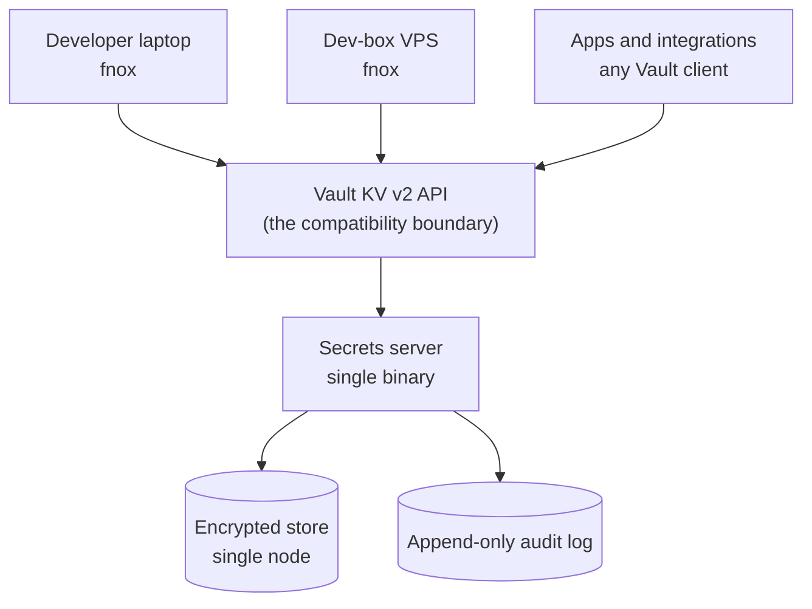
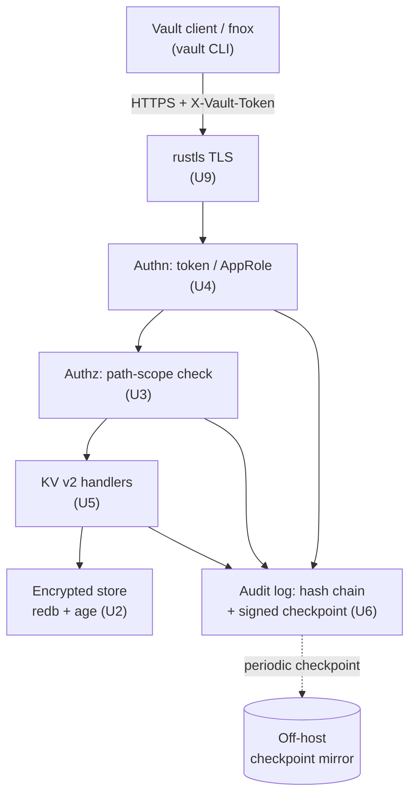

# Ops-Light Secrets Server - Plan

## Goal Capsule

- **Objective:** Build an ops-light, self-hosted secrets server in Rust that speaks the Vault KV v2 API, so fnox and existing Vault clients work against it unmodified. Open source, professional quality, built primarily as a professional-development project.
- **Product authority:** The Product Contract below is canonical. It supersedes the framing in the originating conversation.
- **Open blockers:** None. Rotation semantics, auth surface, storage, transport, and audit-chain design are settled in the Planning Contract; the two remaining open questions (fnox-native protocol, project name) gate phase 2 and cosmetics, not v0.1.
- **Execution profile:** Rust, single binary. Test-first on the authorization, token-lifecycle, and audit-chain paths; every acceptance example lands as an automated test in the compatibility harness (U11).
- **Stop conditions:** Surface a blocker instead of guessing when a change would alter Product Contract scope, weaken the fail-closed postures (R18, R20, R26), or contradict a session-settled decision.

---

## Product Contract

### Summary

A self-hosted secrets server in Rust — single binary, no platform team — that serves the Vault KV v2 API so fnox, and any unmodified Vault client staying within the declared KV v2-plus-auth surface (R3), works against it on day one. Open source under an OSI license with no held-back tier. A fnox-native protocol and AI agent support are later phases.

### Problem Frame

API keys and tokens come straight from wherever they were minted and land in `.env` files on developer laptops and dev-box VPSes, or get passed around in 1Password. Teammates and integrations routinely share the same key, so nobody can rotate one without first finding every consumer — and nobody has that list. The `lx_data_lake` repo's `fnox.toml` is the current best case: `age`-encrypted values committed to git under a single recipient. Safe on disk, but not shareable with a second developer and not rotatable without a commit.

The pain is rotation, not storage. Research on leaked credentials puts 64% of secrets exposed in 2022 as still active — storage was never the part that failed. The vaults that solve rotation properly are built for organizations with a platform team, and this is a small dev team at a non-profit where cost is a real constraint. Vault's operational surface — unseal ceremony, HA topology, storage backends, a policy DSL — exceeds the problem by a wide margin. The feature those tools lead with, dynamic secrets, covers Database, Kubernetes, and AWS credential minting; it does not cover static third-party SaaS keys, which is the entire workload here.

Separately and honestly: the operator has never built a system in this class and wants to. Understanding how sealing, identity, audit chaining, and envelope encryption fit together is a goal in its own right, and Rust is a language the operator has wanted to work in.

### Key Decisions

- **Ops-light is the product, not a shortcut.** What the server refuses — HA, clustering, an unseal ceremony, a policy language — is the wedge. Every one of those could be added later, and adding any of them early turns this back into Vault, which is the thing being routed around. The single-node ceiling is a positioning decision.

- **Compose the Rust ecosystem rather than build from scratch.** (session-settled: user-directed — chosen over hand-building subsystems for their learning value: confidence is higher wiring proven crates together than reimplementing them, and the learning target is architecture and integration, not primitive construction.) This governs every subsystem, not only crypto: where a maintained crate covers the need, it wins. It relocates the design work rather than removing it — no crate ships a Vault KV v2 surface, an identity and token model, or a tamper-evident audit chain, so those get assembled here, and that assembly is where the learning lands.

- **`age`'s recipient model over a hand-built key hierarchy.** (session-settled: user-directed — chosen over designing root-key/KEK/DEK wrapping and a seal state machine by hand: `age` is envelope encryption already, fnox depends on the same crate, and one shared crypto model on both sides makes the phase-2 native provider cheaper.) The server holds an `age` identity supplied at boot rather than running an unseal ceremony — the ops-light thesis applied to crypto, not an exception to it.

- **Dedicated secrets service over a password manager.** (session-settled: user-directed — chosen over 1Password: password-manager primitives are built for human credentials; this workload needs machine identity, scoped audit, and rotation.) 1Password stays where it is for human passwords and documents. Keeping machine credentials in the same store means one blast radius for two different threat models.

- **Vault-API-compatible first over a fnox-native protocol.** (session-settled: user-directed — chosen over building the fnox-native protocol first: inherits fnox's existing Vault provider and every Vault client immediately, with no day-one dependency on a single upstream maintainer.) Compatibility is a wire format — HTTP and JSON — and constrains nothing about the implementation language.

- **Rust over Go.** (session-settled: user-approved — chosen over Go despite the Vault-compatible API: learning Rust is half the point, `zeroize` plus deterministic drop gives secret material an edge over a GC'd heap, and the phase-2 fnox provider is Rust either way.) Vault's API being defined by a Go project says nothing about what implements it.

- **Agents as a later phase over agent-first.** (session-settled: user-directed — chosen over building for AI agents first: "Vault is too much" is the pain that exists today; agent workloads are anticipated, not present.)

The topology the Vault-compat decision buys:

### Actors

- A1. Developer — a human who needs secrets in a shell or in an app running on a laptop or the dev-box VPS. Reaches the server through fnox.
- A2. Application or integration — a non-human workload that needs secrets at start-up or at runtime. Reaches the server through any Vault client.
- A3. Operator — runs the server and performs rotations. The same person as A1 at this team size.
- A4. AI agent — a non-human workload with a short-lived, narrow need. Anticipated, out of v0.1.

### Key Flows

- F1. Operator brings the server up
  - **Trigger:** A3 has a fresh host and no server running.
  - **Actors:** A3
  - **Steps:** Download the binary; supply the encryption key material and the one-time bootstrap credential; start the server; create the first identity and its credential through the bootstrap credential, which disables itself.
  - **Outcome:** The server is serving and one identity can read and write.
  - **Covered by:** R15, R16, R17, R18, R21

- F2. Developer reads a secret
  - **Trigger:** A1 runs a command that needs `POPULI_API_KEY`.
  - **Actors:** A1
  - **Steps:** fnox resolves the secret through its Vault provider against the server; the server authenticates the identity, checks the path scope, returns the value; the read is audited.
  - **Outcome:** The value reaches the process environment and never touches disk.
  - **Covered by:** R1, R2, R7, R8, R13

- F3. Application authenticates at boot
  - **Trigger:** A2 starts and needs credentials.
  - **Actors:** A2
  - **Steps:** The workload presents its bootstrap credential; the server issues a TTL-bound token; the workload reads its scoped paths.
  - **Outcome:** The workload runs without a static key on disk.
  - **Covered by:** R7, R8, R9, R17

- F4. Operator rotates a shared key
  - **Trigger:** A Canvas or Populi key needs replacing.
  - **Actors:** A3, A1, A2
  - **Steps:** The operator enumerates the secret's consumers — every identity whose scope grants read on the path, annotated with last-read recency over R23's window; mints the new value in the upstream SaaS product; writes it to the server, cutting consumers over on their next read; verifies consumers are reading the new version; revokes the old credential in the upstream SaaS product — an action the server records but cannot perform; marks the rotation complete and the old version is retired.
  - **Outcome:** The key is rotated with the consumer list known before the change, not discovered by an outage.
  - **Covered by:** R10, R11, R12, R23

### Requirements

**Vault API compatibility**

- R1. The server serves the Vault KV v2 read, write, list, delete, and versioned-read endpoints, plus the mount-discovery preflight (`sys/internal/ui/mounts/<path>`, reporting KV version 2) and `sys/seal-status` (always reporting unsealed), so an unmodified Vault client can use it as a backend.
- R2. fnox's existing Vault provider reaches the server with no change to fnox beyond configuration.
- R3. The server declares which parts of the Vault API it implements and returns an explicit unsupported response for requests outside that declared surface.
- R31. The server implements Vault token authentication (`X-Vault-Token`) plus the AppRole login endpoint: a workload presents its role_id and secret_id and receives a TTL-bound token (R9). Token auth and AppRole are the entire supported auth surface.

**Storage and crypto**

- R4. Secret material is encrypted at rest under a key that cannot be derived from the storage medium alone.
- R5. Secret material in buffers the server allocates and controls is zeroized once its lifetime ends; transient copies made inside the serialization, HTTP, and TLS layers are minimized but sit outside the zeroization guarantee.
- R6. The server persists to a single-node store with no external database requirement.
- R20. Credentials and secret material never traverse the network in cleartext, and the server refuses plaintext remote connections.
- R21. The server's `age` identity has a documented handling story that does not end in a plaintext file on disk, a shell history, or a process argument.
- R24. Raw bootstrap credentials and issued tokens are disclosed once at creation and never persisted, logged, or recoverable afterward; the server validates them against cryptographically protected, non-recoverable verifiers that support revocation and rotation.

**Identity and access**

- R7. Every human, application, and integration authenticates as a distinct identity.
- R8. An identity's access is scoped to a subset of secret paths rather than the whole store. A scope is defined over logical secret paths and governs every API form of that path — data, metadata, list, delete, and versioned reads.
- R9. A credential issued to an identity carries a TTL and can be revoked before that TTL expires.
- R22. Management capabilities — creating identities, changing scopes, issuing and revoking credentials, completing rotations, reading the audit log, and enumerating a secret's consumers (R10) — require an explicit grant distinct from any secret-path read or write grant. Audit records are confidential at rest and accessible for query, export, and verification only under that grant.
- R28. Disabling an identity or reducing its scope takes effect for every outstanding credential before its next authorized request, independent of token TTL, and the resulting rejection is audited.

**Rotation**

- R10. The server records which identities have read a given secret. A secret's consumer list is every identity whose scope (R8) grants read on its path, annotated with its last recorded read inside R23's window — recency annotates the list; it never filters an identity out of it.
- R11. A secret retains prior versions when a new value is written. Writing the replacement cuts consumers over immediately — KV v2 reads return the latest version — and version history keeps the previous value readable for rollback until the rotation is marked complete and the old version retired. The staging window lives upstream: the old SaaS credential stays valid until the operator revokes it after cutover.
- R12. The server surfaces a secret's age — time since its last completed rotation, or since creation when never rotated — against a per-secret rotation interval, and reports "no interval set" when none is configured.
- R23. R10's enumeration is computed over a documented lookback window, and R13's audit retention is at least as long as that window.
- R29. Deleting a secret version is reversible and distinct from destruction; a management-gated destroy operation irreversibly removes a version, and retention behavior for retired and deleted versions is documented.

**Audit**

- R13. Every read, write, delete, and authentication attempt, and every identity, scope, and credential lifecycle change, is written to an append-only log whose entries record identity, path, operation, timestamp, and outcome — never secret values or credential material.
- R14. The audit log is tamper-evident: a removed or edited entry is detectable.
- R25. Secret values and credential material never appear in any server output — audit entries, application and access logs, traces, metrics labels, error responses, panic output, or crash diagnostics — including echoes of request headers and bodies.
- R26. If an audit entry cannot be written, the audited operation fails — the server never completes a read, write, or credential operation it could not record.
- R27. Unauthenticated surfaces enforce request-size and attempt-rate limits, and audit-log capacity is monitored with a documented fail-closed response before storage exhaustion.

**Operations**

- R15. The server ships as a single binary with no runtime dependency on a cluster, an external database, or a platform team.
- R16. A first-time operator reaches a first successful secret read by following one documented sequence.
- R17. The server's bootstrap credential has a documented handling story that does not end in a plaintext file on disk.
- R18. The server refuses to start in an unsafe configuration rather than warning and continuing. Unsafe configurations include, at minimum: no encryption key material configured, no bootstrap credential configured on an uninitialized store (R17 — the means of creating the first identity), and a remote listener with no transport encryption.
- R30. The bootstrap credential is single-use and short-lived: it is irreversibly disabled once the first management identity exists, cannot be re-enabled on an initialized store, and every attempted use is audited.
- R32. A single operator can take an encrypted backup of the store and audit log while the server runs, and restore it onto a fresh host by a documented, tested sequence.

**Project and licensing**

- R19. The project is OSI-licensed with every feature in the open tree — no `ee/` carve-out, no capability held back for a paid tier.

### Acceptance Examples

- AE1. Unimplemented Vault endpoint
  - **Covers R3.**
  - **Given:** A Vault client calls an endpoint outside the implemented surface.
  - **When:** The request reaches the server.
  - **Then:** The server returns an explicit unsupported error naming the endpoint — never an empty success.

- AE2. Revoked credential
  - **Covers R9, R13.**
  - **Given:** An identity's token was revoked before its TTL elapsed.
  - **When:** The identity presents that token.
  - **Then:** The request is rejected and the rejection is written to the audit log.

- AE3. Staged rotation of a shared key
  - **Covers R10, R11.**
  - **Given:** A Populi API key that three distinct identities have read within the documented lookback window (R23).
  - **When:** The operator writes a replacement value.
  - **Then:** The operator can list those three identities, consumers receive the new value on their next read, and the previous version stays readable through versioned read until the rotation is marked complete.

- AE4. Missing encryption key at boot
  - **Covers R18.**
  - **Given:** The server is started with no encryption key material configured.
  - **When:** It boots.
  - **Then:** It exits non-zero naming the missing setting — it does not generate a throwaway key and continue.

- AE5. Tampered audit log
  - **Covers R14.**
  - **Given:** An audit entry has been edited or removed on disk.
  - **When:** The log is verified.
  - **Then:** Verification fails and identifies where the chain breaks.

- AE6. Scope denial across path forms
  - **Covers R8, R13.**
  - **Given:** An identity scoped to `apps/canvas/*`.
  - **When:** It requests `apps/populi/api-key` through any endpoint form, including list on the metadata path.
  - **Then:** The request is denied and the denial is audited.

- AE7. Backup and restore
  - **Covers R32, R14.**
  - **Given:** A running server holding secrets, identities, and audit history.
  - **When:** The operator takes a backup, provisions a fresh host, and restores onto it.
  - **Then:** Every secret is readable, every identity authenticates, and the audit chain verifies against the last off-host checkpoint.

- AE8. Clean-host onboarding
  - **Covers R2, R16.**
  - **Given:** A fresh consumer host with no Vault tooling installed.
  - **When:** A developer follows the documented sequence — install the pinned `vault` CLI, set `VAULT_ADDR`, authenticate.
  - **Then:** Their first secret read succeeds with no fnox change beyond configuration.

### Success Criteria

- fnox reaches the server by changing configuration only — no fnox fork, no patch, no vendored provider.
- A shared key rotates end-to-end against a non-production credential, with every one of its consumers pointed at the server first, so the enumeration is exercised rather than assumed. The real Canvas or Populi rotation is a post-v0.1 milestone, not a v0.1 gate.
- One full recurring operator cycle — provision an identity, issue and revoke its credential, rotate a secret, verify the audit chain — completes through one documented workflow, with no external service, no server restart, and no policy language to author. This is what makes the ops-light claim falsifiable rather than a first-run impression.
- The operator can explain the identity, token-lifecycle, and audit-chain designs from understanding rather than by reading the code back, and can state what `age` does on the server's behalf and why that boundary holds. Measured by a written explainer produced without consulting the implementation and read back by a second person. This is the primary goal.
- The codebase passes the checks in fnox's own `CONTRIBUTING.md`, as a proxy the operator can apply directly rather than a verdict from a maintainer nobody has contacted.

### Scope Boundaries

**Deferred for later**

- The fnox-native protocol (phase 2), pending OQ1.
- AI agent support (phase 3).
- Team and production adoption — explicitly not a v0.1 gate.
- The real Canvas or Populi rotation, with live consumers cut over to this server. Post-v0.1, and gated on the same FERPA reasoning that defers production adoption.
- Dynamic secrets: minting Database, Kubernetes, or AWS credentials on demand. These do not apply to static third-party SaaS keys, which is the workload.

**Outside this product's identity**

- HA, clustering, and consensus. The single-node ceiling is the product.
- A custom key hierarchy and an unseal ceremony. `age` recipients are the model; an identity supplied at boot is the seal. R1's `sys/seal-status` is a compatibility stub answering "unsealed", not a seal implementation.
- A policy DSL. Path-scoped grants, not a language to learn.
- Human passwords, secure notes, and documents. 1Password keeps those.
- Vault's full API surface and plugin ecosystem. KV v2 plus auth is the boundary.
- A hosted or SaaS tier.

### Dependencies / Assumptions

- Production is covered separately and this project carries no deadline. The team will run something in the meantime for the real secrets — OpenBao being the presumed choice, not yet committed. Which tool wins does not change this contract's v0.1 goals — but if consumers migrate onto the interim tool, the post-v0.1 real-rotation milestone must be re-justified against migrating them a second time. The decoupling itself is settled.
- **fnox's Vault provider does not speak HTTP — it shells out to the `vault` CLI.** It runs `Command::new("vault")` with `vault kv get -field=<field> <path>` and fails with an install hint when the binary is absent. R2 still holds, since pointing `VAULT_ADDR` at the server stays configuration-only, but two consequences follow: the compatibility target is the CLI's behavior rather than the KV v2 API alone (which is why R1 declares the mount preflight and seal-status), and every consumer host needs HashiCorp's BUSL-1.1-licensed `vault` binary installed. R15's single-binary claim covers the server, not its clients.
- **The shared-key problem is upstream and no server fixes it.** Teammates and integrations sharing one Populi or Canvas key can only be ended by minting separate credentials inside each SaaS product. R10 makes the sharing visible; it cannot make it stop.
- **R10 enumerates only consumers whose reads are mediated by the server.** Keys sitting in `.env` files and 1Password never touch it, so a key's consumer list is trustworthy for rotation only once every known consumer has been migrated onto the server. Migration, not R10, is the precondition for a safe rotation — which inverts the naive reading: the list is what you need in order to migrate, and migration is what makes the list complete.
- The Rust ecosystem for this already exists and is proven in the target ecosystem: fnox's own `Cargo.toml` pulls `aes-gcm`, `age`, `rustls`, `tokio`, and `clap`, alongside jdx's `demand` and `usage-lib`.
- **`age` is load-bearing rather than incidental**, and under a single boot-supplied server identity it contributes encryption at rest and nothing more. Recipients never enter the access-control path — R8's scoping is a server-side authorization check — so an authorization bug is a full-store disclosure rather than a scoped one. That property is inherent to any server that decrypts on demand (Vault has it while unsealed), not a defect in the settled decision. The open variable is not whether the recipient model "fits" but which recipient topology the store uses and what rotating the server's own identity costs under it.
- The `lx_data_lake` credentials reach FERPA-protected student records (Populi enrollments and grades, a Canvas token, a live Postgres DSN). This is why production adoption is not a v0.1 gate.
- **Server restart requires the operator to supply the `age` identity interactively.** Unattended restart is out of scope for v0.1, and this availability cost is accepted as part of the no-unseal-ceremony position — R21 rules out every unattended terminus short of an OS secret-storage facility, which v0.1 does not assume.
- **Compatibility is validated against a documented, pinned `vault` CLI version range.** The mount-discovery preflight (`sys/internal/ui/mounts`) is a Vault-internal endpoint whose contract may change across client releases, so R2's configuration-only guarantee holds for the tested versions, not for all future CLIs.
- **Developer tokens persist on consumer hosts by default** (`VAULT_TOKEN` or the vault CLI's `~/.vault-token`). The accepted v0.1 mitigation is R8 path scoping plus short TTL and revocation (R9); an OS-keychain token helper is documented as optional hardening.
- **Workload secret-zero terminus:** each application's AppRole secret_id is delivered by its deployment mechanism (systemd credential, injected environment). The static secret is relocated into deployment configuration, and that is the accepted v0.1 posture; R30's single-use bootstrap covers only the server's own initialization.

### Outstanding Questions

Both remaining questions are deferred, not blocking.

- OQ1. Does jdx want a fnox-native protocol at all? This gates phase 2, not v0.1 — Vault compatibility is what makes v0.1 need no upstream buy-in. Still the highest-leverage cheap move available: a fnox Discussions post costs about 20 minutes. Context: fnox has issues disabled and 119 discussions; #525 ("openbao provider") sits at 0 comments; #568 establishes third-party-provider precedent; no server proposal exists.
- OQ3. Project name and repository home. Cosmetic; the working directory name serves until it is settled.

Crate selection, audit-chain shape, transport mechanism, `age` recipient topology, and the no-interval display — formerly OQ2 and OQ4–OQ7 — are resolved in the Planning Contract's Key Technical Decisions.

### Sources / Research

- `lx_data_lake` repo, `fnox.toml` — the current state: `age` provider, one recipient, ten secrets committed to git. Offline and in-repo; not shareable, not rotatable without a commit.
- `jdx/fnox` `Cargo.toml` — the stack blueprint. Pulls `aes-gcm = "0.11.0-rc.3"`, `age = "0.11"`, `rustls = "0.23"`, `tokio`, `clap`, `demand = "2"`, `usage-lib = "3"`. fnox does client-side crypto already; what it lacks is the server half.
- `jdx/fnox` `src/daemon.rs` — a local unix-socket daemon (`fnoxd.sock`, `UnixListener`, `resolve_secrets_batch`). It is a caching layer, not a network server. There is no server component to fork.
- OpenBao — MPL-2.0 with no `ee/` carve-out anywhere in the tree. Rotation, dynamic secrets, audit, and RBAC are all in core. This corrected the premise that open-source vaults hold rotation back for a paid tier.
- Infisical — open-core. `backend/src/ee/` carries a separate proprietary license. Machine identities are priced per permission set, not per machine: workloads with identical permissions share one identity.
- `Infisical/agent-vault` security documentation — its transparent proxy transport is cleartext HTTP and session tokens travel unencrypted. Its own guidance: "Deploy Agent Vault on a trusted or private network (localhost, VPN, private subnet)."
- Dynamic secrets, across every tool surveyed, cover Database, Kubernetes, and AWS. They do not cover arbitrary SaaS APIs.
- Leaked-credential research: 64% of secrets exposed in 2022 remained active. Rotation, not storage, is the unsolved half of the problem.
- `lx_data_lake` repo, `CONCEPTS.md` — Populi (SIS of record), Canvas (LMS), Watermark (course evaluations), DAP. Establishes what the credentials in that repo reach, and why production adoption is not a v0.1 gate.

---

## Planning Contract

**Product Contract preservation:** Product Contract changed during planning. R11 recast to write-is-cutover (staging lives upstream); R12 gained a secret-age anchor and no-interval display; R18 bootstrap-order reworded; R3 gained R31 (auth surface); R30/R32 and AE6–AE8 added; OQ2/OQ4–OQ7 resolved into Key Technical Decisions below. Each change resolves a 2026-07-15 review finding the user signed off on; none alters the product's problem frame, actors, or positioning.

### Key Technical Decisions

- KTD1. **HTTP surface: `axum` over rustls.** `axum` implements `tower::Service`, so `tower-http` middleware (auth extraction, request limits, tracing) composes without glue, and rustls TLS wires through `axum-server`. Resolves OQ2's HTTP question. Rationale: fnox already depends on `rustls`; one TLS stack across client and server. (Research: axum 0.8, Tokio-team maintained; actix-web's throughput edge does not matter at single-node nonprofit scale.)

- KTD2. **Storage: `redb` embedded ACID store.** (session-settled: user-approved — chosen over `rusqlite`/SQLite: pure-Rust copy-on-write B-trees with MVCC fit a small versioned-blob KV, and a single dependency-light crate matches the single-binary thesis; SQLite remains the fallback if 20 years of hardening outweighs API fit.) Resolves OQ2's storage question. **Load-bearing caveat:** redb's single-writer lock is silently skipped on filesystems without file-lock support, permitting multi-process corruption — U1's startup MUST verify the data directory supports locking and refuse to start otherwise (folds into R18).

- KTD3. **Encryption at rest: `age` v0.12 envelope under one boot-supplied server recipient.** Instantiates the settled `age` decision. Every stored blob is `age`-encrypted to the server's single recipient; decryption happens on demand in the request path. Resolves OQ6's topology question in favor of one server recipient for every secret (simplest; the per-secret-recipient alternative buys nothing while recipients stay out of the authorization path per the Product Contract). The cost this accepts — rotating the server identity is a full-store re-encrypt — is owned by U8.

- KTD4. **Audit chain: per-entry hash chain (`blake3`) with periodic `ed25519-dalek`-signed checkpoints mirrored off-host.** Resolves OQ4 (per-entry, not per-batch) and answers R14's trust-anchor gap: a re-chaining attacker with write access is caught because the off-host checkpoint pins a chain head the attacker cannot retroactively rewrite. (Research: this is the Certificate-Transparency / Trillian signed-tree-head pattern reduced to single-node scale; full Merkle inclusion-proof infrastructure would be over-building for v0.1.) The checkpoint signing key is supplied at boot via the same secret-delivery mechanism as the `age` identity, held only in a `secrecy::SecretBox` and never persisted on the host; signed checkpoints are mirrored off-host per R14, so a host-write attacker cannot re-sign a re-chained log.

- KTD5. **Credential verifiers: `argon2`; tokens are server-generated 128-bit random.** Raw bootstrap credentials, secret_ids, and tokens are shown once and stored only as `argon2` verifiers (R24). Satisfies the entropy floor implied by R9 on a network-reachable auth surface.

- KTD6. **Transport: bearer tokens over rustls TLS; server refuses plaintext remote listeners.** (session-settled: user-approved — chosen over mTLS and over leaning on Tailscale: TLS + `X-Vault-Token` is exactly what unmodified Vault clients expect, so it satisfies R20 without a client-cert burden; a network-layer-only posture the server cannot verify was rejected as an R20 rewrite, not a mechanism.) Resolves OQ5. A loopback-only listener may run plaintext; any non-loopback bind without TLS fails R18 startup.

- KTD7. **Secret material lives in `zeroize`/`secrecy` types.** Server-owned plaintext buffers (the `age` identity, decrypted values before serialization) are `SecretBox`/`SecretString` with pre-sized backing to avoid reallocation leaving stale copies. Bounds R5 to what the composed stack can honor; copies inside serde/hyper/rustls are acknowledged out of scope by R5's wording.

### High-Level Technical Design

The request path is a middleware stack: TLS termination, then token authentication, then path-scope authorization, then the KV handler, with every terminal outcome written to the audit log before the response returns (R26 fail-closed).

Audit write ordering: a read/write/auth outcome is committed to the audit log before the HTTP response is sent. If the audit append fails, the operation fails (R26) — the response the client sees is an error, not a silent success.

### Assumptions

- The deployment host provides a secret-delivery mechanism (systemd credentials or injected environment) for the server's `age` identity, the bootstrap credential, the audit checkpoint signing key, and each workload's AppRole secret_id. v0.1 does not implement an unattended-restart key custodian; server restart is operator-attended (Dependencies / Assumptions).
- The data directory sits on a filesystem supporting POSIX file locks (KTD2 caveat). Startup verifies this.

### Sequencing

U1 → U2 form the foundation. U3 → U4 → U5 build the request path; U6 (audit) lands alongside U5 because R26 requires audit wiring before any handler can be considered done. U7–U10 layer on the working core. U11 (compat harness) runs continuously once U5 exists but is only complete when every acceptance example passes. See the Unit Index for the dependency graph.

---

## Implementation Units

| U-ID | Unit | Key files | Depends on |
|---|---|---|---|
| U1 | Scaffold, config, fail-closed startup | `src/main.rs`, `src/config.rs`, `src/startup.rs` | — |
| U2 | Encrypted single-node store | `src/store/mod.rs`, `src/store/crypto.rs` | U1 |
| U3 | Identity, scope, and token model | `src/identity/mod.rs`, `src/identity/scope.rs` | U2 |
| U4 | Vault-compatible auth surface | `src/auth/token.rs`, `src/auth/approle.rs` | U3 |
| U5 | Vault KV v2 API surface | `src/api/kv.rs`, `src/api/sys.rs` | U2, U4 |
| U6 | Tamper-evident audit log | `src/audit/mod.rs`, `src/audit/chain.rs`, `src/audit/checkpoint.rs` | U1 |
| U7 | Rotation surfaces | `src/rotation.rs`, `src/api/kv.rs` | U5, U6 |
| U8 | Server-identity rotation (re-encrypt) | `src/store/reencrypt.rs`, `src/cli.rs` | U2 |
| U9 | TLS transport and plaintext refusal | `src/transport.rs`, `src/startup.rs` | U1 |
| U10 | Backup and restore | `src/backup.rs`, `src/cli.rs` | U2, U6 |
| U11 | Compatibility harness and acceptance tests | `tests/compat/`, `tests/acceptance/` | U5, U6, U7 |
| U12 | Operator documentation and licensing | `README.md`, `docs/operating.md`, `LICENSE` | U1–U11 |

### U1. Scaffold, config, and fail-closed startup

- **Goal:** A single binary that loads configuration, validates it, and refuses to start in any unsafe configuration.
- **Requirements:** R15, R16, R18, R6 (data-dir), KTD2 caveat.
- **Dependencies:** none.
- **Files:** `src/main.rs`, `src/config.rs`, `src/startup.rs`, `tests/startup.rs`.
- **Approach:** `clap` for CLI, config from environment plus a config file. Startup validation runs before the listener binds: encryption key material present, bootstrap credential present on an uninitialized store, data directory supports file locking, and no non-loopback listener without TLS. Any failure exits non-zero naming the missing or unsafe setting.
- **Execution note:** Test-first on the refusal matrix — each unsafe configuration is a failing test before the check exists.
- **Test scenarios:**
  - Covers AE4. Boot with no encryption key material configured → exits non-zero naming the missing setting; does not generate a throwaway key.
  - Boot on an uninitialized store with no bootstrap credential → exits non-zero.
  - Boot with a non-loopback listener and no TLS configured → exits non-zero (R18/R20 seam).
  - Boot with a data directory on a lock-unsupported filesystem → exits non-zero (KTD2 caveat).
  - Boot with a complete valid configuration → listener binds, health responds.
- **Verification:** `cargo test --test startup` green; manual `--help` shows documented settings.

### U2. Encrypted single-node store

- **Goal:** A versioned key-value store persisting `age`-encrypted blobs to a single redb file.
- **Requirements:** R4, R5, R6, R11, R21, KTD2, KTD3, KTD7.
- **Dependencies:** U1.
- **Files:** `src/store/mod.rs`, `src/store/crypto.rs`, `tests/store.rs`.
- **Approach:** redb tables keyed by logical path; each value is an `age`-encrypted, versioned record (version number, created_time, ciphertext). The server `age` identity loads into a `secrecy::SecretBox` at boot (R21 — never written to disk, shell history, or argv). Encrypt on write, decrypt on read; plaintext buffers zeroize on drop.
- **Execution note:** Characterization test the redb round-trip and the version-append semantics before layering the API on top.
- **Test scenarios:**
  - Write then read a secret → plaintext round-trips; on-disk bytes are `age` ciphertext, not plaintext.
  - Write twice → both versions retained; versioned read returns each; unversioned read returns latest (R11).
  - Decrypt with a wrong/absent identity → fails closed, no partial plaintext.
  - Value buffer is zeroized after use (assert via a wrapper that observes drop).
  - Test expectation for on-disk format: byte-inspect that no plaintext secret substring appears in the redb file.
- **Verification:** `cargo test --test store` green; hexdump spot-check shows ciphertext.

### U3. Identity, scope, and token model

- **Goal:** Distinct identities, path-scoped grants that govern every KV path form, TTL-bearing revocable tokens, and a management grant distinct from read/write.
- **Requirements:** R7, R8, R9, R22, R28, KTD5.
- **Dependencies:** U2.
- **Files:** `src/identity/mod.rs`, `src/identity/scope.rs`, `src/identity/token.rs`, `tests/identity.rs`.
- **Approach:** Identities and grants persist in the store. A scope is a set of logical path patterns; the authorization check maps every KV API form (`data/`, `metadata/`, list, delete, versioned) of a requested path back to the logical path before matching (R8). Tokens carry a TTL and revocation state; scope reductions and identity disable take effect on the next request regardless of TTL (R28). Management capabilities (R22) require an explicit grant, including audit-read and consumer-enumeration.
- **Execution note:** Test-first — this is the authorization boundary; an authz bug is a full-store disclosure.
- **Test scenarios:**
  - Covers AE6. Identity scoped to `apps/canvas/*` requests `apps/populi/api-key` via data, metadata, and list forms → each denied.
  - Prefix-boundary: grant on `apps/foo` does not reach `apps/foobar`.
  - Revoke a token before its TTL → next request rejected (feeds AE2).
  - Reduce a scope while a token is live → the removed path is denied on the next request without waiting for TTL (R28).
  - A read/write grant cannot perform a management operation (R22); a management grant is required for audit read and consumer enumeration.
- **Verification:** `cargo test --test identity` green.

### U4. Vault-compatible auth surface

- **Goal:** An operator bootstraps the first identity, and unmodified Vault clients thereafter obtain and present tokens via token auth and AppRole login, behind request-rate limits.
- **Requirements:** R31, R30, R27, R9, R24, KTD5; Key Flows F1, F3.
- **Dependencies:** U3.
- **Files:** `src/auth/token.rs`, `src/auth/approle.rs`, `src/auth/bootstrap.rs`, `src/api/router.rs`, `tests/auth.rs`.
- **Approach:** `X-Vault-Token` extraction as `tower-http` middleware. `POST /v1/auth/approle/login` accepts `{role_id, secret_id}` and returns `{"auth":{"client_token","lease_duration","token_policies",...}}` matching the Vault wire shape. secret_ids and tokens are stored only as `argon2` verifiers and disclosed once (R24). **Bootstrap exchange (R30, F1):** on an uninitialized store, the one-time bootstrap credential creates the first management identity, then is irreversibly disabled and cannot be re-enabled on an initialized store. Request-size and attempt-rate limits (R27) are `tower-http` middleware on the router, since this is where the unauthenticated login and token surfaces live.
- **Execution note:** Start from a failing test asserting the AppRole login response envelope byte-shape; test the bootstrap disable path before the happy path.
- **Test scenarios:**
  - Covers F1. On a fresh store, the bootstrap credential creates the first management identity; the credential is then disabled.
  - Covers R30. Any use of the bootstrap credential after the first identity exists → rejected and audited; it cannot be re-enabled on an initialized store.
  - Covers F3. Valid role_id + secret_id → TTL-bound token in the Vault `auth.client_token` envelope; token then reads a scoped path.
  - Invalid secret_id → 400-class error in `{"errors":[...]}` shape; attempt audited.
  - Expired/revoked token on a KV request → rejected (feeds AE2).
  - Raw secret_id is never returned after creation and never appears in the store as plaintext (argon2 verifier only).
  - Covers R27. Flood of failed auth attempts → rate limit engages; oversized request body → rejected before handler.
- **Verification:** `cargo test --test auth` green; envelope shape asserted against captured Vault responses.

### U5. Vault KV v2 API surface

- **Goal:** Serve the KV v2 read, write, list, delete, versioned-read, mount preflight, and seal-status endpoints so an unmodified `vault` CLI uses the server as a backend.
- **Requirements:** R1, R3, R11, R29; Key Flow F2.
- **Dependencies:** U2, U4.
- **Files:** `src/api/kv.rs`, `src/api/sys.rs`, `src/api/errors.rs`, `tests/api_kv.rs`.
- **Approach:** Implement `GET/POST /v1/:mount/data/:path` (`data.data`/`data.metadata` envelope), LIST on `metadata/`, versioned read via `?version=N`, soft-delete/undelete/destroy, `GET /v1/:mount/metadata/:path` version history. `sys/internal/ui/mounts/<path>` returns `options.version:"2"` exactly (the historically fragile preflight joint). `sys/seal-status` always reports unsealed. Unimplemented endpoints return an explicit unsupported error naming the endpoint (R3), never an empty success. Errors use `{"errors":[...]}` with Vault status conventions (404 overloaded for missing/forbidden/empty-list).
- **Execution note:** Build against captured real `vault` CLI request traces; the preflight shape is the known compat break point.
- **Test scenarios:**
  - Covers AE1. Unimplemented endpoint → explicit unsupported error naming the endpoint, not empty success.
  - `vault kv get -field=X <path>` issues the preflight then the data read → both succeed against the server (feeds F2).
  - Versioned read returns the requested version; unversioned returns latest (R11).
  - soft-delete then undelete restores; destroy removes a specific version irrecoverably (R29).
  - Read of a nonexistent path → 404 in `{"errors":[]}` shape.
- **Verification:** `cargo test --test api_kv` green; U11 exercises the real CLI.

### U6. Tamper-evident audit log

- **Goal:** An append-only, hash-chained audit log with off-host signed checkpoints that never records secret material and fails closed on write failure.
- **Requirements:** R13, R14, R23, R25, R26, R27, KTD4.
- **Dependencies:** U1.
- **Files:** `src/audit/mod.rs`, `src/audit/chain.rs`, `src/audit/checkpoint.rs`, `src/cli.rs`, `tests/audit.rs`.
- **Approach:** Each entry records identity, path, operation, timestamp, outcome — never values or credential material (R25 extends this ban to all server output: logs, traces, errors, panics). Each entry's `blake3` hash chains to its predecessor; periodic `ed25519-dalek`-signed checkpoints publish the chain head off-host, signed with a boot-supplied key held only in a `secrecy::SecretBox` (KTD4). A request's outcome is appended before its response returns; if the append fails, the operation fails (R26). Audit-log capacity is monitored with a fail-closed response before disk exhaustion (R27 — request-size and attempt-rate limits on the unauthenticated HTTP surface live in U4). An `audit verify` CLI subcommand (`src/cli.rs`) checks the chain against the last off-host checkpoint.
- **Execution note:** Test-first on the tamper-detection and fail-closed paths — this log is the sole record a rotation trusts.
- **Test scenarios:**
  - Covers AE5. Edit or remove an entry on disk → verification fails and identifies where the chain breaks.
  - Re-chaining attack: rewrite an entry and recompute all subsequent hashes → verification against the off-host checkpoint still fails (R14 trust anchor).
  - Audit append fails (simulated I/O error) → the triggering operation returns an error and does not complete (R26).
  - A secret value passed through a request never appears in any audit entry, error response, or panic output (R25).
  - Covers R27. Audit store approaches capacity → fail-closed response before exhaustion (request/rate limits are covered in U4).
- **Verification:** `cargo test --test audit` green; `<binary> audit verify` detects a hand-tampered log.

### U7. Rotation surfaces

- **Goal:** Enumerate a secret's consumers, surface its age against a rotation interval, and mark rotations complete.
- **Requirements:** R10, R12, R23, R29; Key Flow F4.
- **Dependencies:** U5, U6.
- **Files:** `src/rotation.rs`, `src/api/kv.rs`, `tests/rotation.rs`.
- **Approach:** Consumer enumeration is every identity whose scope grants read on the path, annotated with last-read recency from the audit log over R23's window — recency annotates, never filters (R10). Secret age is time since last completed rotation, else creation; "no interval set" when none configured (R12). Marking a rotation complete retires the prior version. Enumeration and audit read require the management grant (R22).
- **Test scenarios:**
  - Covers AE3. Three identities have read a key within the window → all three enumerated; write a replacement → consumers read new on next read; previous version stays readable until complete.
  - An identity with read scope but no read inside the window still appears, annotated stale (R10 — recency annotates, not filters).
  - Secret with no configured interval → age view shows "no interval set" (R12).
  - Enumeration without the management grant → denied and audited.
- **Verification:** `cargo test --test rotation` green.

### U8. Server-identity rotation (re-encrypt)

- **Goal:** An operator can rotate the server's `age` identity by re-encrypting the whole store, crash-recoverably.
- **Requirements:** R21, KTD3; the accepted cost of the single-recipient topology.
- **Dependencies:** U2.
- **Files:** `src/store/reencrypt.rs`, `src/cli.rs`, `tests/reencrypt.rs`.
- **Approach:** A CLI subcommand decrypts every blob under the old identity and re-encrypts under the new recipient in a crash-recoverable pass (write-new-then-swap, resumable if interrupted), preserving readable secrets and audit history. `age` has no rotation primitive, so this is an explicit application-level job (mirrors fnox's `fnox reencrypt`).
- **Execution note:** Test the interrupt-and-resume path explicitly — a half-rotated store must not lose secrets.
- **Test scenarios:**
  - Rotate identity → every secret readable under the new identity, none readable under the old.
  - Interrupt mid-rotation, then resume → no secret lost, no blob left under the old identity.
  - Audit history survives the rotation and still verifies.
- **Verification:** `cargo test --test reencrypt` green.

### U9. TLS transport and plaintext refusal

- **Goal:** Serve over rustls TLS and refuse plaintext remote connections.
- **Requirements:** R20, R18, KTD6.
- **Dependencies:** U1.
- **Files:** `src/transport.rs`, `src/startup.rs`, `tests/transport.rs`.
- **Approach:** `axum-server` `bind_rustls` with PEM cert/key from config. A non-loopback bind without TLS fails startup (R18 seam already in U1; U9 supplies the TLS path and the runtime refusal). Loopback-only may run plaintext.
- **Test scenarios:**
  - Non-loopback listener without TLS → refused at startup.
  - TLS configured → HTTPS request with `X-Vault-Token` succeeds; plaintext HTTP to the TLS port is rejected.
  - Loopback plaintext listener → allowed.
- **Verification:** `cargo test --test transport` green.

### U10. Backup and restore

- **Goal:** A single operator backs up and restores the store and audit log by a documented, tested sequence.
- **Requirements:** R32, R14.
- **Dependencies:** U2, U6.
- **Files:** `src/backup.rs`, `src/cli.rs`, `docs/operating.md`, `tests/backup.rs`.
- **Approach:** `backup` produces an encrypted, crash-consistent snapshot of the redb store and audit log while the server runs; `restore` reconstructs onto a fresh host. The audit chain verifies against the last off-host checkpoint after restore.
- **Test scenarios:**
  - Covers AE7. Backup a running server, restore onto a fresh data directory → every secret readable, every identity authenticates, audit chain verifies.
  - Backup taken during concurrent writes → restores to a crash-consistent point, no torn record.
- **Verification:** `cargo test --test backup` green; documented sequence exercised end-to-end.

### U11. Compatibility harness and acceptance tests

- **Goal:** Every acceptance example runs as an automated test, and KV reads are proven against the real pinned `vault` and `bao` CLIs.
- **Requirements:** R2, R3; AE1–AE8; the pinned-CLI assumption.
- **Dependencies:** U5, U6, U7.
- **Files:** `tests/compat/mod.rs`, `tests/acceptance/mod.rs`, `.github/workflows/ci.yml`.
- **Approach:** The harness starts a server instance and drives it with the actual `vault` CLI at pinned versions (and `bao` as a non-BUSL client path), asserting `vault kv get/put/list` and the preflight succeed configuration-only (R2). Acceptance tests AE1–AE8 assert product-level outcomes. CLI versions are pinned in CI so a client upgrade cannot silently break R2.
- **Execution note:** This is the compat gate — API-shape unit tests are necessary but the CLI drives the fragile preflight joint.
- **Test scenarios:**
  - `vault kv put/get/list` against the server at each pinned CLI version → succeed configuration-only (R2, AE8-adjacent).
  - `bao` CLI reads a secret the `vault` CLI wrote → succeeds (OpenBao non-BUSL path).
  - AE1–AE8 each run green as integration tests.
  - A deliberately mismatched preflight `options.version` → the harness catches the break (guards the known fragile joint).
- **Verification:** `cargo test --test compat --test acceptance` green in CI against pinned CLIs.

### U12. Operator documentation and licensing

- **Goal:** A first-time operator reaches a first successful secret read by one documented sequence, and the project ships OSI-licensed with everything in the open tree.
- **Requirements:** R16, R17, R19, R21; Key Flow F1; dev-token and workload-secret-zero postures.
- **Dependencies:** U1–U11.
- **Files:** `README.md`, `docs/operating.md`, `LICENSE`, `CONTRIBUTING.md`, `deny.toml`.
- **Approach:** `docs/operating.md` documents F1 end to end (key material handling per R21, bootstrap credential per R17, first identity, first read), the developer-token posture (accept-and-mitigate; optional keychain helper), the workload secret_id delivery posture, backup/restore (U10), and identity rotation (U8). An OSI license (e.g. MPL-2.0 or Apache-2.0) at the tree root with no `ee/` carve-out (R19). `deny.toml` configures `cargo-deny` for both licenses and advisories so the Verification Contract's `cargo deny check` gate has an owner.
- **Test scenarios:**
  - Covers AE8. A fresh consumer host following the documented sequence reaches a first secret read with no fnox change beyond configuration.
  - Test expectation: none for prose — verified by the AE8 harness test in U11 exercising the documented steps.
- **Verification:** AE8 green; `cargo deny check` passes (licenses + advisories); a second reader can follow F1 unaided (Success Criteria).

---

## Verification Contract

| Gate | Command | Applies to |
|---|---|---|
| Unit + integration tests | `cargo test` | all units |
| Compatibility harness | `cargo test --test compat --test acceptance` (pinned `vault`/`bao` CLIs) | U11; gates R2 |
| Lint | `cargo clippy -- -D warnings` | all |
| Format | `cargo fmt --check` | all |
| License + advisories | `cargo deny check` | R19 |
| Audit tamper check | `<binary> audit verify` against a hand-tampered log | U6; gates R14 |

Behavioral proof: AE1–AE8 each pass as automated tests (U11). The falsifiable ops-light claim (Success Criteria) — one operator cycle of provision, issue/revoke, rotate, verify — runs through the documented workflow with no external service, no restart, no policy language.

---

## Definition of Done

**Global**
- Every requirement R1–R32 is advanced by at least one unit and its cited tests.
- AE1–AE8 pass in CI against the pinned CLI matrix.
- The full Verification Contract passes.
- `age` identity, bootstrap credential, and workload secret_ids never touch disk as plaintext, shell history, or argv (R21, R17, R24) — asserted by tests and reviewed in the diff.
- Fail-closed postures hold: unsafe-config startup refusal (R18), plaintext-remote refusal (R20), audit-write-failure operation failure (R26).
- Abandoned-attempt code from approaches that did not pan out is removed from the diff.

**Per-unit:** each unit's Verification line is green and its test scenarios are implemented, not stubbed.

---

## Deferred / Open Questions

### From 2026-07-15 review — dispositions

The document review's findings were resolved during planning enrichment; each landed in the Product Contract or Planning Contract above.

| Finding | Disposition |
|---|---|
| KV v2 versions lack a cutover contract | Resolved — R11 recast to write-is-cutover; staging lives upstream. AE3, U7. |
| R14 tamper-evidence names no threat actor or trust anchor | Resolved — KTD4: per-entry `blake3` chain + off-host `ed25519` signed checkpoints. AE5, U6. |
| Vault-compatible authentication surface undefined | Resolved — R31: token auth + AppRole login. U4. |
| Workload bootstrap has no secret-zero mechanism | Resolved as accepted posture — secret_id delivered by the deployment mechanism (Assumptions, Dependencies). U12. |
| Bootstrap sequence conflicts with startup validation | Resolved — R18/F1 reworded to one-time bootstrap credential; R30. U1 (startup presence check), U4 (bootstrap exchange). |
| Developer credential storage an unchosen posture | Resolved — accept-and-mitigate (scope + TTL + revocation), optional keychain helper (Dependencies). U12. |
| Ops-light stops before backup/restore | Resolved (backup/restore) — R32, AE7, U10. Upgrade-with-rollback deferred below. |
| `age` identity rotation has no acceptance invariant | Resolved — U8 crash-recoverable re-encrypt; KTD3. |
| Secret age has no lifecycle anchor | Resolved — R12 anchors age to last completed rotation. |
| Clean-host client onboarding unvalidated | Resolved — AE8, U11, U12. |

**Deferred to Follow-Up Work**

- **Pre-migration consumer inventory** (review finding, confidence 100). The user chose not to add a migration-inventory requirement to v0.1. R10's list is trustworthy for rotation only once every known consumer has been migrated onto the server (Dependencies / Assumptions already states this). Mechanizing the pre-server inventory and reconciliation remains post-v0.1, gated with the real Canvas/Populi rotation.
- **Upgrade-with-rollback.** Backup/restore ships in v0.1 (U10); a supported in-place version-upgrade path with rollback, and explicit RPO/RTO targets, are deferred.

### From 2026-07-15 planning
