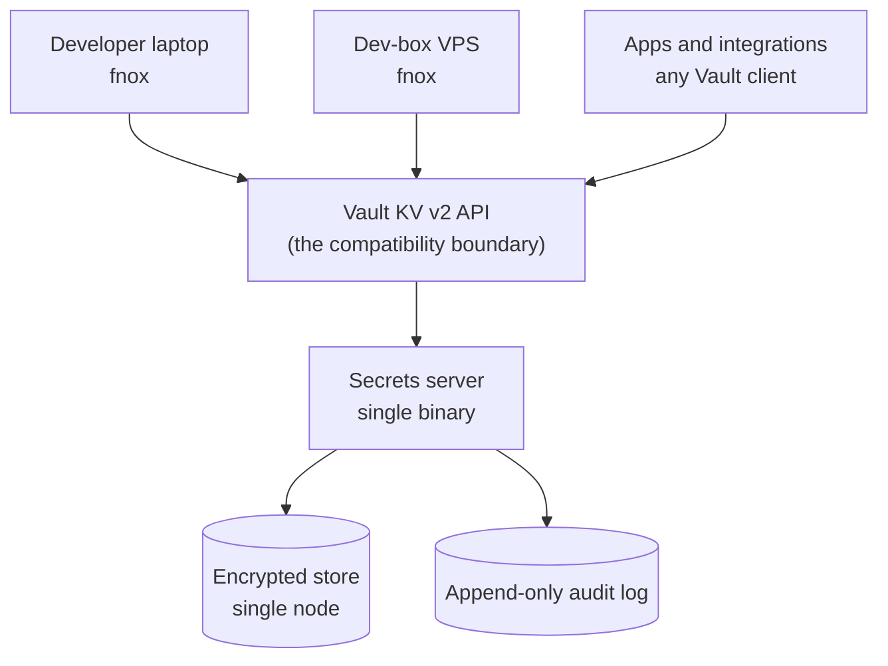
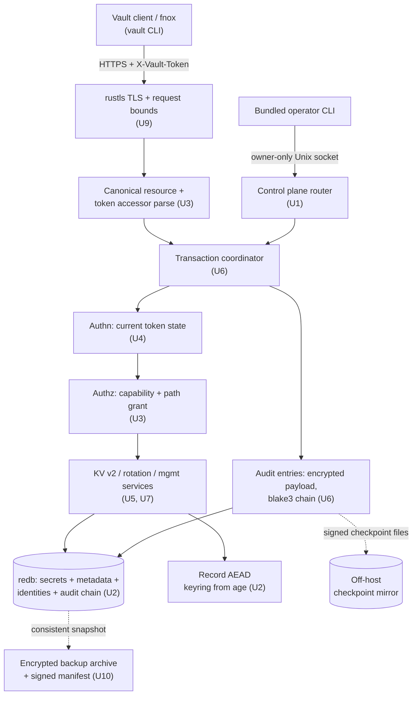

# Ops-Light Secrets Server - Plan

## Goal Capsule

- **Objective:** Build an ops-light, self-hosted secrets server in Rust that
  speaks the Vault KV v2 API, so fnox and existing Vault clients work against it
  unmodified. Open source, professional quality, built primarily as a
  professional-development project.
- **Product authority:** The Product Contract below is canonical. It supersedes
  the framing in the originating conversation.
- **Open blockers:** None. Rotation semantics, auth surface, storage, transport,
  and audit-chain design are settled in the Planning Contract; the two remaining
  open questions (fnox-native protocol, project name) gate phase 2 and
  cosmetics, not v0.1. Two internal gates order the work without blocking it: U0
  (client characterization) freezes fnox and Vault/OpenBao wire evidence before
  the API router is finalized, and U2's storage spike proves redb can carry the
  atomic state-plus-audit transaction (KTD8) before higher units build on it.
- **Execution profile:** Rust, single binary. U0 first characterizes the pinned
  fnox and Vault/OpenBao client behavior as recorded fixtures. Test-first on the
  authorization, token-lifecycle, and audit-chain paths; every acceptance
  example lands as an automated test in the compatibility harness (U11), which
  drives the actual pinned `fnox`, `vault`, and `bao` binaries and checks a
  normalized request corpus against a pinned OpenBao reference server.
- **Stop conditions:** Surface a blocker instead of guessing when a change would
  alter Product Contract scope, weaken the fail-closed postures (R18, R20, R26),
  or contradict a session-settled decision.

---

## Product Contract

### Summary

A self-hosted secrets server in Rust — single binary, no platform team — that
serves the Vault KV v2 API so fnox, and any unmodified Vault client staying
within the declared KV v2-plus-auth surface (R3), works against it on day one.
Open source under an OSI license with no held-back tier. A fnox-native protocol
and AI agent support are later phases.

### Problem Frame

API keys and tokens come straight from wherever they were minted and land in
`.env` files on developer laptops and dev-box VPSes, or get passed around in
1Password. Teammates and integrations routinely share the same key, so nobody
can rotate one without first finding every consumer — and nobody has that list.
The `lx_data_lake` repo's `fnox.toml` is the current best case: `age`-encrypted
values committed to git under a single recipient. Safe on disk, but not
shareable with a second developer and not rotatable without a commit.

The pain is rotation, not storage. Research on leaked credentials puts 64% of
secrets exposed in 2022 as still active — storage was never the part that
failed. The vaults that solve rotation properly are built for organizations with
a platform team, and this is a small dev team at a non-profit where cost is a
real constraint. Vault's operational surface — unseal ceremony, HA topology,
storage backends, a policy DSL — exceeds the problem by a wide margin. The
feature those tools lead with, dynamic secrets, covers Database, Kubernetes, and
AWS credential minting; it does not cover static third-party SaaS keys, which is
the entire workload here.

Separately and honestly: the operator has never built a system in this class and
wants to. Understanding how sealing, identity, audit chaining, and envelope
encryption fit together is a goal in its own right, and Rust is a language the
operator has wanted to work in.

### Key Decisions

- **Ops-light is the product, not a shortcut.** What the server refuses — HA,
  clustering, an unseal ceremony, a policy language — is the wedge. Every one of
  those could be added later, and adding any of them early turns this back into
  Vault, which is the thing being routed around. The single-node ceiling is a
  positioning decision.

- **Compose the Rust ecosystem rather than build from scratch.**
  (session-settled: user-directed — chosen over hand-building subsystems for
  their learning value: confidence is higher wiring proven crates together than
  reimplementing them, and the learning target is architecture and integration,
  not primitive construction.) This governs every subsystem, not only crypto:
  where a maintained crate covers the need, it wins. It relocates the design
  work rather than removing it — no crate ships a Vault KV v2 surface, an
  identity and token model, or a tamper-evident audit chain, so those get
  assembled here, and that assembly is where the learning lands.

- **`age`'s recipient model over a hand-built key hierarchy.** (session-settled:
  user-directed — chosen over designing root-key/KEK/DEK wrapping and a seal
  state machine by hand: `age` is envelope encryption already, fnox depends on
  the same crate, and one shared crypto model on both sides makes the phase-2
  native provider cheaper.) The server holds an `age` identity supplied at boot
  rather than running an unseal ceremony — the ops-light thesis applied to
  crypto, not an exception to it. (planning-revised 2026-07-15: `age` remains
  the only recipient mechanism and the boot-time seal boundary, but it wraps a
  compact fixed-purpose keyring rather than encrypting every stored record
  directly — KTD3. The settled decision's substance survives — no seal state
  machine, no policy-driven KEK/DEK hierarchy, recipients stay the
  operator-facing model — while recipient rotation becomes a cheap keyring
  rewrap and every ciphertext gets bound to its record so valid ciphertext
  cannot be transplanted between paths.)

- **Dedicated secrets service over a password manager.** (session-settled:
  user-directed — chosen over 1Password: password-manager primitives are built
  for human credentials; this workload needs machine identity, scoped audit, and
  rotation.) 1Password stays where it is for human passwords and documents.
  Keeping machine credentials in the same store means one blast radius for two
  different threat models.

- **Vault-API-compatible first over a fnox-native protocol.** (session-settled:
  user-directed — chosen over building the fnox-native protocol first: inherits
  fnox's existing Vault provider and every Vault client immediately, with no
  day-one dependency on a single upstream maintainer.) Compatibility is a wire
  format — HTTP and JSON — and constrains nothing about the implementation
  language.

- **Rust over Go.** (session-settled: user-approved — chosen over Go despite the
  Vault-compatible API: learning Rust is half the point, `zeroize` plus
  deterministic drop gives secret material an edge over a GC'd heap, and the
  phase-2 fnox provider is Rust either way.) Vault's API being defined by a Go
  project says nothing about what implements it.

- **Agents as a later phase over agent-first.** (session-settled: user-directed
  — chosen over building for AI agents first: "Vault is too much" is the pain
  that exists today; agent workloads are anticipated, not present.)

- **The bundled CLI over a local control socket is the management surface.**
  (planning-settled 2026-07-15: the Vault-compatible API is the data-plane
  integration surface for clients; identity, grant, credential, rotation, audit,
  backup, and key operations live on an owner-only local Unix socket driven by
  the bundled CLI, plus offline subcommands for init, restore, and key rotation.
  One process, one binary, two routers — management never rides the remote
  listener, so the highest-privilege operations are simply not remotely
  reachable, and no incompatible pseudo-Vault management endpoints get invented.
  Remote administration, if it ever exists, is a later phase with its own
  authentication design.)

- **A complexity budget governs feature admission.** (planning-settled
  2026-07-15, third revision: adopted from the idea-consolidation review — most
  proposed features would make the core less trustworthy, not more.) A feature
  must close a named failure mode or materially improve rotation, migration, or
  recovery, and reusing existing metadata and queries beats new machinery. For
  at least the first two releases these are hard rules, not preferences: no
  server-side arbitrary process execution; no generic server-initiated network
  calls; no remotely reachable management routes; no second authorization model;
  no policy or validation expression language; no durable job queue or internal
  scheduler; no client-process supervision; and no new compatibility endpoints
  that U0/U11 evidence did not demonstrate a real client needs. A feature
  demanding any of these requires exceptional evidence, recorded in this
  document.

The topology the Vault-compat decision buys:

### Actors

- A1. Developer — a human who needs secrets in a shell or in an app running on a
  laptop or the dev-box VPS. Reaches the server through fnox.
- A2. Application or integration — a non-human workload that needs secrets at
  start-up or at runtime. Reaches the server through any Vault client.
- A3. Operator — runs the server and performs rotations. The same person as A1
  at this team size.
- A4. AI agent — a non-human workload with a short-lived, narrow need.
  Anticipated, out of v0.1. The identity schema carries a `kind` field from day
  one (`human` | `workload`, extensible) so the agent type lands later without a
  data migration; no agent-specific enforcement ships in v0.1.

### Key Flows

- F1. Operator brings the server up
  - **Trigger:** A3 has a fresh host and no server running.
  - **Actors:** A3
  - **Steps:** Download the binary; run `init` locally against an exclusively
    locked empty data directory, which creates the store, encrypted keyring,
    audit genesis, and first management identity in one transaction and shows
    that identity's short-lived credential exactly once — written and flushed to
    a validated output sink before the transaction commits (R17); start `serve`
    with the `age` identity supplied through an approved credential channel;
    issue normal operator and workload credentials over the local control
    socket.
  - **Outcome:** The server is serving and one identity can read and write. No
    initialization or management route was ever reachable remotely, and no
    bootstrap credential exists to handle, leak, or disable.
  - **Covered by:** R15, R16, R17, R18, R21, R30, R34

- F2. Developer reads a secret
  - **Trigger:** A1 runs a command that needs `POPULI_API_KEY`.
  - **Actors:** A1
  - **Steps:** fnox resolves the secret through its Vault provider against the
    server; the server authenticates the identity, checks the path scope,
    returns the value; the read is audited.
  - **Outcome:** The server returns the value only after authorization and a
    durable audit commit, and never intentionally persists the returned
    plaintext. What fnox, the shell, swap, or the consuming process do with the
    value after delivery sits outside the server's guarantee (Threat Model).
  - **Covered by:** R1, R2, R7, R8, R13, R26

- F3. Application authenticates at boot
  - **Trigger:** A2 starts and needs credentials.
  - **Actors:** A2
  - **Steps:** The workload presents its AppRole role_id and secret_id; the
    server issues a TTL-bound token; the workload reads its scoped paths.
  - **Outcome:** The workload runs without a static key on disk.
  - **Covered by:** R7, R8, R9, R17

- F4. Operator rotates a shared key
  - **Trigger:** A Canvas or Populi key needs replacing.
  - **Actors:** A3, A1, A2
  - **Steps:** The operator enumerates the secret's consumers — every identity
    whose scope grants read on the path, annotated with last-read recency over
    R23's window; starts a rotation, which snapshots that consumer set; mints
    the new value in the upstream SaaS product; writes it to the server with
    check-and-set so a concurrent write cannot silently clobber the cutover;
    watches the rotation status view report each snapshotted consumer as
    on-current, on-prior, or silent-since-write from the versioned read audit
    (R33) — verification by observation, not guesswork; revokes the old
    credential in the upstream SaaS product — an action the server records but
    cannot perform; marks the rotation complete, which succeeds only while the
    written version is still current and every snapshotted consumer is observed
    on-current — or with an explicit audited acknowledgement naming why an
    unverified consumer is acceptable (R33) — and the old version is retired,
    closing with a redacted closeout report.
  - **Outcome:** The key is rotated with the consumer list known before the
    change, not discovered by an outage — and cutover is confirmed per consumer
    by observed reads of the exact new version.
  - **Covered by:** R10, R11, R12, R23, R33

### Requirements

**Vault API compatibility**

- R1. The server serves the Vault KV v2 read, write, list,
  soft-delete/undelete/destroy, and versioned-read endpoints, including write
  `cas` (check-and-set) semantics and metadata read/write carrying
  `custom_metadata`, `max_versions`, and `cas_required`, plus the
  mount-discovery preflight (`sys/internal/ui/mounts/<path>`, reporting KV
  version 2), `sys/seal-status` (always reporting unsealed), and `sys/health`,
  so an unmodified Vault client can use it as a backend. The exact
  method/path/status matrix is published in `docs/compatibility.md` and
  generated from contract tests; endpoints outside it (PATCH included) are
  rejected explicitly (R3), never silently approximated as ordinary writes.
- R2. Every fnox version in the published compatibility matrix resolves a secret
  through its unmodified Vault provider by configuration only. The actual pinned
  fnox binary — not merely the Vault CLI it is currently understood to shell out
  to — is the acceptance subject (U0, U11).
- R3. The server declares which parts of the Vault API it implements and returns
  an explicit unsupported response for requests outside that declared surface.
- R31. The server implements Vault token authentication (`X-Vault-Token`), the
  AppRole login endpoint (a workload presents its role_id and secret_id and
  receives a TTL-bound token, R9), and `GET /v1/auth/token/lookup-self`
  (identity, TTL remaining, creation time — never credential material). v0.1
  tokens are non-renewable: login responses advertise `renewable: false` and
  `renew-self` returns R3's explicit unsupported error; workloads re-login via
  AppRole. That is the entire supported auth surface.

**Storage and crypto**

- R4. Secret values and confidential audit payloads are encrypted at rest under
  purpose-separated record keys that cannot be derived from the storage medium
  alone. Every ciphertext is authenticated against its immutable logical context
  (store, record type, path, version, key id), so valid ciphertext copied to
  another path, version, or store fails authentication rather than decrypting.
  Confidentiality at rest covers exactly that set — secret values, credential
  verifier keys, audit payloads; structural metadata (logical paths, identity
  names, grants, version numbers and timestamps) is integrity-covered but stored
  in the clear, a documented offline-theft boundary (Threat Model, KTD11) chosen
  over opaque-identifier indirection for v0.1.
- R5. Plaintext secret material is held only in bounded server-owned secret
  buffers for the minimum request lifetime and is zeroized on drop. The
  guarantee excludes unavoidable copies inside the allocator, kernel, HTTP/TLS
  stack, and client; best-effort process-dump hardening is documented separately
  from this guarantee.
- R6. The server persists to a single-node store with no external database
  requirement.
- R20. Credentials and secret material never traverse the network in cleartext,
  and the server refuses plaintext remote connections. Reverse-proxy deployment
  is supported only when the backend hop is loopback or a Unix socket and the
  proxy boundary is explicitly configured; forwarded client-identity headers are
  ignored by default.
- R21. The server's active `age` identity and any offline recovery copy have
  distinct documented custody stories, neither of which ends in a plaintext file
  on disk, a shell history, or a process argument. The active identity is
  supplied at boot through an approved credential channel; the recovery copy
  lives off-host (R32).
- R24. Raw credentials — the first management credential, AppRole secret_ids,
  and issued tokens — are disclosed once at creation and never persisted,
  logged, or recoverable afterward. Each credential carries a public accessor
  that selects exactly one record; the secret portion is validated against a
  keyed, non-recoverable verifier under a key held in the encrypted keyring, so
  possession of the database alone is insufficient to verify guesses or mint
  credentials. Verifiers support revocation and rotation.

**Identity and access**

- R7. Every human, application, and integration authenticates as a distinct
  identity. Identities carry a `kind` field (`human` | `workload`, extensible)
  used for display and audit; v0.1 attaches no kind-specific enforcement.
- R8. An identity's access is scoped to a subset of secret paths rather than the
  whole store. Authorization operates on one canonical resource — the configured
  mount plus a validated sequence of logical path segments — that the router
  constructs exactly once per request; every API form of a path (data, metadata,
  list, delete, undelete, destroy, versioned read) converts to that resource
  before the grant check. The parser rejects rather than normalizes ambiguous
  forms: encoded separators, dot segments, empty middle segments, repeated
  separators, control characters, invalid UTF-8, and double-decoding. Grants are
  exact-path or segment-prefix subtree matches over that canonical form — no
  globs, no regular expressions, no deny rules, no policy language.
- R9. A credential issued to an identity carries a TTL and can be revoked before
  that TTL expires.
- R22. Authorization uses a closed, versioned capability set rather than one
  boolean management bit. Secret capabilities are distinct: read-current,
  read-history (any non-current version), list, write, soft-delete/undelete, and
  destroy — reading history or destroying versions is never implied by
  read-current or write. Management capabilities are likewise distinct: identity
  and grant management, credential issue/revoke, rotation management, consumer
  enumeration (R10), audit read/export, backup, key rotation, and diagnostics —
  so an audit-pulling integration needs no power to mint credentials. Built-in
  bundles (e.g. `admin`, `auditor`) are convenience aliases over the fixed set,
  not a policy language. Audit records are confidential at rest and accessible
  for query, export, and verification only under the audit capabilities.
- R28. Identity disable, grant reduction, credential revocation, and authorized
  requests are linearized through the storage transaction boundary (KTD8): any
  request whose authorization transaction begins after the administrative change
  commits observes the new state, independent of token TTL; an already
  linearized in-flight request may complete. Tokens are capability-thin — they
  carry identity, expiry, and revocation state, never a snapshot of grants — and
  every authorized request reloads current grants, which is what makes this
  requirement implementable without an invalidation bus. Every resulting
  rejection is audited.

**Rotation**

- R10. The server records which identities have read a given secret. A secret's
  consumer view reports two separately labeled facts that are never collapsed
  into one unqualified list: **authorized** — every identity whose current
  grants (R8) permit read on the path — and **observed** — identities with
  audited reads, each carrying last-read time and the version served (R13),
  inside R23's window. Recency and observation annotate the authorized list;
  they never filter an identity out of it. (A declared-consumer registry for
  pre-migration dependencies stays deferred — see Deferred / Open Questions.)
- R11. A secret retains prior versions when a new value is written, and writes
  are monotonically versioned with Vault KV v2 check-and-set: `cas=0` is
  create-only, a positive `cas` must equal the current version, and paths with
  `cas_required` reject unconditional writes — so two operators cannot silently
  clobber each other's cutover. Writing the replacement cuts consumers over
  immediately — KV v2 reads return the latest version — and version history
  keeps the previous value readable for rollback (under the read-history
  capability, R22) until the rotation is marked complete and the old version
  retired. Starting a rotation snapshots the consumer set and writes the target
  version atomically; completing it succeeds only while that target is still the
  current version and only under R33's closeout guard; rollback copies a prior
  value into a new higher version — the current-version pointer never moves
  backward. The staging window lives upstream: the old SaaS credential stays
  valid until the operator revokes it after cutover.
- R12. The server surfaces a secret's age — time since its last completed
  rotation, or since creation when never rotated — against a per-secret rotation
  interval stored in KV v2 `custom_metadata` under a documented key, and reports
  "no interval set" when none is configured. A value written outside a rotation
  is labeled `changed_since_last_completed_rotation`; the age display never
  implies the current value was covered by an older completed rotation.
- R23. R10's observed view is computed over a documented lookback window — the
  authorized view does not expire — and R13's audit retention is at least as
  long as that window.
- R29. Deleting a secret version is reversible and distinct from destruction; a
  destroy-capability-gated operation removes a version's ciphertext from the
  active store so it is permanently unavailable through the server and every
  supported API, and full metadata-plus-all-versions deletion additionally
  requires explicit confirmation and an audited reason. Destruction is logical,
  not cryptographic erasure — historical backups, copy-on-write pages, and
  unreclaimed filesystem blocks may retain encrypted copies until backup expiry,
  compaction, or media replacement, and the documentation says so plainly;
  per-version cryptographic deletion would require a per-version wrapped-DEK
  hierarchy and is explicitly out of v0.1 (Threat Model). Per-secret and
  mount-default `max_versions` bound retained history; retention never destroys
  the prior version of a rotation that has not been marked complete, and
  behavior for retired and deleted versions is documented.
- R33. After a replacement write, a management-gated rotation status view
  reports, for each consumer in the rotation's snapshot, whether its latest
  audited read fetched the current version (`on-current`), a prior version
  (`on-prior`), or nothing since the write (`silent-since-write`) — computed
  from R13's versioned read events at identity granularity and, where R13
  recorded distinct credential accessors, at accessor granularity as well,
  because one identity's replicas can disagree and an identity-level rollup
  alone would overstate adoption. Status language is "fetched version N", never
  "using version N" — only an application-level acknowledgement could prove use,
  and that is out of v0.1. Completion is guarded: `rotation complete` succeeds
  only when every snapshotted consumer is `on-current`, or with an explicit
  `--acknowledge-unverified` flag plus an audited reason; either path emits a
  redacted closeout report (path, prior and target versions, snapshot with
  adoption states, write and completion audit sequence numbers,
  upstream-revocation attestation, any override reason, latest checkpoint
  reference) whose integrity rides the existing audit chain — no separate
  closeout signature scheme. Beyond that one guard, observation only: no
  automatic revocation, no campaign state machine in v0.1.

**Audit**

- R13. Every read, write, delete, authorization decision, and admitted
  authentication attempt, and every identity, scope, credential, and rotation
  lifecycle change, is written to an append-only log whose entries record
  identity, path, operation, timestamp, outcome, the public credential accessor
  that performed the operation (KTD5 — never the credential secret), and — for
  successful secret reads and writes — the version served or written; never
  secret values or credential material. Requests dropped by the pre-verifier
  rate limiter are accounted for in bounded aggregate entries (source bucket,
  count, window) rather than one durable row per flood packet, so an
  unauthenticated attacker cannot fill the disk one audit entry at a time.
- R14. The audit log is tamper-evident at two documented assurance levels: local
  chain verification detects any edited, removed, inserted, or reordered entry;
  verification against an independently retained signed checkpoint additionally
  detects wholesale re-chaining and truncation through the anchored sequence.
  The verifier reports the anchored prefix and the unanchored tail separately.
  The claim excludes an attacker controlling the running process and its signing
  key before entries are anchored — detection of offline and post-checkpoint
  tampering, not prevention of live forgery.
- R25. Except for the body of an explicitly authorized successful secret-read
  response, secret values and credential material never appear in any server
  output — audit entries, application and access logs, traces, metrics labels,
  error responses, panic output, or crash diagnostics — including echoes of
  request headers and bodies. Secret paths and identity names are additionally
  banned from metrics labels.
- R26. Every state mutation and its audit entry commit atomically in one storage
  transaction — neither becomes visible without the other. Every successful
  secret read withholds its response until the read's audit entry has committed;
  if the audit commit fails, the client receives an error and no secret material
  is returned. The audited outcome for a read means "authorized and response
  prepared" — no server can attest the client received the bytes.
- R27. Unauthenticated surfaces enforce request-size and attempt-rate limits
  with bounded limiter state (no per-attacker-address permanent allocation).
  Authenticated surfaces enforce request-size limits, a global concurrency cap,
  and per-identity rate limits sufficient to bound decrypt-plus-audit write
  amplification from a stolen token or a looping client. Bodies, header counts,
  path lengths, JSON depth, list results, and secret value sizes all have
  documented bounds that fail before unbounded allocation. Audit-log and disk
  capacity have warning and stop-admitting thresholds with a documented
  fail-closed response before storage exhaustion, plus a reserved recovery
  allowance so checkpoint export, backup, and orderly shutdown remain possible
  after the data plane has failed closed.

**Operations**

- R15. The server ships as a single binary with no runtime dependency on a
  cluster, an external database, or a platform team.
- R16. A first-time operator reaches a first successful secret read by following
  one documented sequence, and recurring operations run through task-oriented
  CLI commands (identity, grant, token, approle, secret, rotation, audit, key,
  backup) with human-readable and stable JSON output.
- R17. The first management credential is generated by local `init`, shown once
  to a TTY or caller-supplied file descriptor, stored only as a verifier, and
  never accepted by the remote listener. Disclosure is failure-safe and ordered
  before durability: `init` opens and validates the output sink first, generates
  the credential, writes and flushes it to that sink, and only then commits the
  initialization transaction containing its verifier — a crash or broken pipe
  before commit leaves no initialized store and a harmless disclosed string
  (`init` reruns cleanly); a crash after commit leaves an operator already
  holding the credential. A failed sink write aborts initialization. Its
  documented handling story does not end in a plaintext file on disk.
- R18. The server refuses to start in an unsafe configuration rather than
  warning and continuing. Unsafe configurations include, at minimum: no
  encryption key material configured; `serve` on an uninitialized store; `init`
  on an initialized or concurrently opened store; a remote listener with no
  transport encryption; unknown configuration keys; secret material supplied via
  argv; unsafe data-directory ownership, permissions, or symlinked sensitive
  paths; a store/keyring mismatch; an unknown or newer schema version or a
  non-`ready` lifecycle state (R35); a wall clock behind the store's persisted
  time high-water mark beyond the documented tolerance, absent an explicit
  audited local override (Assumptions — clock model); and a data directory whose
  filesystem cannot hold the exclusive lock. Validation completes before the
  listener binds, and every refusal exits non-zero naming the setting.
- R30. Initialization is local, exclusive, and one-time: creation of the store
  id, schema version, encrypted keyring, audit genesis, first management
  identity, and its credential verifier occurs in one transaction against an
  exclusively locked empty data directory. Repeated or concurrent `init` cannot
  create a second first-administrator, re-initialization of an initialized store
  is refused, and every attempt is audited.
- R32. A single operator can take an encrypted, transactionally consistent
  backup of the store and audit log while the server runs, and restore it onto a
  fresh host by a documented, tested sequence. The backup archive carries a
  manifest (store id, schema version, keyring version, chain head, latest
  included checkpoint, checksums) and never contains the private `age` identity
  or the checkpoint signing key; the documented recovery package pairs the
  archive with offline copies of those keys, and the docs state plainly that a
  store backup without them is not a recovery. Restore targets an empty
  directory, verifies archive integrity, chain, and checkpoint relationship
  before the store becomes startable, and — because a restored snapshot could
  otherwise resurrect credentials revoked after it was taken — opens a new
  credential epoch that invalidates all pre-restore tokens and secret_ids by
  default. Identities, grants, secrets, and audit history survive; bearer
  credentials are reissued. `backup verify --full` is the standing
  disaster-recovery rehearsal: restore into an isolated temporary directory,
  validate schema and tables, authenticate and decrypt every encrypted record
  without emitting any plaintext, verify the audit chain and checkpoint
  relationship, then remove the temporary store — with the last success recorded
  so `doctor` (U12) reports its age. A backup that has never survived a
  rehearsal is treated as unproven, and the docs say so.
- R34. The remote listener exposes only the declared Vault-compatible data
  plane. Identity, grant, credential, rotation, consumer, audit-query, backup,
  and key operations are reachable only through the owner-restricted local
  control socket (still authenticated and audited) or offline CLI commands —
  never remotely.
- R35. The store carries an explicit schema/format version and a lifecycle state
  (`ready` | `reencrypting` | `restoring`). `serve` requires `lifecycle=ready`
  and refuses schema versions newer than the binary; migrations are
  forward-only, take a verified backup first, record the transition in the audit
  log, and CI retains a restore-and-migrate fixture for every released schema.
  Binary rollback after a completed migration stays deferred; the version stamp
  is what makes that deferral safe.
- R36. The server distinguishes liveness from readiness — readiness is false
  whenever the keyring, schema, transaction/audit path, or capacity state cannot
  uphold the fail-closed guarantees — reloads TLS certificate material without a
  restart (restarts are expensive while key supply is operator-attended), and
  shuts down gracefully: stop admission, drain bounded in-flight work, flush,
  write a final checkpoint, zeroize key material.
- R37. CLI commands accepting secret values or private key material read them
  from stdin, an inherited file descriptor, an approved credential channel, or a
  hidden interactive prompt — never argv; environment-variable input is
  development-only behind an explicit unsafe flag. No plaintext bulk-export
  feature ships in v0.1; backup and audit exports are encrypted by default.

**Project and licensing**

- R19. The project is OSI-licensed with every feature in the open tree — no
  `ee/` carve-out, no capability held back for a paid tier.
- R38. Releases are attestable: artifacts ship with signed checksums, a software
  bill of materials, and build provenance; the Rust MSRV is pinned; `Cargo.lock`
  is committed and CI enforces `--locked`; dependency advisories and licenses
  are checked in CI; a documented security-reporting process exists
  (`SECURITY.md`); every storage-format change ships upgrade notes; and the
  release pipeline smoke-tests the actual published binary, including restoring
  a store fixture from at least one prior release (R35).

### Acceptance Examples

- AE1. Unimplemented Vault endpoint
  - **Covers R3.**
  - **Given:** A Vault client calls an endpoint outside the implemented surface.
  - **When:** The request reaches the server.
  - **Then:** The server returns an explicit unsupported error naming the
    endpoint — never an empty success.

- AE2. Revoked credential
  - **Covers R9, R13.**
  - **Given:** An identity's token was revoked before its TTL elapsed.
  - **When:** The identity presents that token.
  - **Then:** The request is rejected and the rejection is written to the audit
    log.

- AE3. Staged rotation of a shared key
  - **Covers R10, R11.**
  - **Given:** A Populi API key that three distinct identities have read within
    the documented lookback window (R23).
  - **When:** The operator starts a rotation and writes a replacement value with
    check-and-set.
  - **Then:** The operator can list those three identities, consumers receive
    the new value on their next read, the previous version stays readable (under
    the read-history capability) until the rotation is marked complete, a
    concurrent write with a stale `cas` fails without replacing the rotation
    target, and completion fails if a later version has superseded the target.

- AE4. Missing encryption key at boot
  - **Covers R18.**
  - **Given:** The server is started with no encryption key material configured.
  - **When:** It boots.
  - **Then:** It exits non-zero naming the missing setting — it does not
    generate a throwaway key and continue.

- AE5. Tampered audit log
  - **Covers R14.**
  - **Given:** An audit entry has been edited or removed on disk.
  - **When:** The log is verified.
  - **Then:** Verification fails and identifies where the chain breaks.

- AE6. Scope denial across path forms
  - **Covers R8, R13.**
  - **Given:** An identity with a subtree grant on `apps/canvas`.
  - **When:** It requests `apps/populi/api-key` through any endpoint form,
    including list on the metadata path, and through ambiguous encodings
    (encoded slashes, dot segments, doubled separators) of paths inside and
    outside its grant.
  - **Then:** The request is denied and the denial is audited; ambiguous
    encodings are rejected outright and can never authorize as a resource
    different from the one checked.

- AE7. Backup and restore
  - **Covers R32, R14.**
  - **Given:** A running server holding secrets, identities, and audit history,
    with a token revoked after the backup was taken.
  - **When:** The operator takes a backup, provisions a fresh host, restores
    onto it, and supplies the offline-recovered `age` identity.
  - **Then:** Every secret is readable, every identity and grant survives, the
    audit chain verifies against the last off-host checkpoint, every pre-restore
    token and secret_id is rejected (the revoked token stays revoked), and a
    freshly issued credential authenticates.

- AE8. Clean-host onboarding
  - **Covers R2, R16.**
  - **Given:** A fresh consumer host with no Vault tooling installed.
  - **When:** A developer follows the documented sequence — install the pinned
    fnox binary plus whatever prerequisite U0 proved that version requires,
    configure the Vault provider, authenticate — and runs `fnox` commands that
    resolve a secret from the server.
  - **Then:** The fnox-driven read succeeds with no fnox change beyond
    configuration — the fnox binary itself, not a stand-in CLI, is the subject.

- AE9. Crash atomicity of state and audit
  - **Covers R26, KTD8.**
  - **Given:** A secret write (and, separately, a token revocation) with the
    process killed at injected points around the commit.
  - **When:** The server restarts and the store is inspected.
  - **Then:** Either both the state change and its audit entry exist, or neither
    does — no committed mutation without its audit record, no audit record for a
    mutation that never landed.

- AE10. Audit-commit failure returns no secret
  - **Covers R26.**
  - **Given:** A readable secret and a fault-injected audit-commit failure.
  - **When:** An authorized client reads the secret.
  - **Then:** The response is an error and contains no secret bytes.

- AE11. Rotation status observes version adoption
  - **Covers R10, R13, R33; Key Flow F4.**
  - **Given:** Two identities in a rotation's consumer snapshot; the operator
    writes the new version.
  - **When:** Only one identity reads after the write.
  - **Then:** The status view shows one consumer `on-current` and one
    `silent-since-write`, from audited read versions — not from grant inference
    — and `rotation complete` is refused while the silent consumer stands unless
    the operator passes `--acknowledge-unverified` with an audited reason (R33).

- AE12. Management surface is not remotely reachable
  - **Covers R34.**
  - **Given:** A remote client with a valid management-capable token.
  - **When:** It attempts identity creation, credential issuance, audit query,
    or any control operation against the remote listener.
  - **Then:** The routes do not exist on that listener — explicit rejection, not
    an authorization failure — while the same operations succeed over the local
    control socket.

### Success Criteria

- fnox reaches the server by changing configuration only — no fnox fork, no
  patch, no vendored provider.
- A shared key rotates end-to-end against a non-production credential, with
  every one of its consumers pointed at the server first, so the enumeration is
  exercised rather than assumed. The real Canvas or Populi rotation is a
  post-v0.1 milestone, not a v0.1 gate.
- One full recurring operator cycle — provision an identity, issue and revoke
  its credential, rotate a secret, verify the audit chain — completes through
  one documented workflow, with no external service, no server restart, and no
  policy language to author. This is what makes the ops-light claim falsifiable
  rather than a first-run impression.
- The operator can explain the identity, token-lifecycle, and audit-chain
  designs from understanding rather than by reading the code back, and can state
  what `age` does on the server's behalf and why that boundary holds. Measured
  by a written explainer produced without consulting the implementation and read
  back by a second person. This is the primary goal.
- The codebase passes the checks in fnox's own `CONTRIBUTING.md`, as a proxy the
  operator can apply directly rather than a verdict from a maintainer nobody has
  contacted.

### Scope Boundaries

**Deferred for later**

- The fnox-native protocol (phase 2), pending OQ1.
- AI agent support (phase 3).
- Team and production adoption — explicitly not a v0.1 gate.
- The real Canvas or Populi rotation, with live consumers cut over to this
  server. Post-v0.1, and gated on the same FERPA reasoning that defers
  production adoption.
- Dynamic secrets: minting Database, Kubernetes, or AWS credentials on demand.
  These do not apply to static third-party SaaS keys, which is the workload.
- The first post-v0.1 package (v0.2): the consumer truth graph plus migration
  tooling. Small declared-consumer records (consumer id, path, identity, owner,
  environment, source, last-verified) reconciled against R10's authorized and
  observed views — declared/authorized/observed states with honest staleness
  labels, ordinary records and queries rather than a graph database — alongside
  client-side reference discovery and import (`.env`, fnox, live Vault/OpenBao;
  reuse fnox's own scan/import machinery rather than duplicating parsers;
  imports stream through the normal write API with create-only CAS and a
  redacted, resumable result manifest — never an intermediate plaintext export).
  The user's earlier deferral of the registry stands for v0.1; KTD11's metadata
  record and R10's labeled views are the reserved seam.
- Rotation campaigns beyond R33's status view and closeout guard: multi-step
  state machines, per-consumer acknowledgements beyond the single audited
  override, separate signed closeout receipts (the audit chain already
  authenticates the closeout report), canaries (conditional on a way to monitor
  their events), and drift detection — whose proposed server-side
  salted-fingerprint endpoint is rejected outright as a secret-equality oracle;
  any later drift scan runs client-side over explicitly authorized
  `read-history` fetches. R13's version-on-audit is the seam these build on.
- Post-v0.1 automation at the edges (v0.3, evidence-driven): narrow OIDC
  workload auth — one explicitly configured issuer profile (likely GitHub
  Actions), pinned JWKS location, algorithm allowlist, exact audience
  validation, tight subject mapping, short assertion age, bounded skew,
  fail-closed key-cache expiry, no key-URL discovery from the presented token
  (RFC 8725), no claim-expression language, mapping onto existing identities and
  grants — only after AppRole is proven; a global credential-epoch incident
  command (one local command invalidates every remote token and secret_id,
  reusing R32's epoch primitive); fixed structural secret contracts (opt-in per
  secret, local-plane-configured, required field names and primitive JSON types
  only, enforced before the transactional write, audited override — never
  regexes, scripts, or a schema language); a deterministic `scope dry-run`
  advisor (advisory only — non-observation is not non-need, nothing is ever
  auto-revoked); aggregate local metrics (control-socket or loopback only, no
  path, identity, or accessor labels — R25); operator-side rotation adapters (an
  explicitly invoked CLI runs the adapter under the operator's authority and
  pipes the new value into the normal CAS write path — the server process never
  executes anything); a signed, redacted local event outbox (owner-only spool
  directory, operator-owned delivery) as the composition seam generic webhooks
  would otherwise claim; local-only encrypted operator runbook metadata
  (upstream console URLs, account identifiers) kept out of remote-API-visible
  `custom_metadata`; declarative management kept to non-secret
  `export`/`validate`/`diff` and idempotent `ensure` over concrete objects —
  omission never means deletion; and CLI sugar for short-lived delegated
  handoffs (ephemeral identity, exact-path grant, short-TTL token, optional use
  count minted atomically in one command — never a second authorization model or
  a special one-time secret type).
- An embedded Vault-CLI shim for BUSL avoidance, conditional on U0/U11 evidence:
  prefer contributing a direct-HTTP/OpenBao provider upstream to fnox; if pinned
  fnox versions must keep shelling out to a `vault` binary, ship a tiny separate
  shim binary covering only the captured command subset — CLI emulation never
  lands inside the server daemon.

**Outside this product's identity**

- HA, clustering, and consensus. The single-node ceiling is the product.
- A configurable key hierarchy and an unseal ceremony. `age` recipients are the
  model; an identity supplied at boot is the seal; KTD3's fixed-purpose keyring
  is plumbing under that seal, not a policy surface. R1's `sys/seal-status` is a
  compatibility stub answering "unsealed", not a seal implementation.
  Auto-unseal via KMS, TPM, or HSM integration is likewise out.
- A policy DSL. Path-scoped grants over a fixed capability set, not a language
  to learn.
- Human passwords, secure notes, and documents. 1Password keeps those.
- Vault's full API surface and plugin ecosystem. KV v2 plus auth is the
  boundary.
- A hosted or SaaS tier, a web administration UI, and a remotely reachable
  administration API (R34 — management is local by design).
- Operator code executing inside the server process: `rotate_exec` hooks,
  plugins, or any daemon-side script execution. Arbitrary code in the most
  privileged secret-bearing process contradicts the design; rotation adapters,
  if they ever exist, run operator-side (Deferred for later).
- Server-initiated egress: generic outbound webhooks with their retry queues,
  SSRF surface, and delivery secrets. The composition seam, if ever needed, is
  the local signed event spool an operator-owned process delivers (Deferred for
  later).
- Background automation inside the daemon: an in-process scheduler, a durable
  job queue, or watch-and-run supervision of client processes. External timers
  and companion processes own time and lifecycle.
- A TUI or cockpit before the CLI's JSON query surface is proven stable; a demo
  or unsafe mode in the production binary; automatic grant pruning from
  non-observation; server-attested upstream revocation (the server records the
  operator's attestation — it cannot prove a third-party SaaS revoked anything);
  and any server-side secret-fingerprint or equality-oracle endpoint, salted or
  otherwise.
- Plaintext bulk export (R37).

### Dependencies / Assumptions

- Production is covered separately and this project carries no deadline. The
  team will run something in the meantime for the real secrets — OpenBao being
  the presumed choice, not yet committed. Which tool wins does not change this
  contract's v0.1 goals — but if consumers migrate onto the interim tool, the
  post-v0.1 real-rotation milestone must be re-justified against migrating them
  a second time. The decoupling itself is settled.
- **fnox transport behavior is versioned evidence, not a permanent assumption.**
  The evidence as of this writing: fnox's Vault provider shells out to the
  `vault` CLI — `Command::new("vault")` running
  `vault kv get -field=<field> <path>`, failing with an install hint when the
  binary is absent — but the provider surface has grown configuration
  (`address`, `token`, `credential_command`) that may change transport across
  releases. U0 pins the target fnox tags, captures their requests on the wire
  and at the process boundary, and derives client prerequisites and the
  compatibility endpoint set from those recordings. Consequences that hold under
  the current evidence: the compatibility target is the CLI's behavior rather
  than the KV v2 API alone (which is why R1 declares the mount preflight and
  seal-status), and every consumer host needs HashiCorp's BUSL-1.1-licensed
  `vault` binary installed. R15's single-binary claim covers the server, not its
  clients.
- **The shared-key problem is upstream and no server fixes it.** Teammates and
  integrations sharing one Populi or Canvas key can only be ended by minting
  separate credentials inside each SaaS product. R10 makes the sharing visible;
  it cannot make it stop.
- **R10 enumerates only consumers whose reads are mediated by the server.** Keys
  sitting in `.env` files and 1Password never touch it, so a key's consumer list
  is trustworthy for rotation only once every known consumer has been migrated
  onto the server. Migration, not R10, is the precondition for a safe rotation —
  which inverts the naive reading: the list is what you need in order to
  migrate, and migration is what makes the list complete.
- The Rust ecosystem for this already exists and is proven in the target
  ecosystem: fnox's own `Cargo.toml` pulls `aes-gcm`, `age`, `rustls`, `tokio`,
  and `clap`, alongside jdx's `demand` and `usage-lib`.
- **`age` is load-bearing rather than incidental**, and under a single
  boot-supplied server identity it contributes encryption at rest and nothing
  more. Recipients never enter the access-control path — R8's scoping is a
  server-side authorization check — so an authorization bug is a full-store
  disclosure rather than a scoped one. That property is inherent to any server
  that decrypts on demand (Vault has it while unsealed), not a defect in the
  settled decision. The open variable is not whether the recipient model "fits"
  but which recipient topology the store uses and what rotating the server's own
  identity costs under it.
- The `lx_data_lake` credentials reach FERPA-protected student records (Populi
  enrollments and grades, a Canvas token, a live Postgres DSN). This is why
  production adoption is not a v0.1 gate.
- **Server restart key delivery supports two R21-compliant termini:**
  operator-attended supply (stdin/FD/TTY) and an OS secret-storage facility —
  specifically a configured credentials directory in the systemd
  `LoadCredential`/`LoadCredentialEncrypted` layout, read at boot and shipped as
  tested example units plus a credentials-directory test, not documentation
  alone (U1, U12). v0.1 implements no custom unseal ceremony and no network KMS
  client. Hosts without OS secret storage keep the attended path, and that
  availability cost is accepted as part of the no-unseal-ceremony position;
  environment-variable key delivery is development-only (R37).
- **Compatibility is validated against a documented, pinned client matrix** —
  initially HashiCorp `vault` CLI 1.15.x and 1.17.x, OpenBao `bao` 2.x, and the
  two most recent fnox releases at U0 time; exact patch pins live in CI and
  `docs/operating.md` (KTD14). The mount-discovery preflight
  (`sys/internal/ui/mounts`) is a Vault-internal endpoint whose contract may
  change across client releases, so R2's configuration-only guarantee holds for
  the tested versions, not for all future CLIs.
- **Developer tokens persist on consumer hosts by default** (`VAULT_TOKEN` or
  the vault CLI's `~/.vault-token`). The accepted v0.1 mitigation is R8 path
  scoping plus short TTL and revocation (R9); an OS-keychain token helper is
  documented as optional hardening.
- **Workload secret-zero terminus:** each application's AppRole secret_id is
  delivered by its deployment mechanism (systemd credential, injected
  environment). The static secret is relocated into deployment configuration,
  and that is the accepted v0.1 posture; R30's local one-time init covers only
  the server's own initialization.

### Outstanding Questions

Both remaining questions are deferred, not blocking.

- OQ1. Does jdx want a fnox-native protocol at all? This gates phase 2, not v0.1
  — Vault compatibility is what makes v0.1 need no upstream buy-in. Still the
  highest-leverage cheap move available: a fnox Discussions post costs about 20
  minutes. Context: fnox has issues disabled and 119 discussions; #525 ("openbao
  provider") sits at 0 comments; #568 establishes third-party-provider
  precedent; no server proposal exists.
- OQ3. Project name and repository home. Cosmetic; the working directory name
  serves until it is settled.

Crate selection, audit-chain shape, transport mechanism, `age` recipient
topology, and the no-interval display — formerly OQ2 and OQ4–OQ7 — are resolved
in the Planning Contract's Key Technical Decisions.

### Sources / Research

- `lx_data_lake` repo, `fnox.toml` — the current state: `age` provider, one
  recipient, ten secrets committed to git. Offline and in-repo; not shareable,
  not rotatable without a commit.
- `jdx/fnox` `Cargo.toml` — the stack blueprint. Pulls
  `aes-gcm = "0.11.0-rc.3"`, `age = "0.11"`, `rustls = "0.23"`, `tokio`, `clap`,
  `demand = "2"`, `usage-lib = "3"`. fnox does client-side crypto already; what
  it lacks is the server half.
- `jdx/fnox` `src/daemon.rs` — a local unix-socket daemon (`fnoxd.sock`,
  `UnixListener`, `resolve_secrets_batch`). It is a caching layer, not a network
  server. There is no server component to fork.
- OpenBao — MPL-2.0 with no `ee/` carve-out anywhere in the tree. Rotation,
  dynamic secrets, audit, and RBAC are all in core. This corrected the premise
  that open-source vaults hold rotation back for a paid tier.
- Infisical — open-core. `backend/src/ee/` carries a separate proprietary
  license. Machine identities are priced per permission set, not per machine:
  workloads with identical permissions share one identity.
- `Infisical/agent-vault` security documentation — its transparent proxy
  transport is cleartext HTTP and session tokens travel unencrypted. Its own
  guidance: "Deploy Agent Vault on a trusted or private network (localhost, VPN,
  private subnet)."
- Dynamic secrets, across every tool surveyed, cover Database, Kubernetes, and
  AWS. They do not cover arbitrary SaaS APIs.
- Leaked-credential research: 64% of secrets exposed in 2022 remained active.
  Rotation, not storage, is the unsolved half of the problem.
- `lx_data_lake` repo, `CONCEPTS.md` — Populi (SIS of record), Canvas (LMS),
  Watermark (course evaluations), DAP. Establishes what the credentials in that
  repo reach, and why production adoption is not a v0.1 gate.
- `docs/plans_revisions/gpt-ideas-consolidation.md` — the 2026-07-15
  idea-consolidation review behind the third revision round. External anchors it
  carries: NIST SP 800-38D (GCM nonce uniqueness), RFC 8725 (JWT best practices
  — never follow key URLs from the presented token), systemd `CREDENTIALS.md`
  (encrypted service credentials), HashiCorp token-accessor docs, fnox
  `providers/vault.rs` (the CLI shell-out evidence), Vault's BUSL-1.1 license
  text.

---

## Planning Contract

**Product Contract preservation:** Product Contract changed during planning. R11
recast to write-is-cutover (staging lives upstream); R12 gained a secret-age
anchor and no-interval display; R18 bootstrap-order reworded; R3 gained R31
(auth surface); R30/R32 and AE6–AE8 added; OQ2/OQ4–OQ7 resolved into Key
Technical Decisions below. Each change resolves a 2026-07-15 review finding the
user signed off on; none alters the product's problem frame, actors, or
positioning.

A second 2026-07-15 revision round incorporated a three-way competitive plan
review. Substantive outcomes: remote bootstrap replaced by local `init` plus a
local control plane (R17/R30/R34); the `age` decision evolved to a keyring wrap
with record AEAD (KTD3); state and audit unified into one transactional
durability domain (R26/KTD8); credentials recast as accessor-plus-keyed-MAC with
no hot-path password KDF (KTD5); CAS, capability separation, canonical paths,
version-on-audit, and the rotation status view added (R8/R11/R13/R22/ R33);
backup gained a manifest and credential epoch (R32); schema versioning,
operational lifecycle, and CLI hygiene added (R35–R37); U0 client
characterization added; threat model added below. The problem frame, actors,
positioning, single-node ceiling, and the deferrals the user already ruled on
(pre-migration inventory, production adoption) are unchanged.

A third 2026-07-15 revision round integrated the idea-consolidation review
(`docs/plans_revisions/gpt-ideas-consolidation.md`), which scored every
externally proposed feature and found several already present (the rotation
tracker, `authz explain`, the metadata seam, systemd credentials, `doctor`).
Substantive outcomes: the offline metadata-confidentiality boundary made
explicit (R4, KTD11, Threat Model); destroy recast as logical rather than
cryptographic erasure (R29); the AEAD nonce lifecycle specified (KTD3, U2, U8);
first-admin credential delivery made failure-safe by disclosure-before-commit
(R17, U1, F1); a complexity budget adopted as a Key Decision; clock rollback
made fail-closed (R18, Assumptions); audit events gained the credential
accessor, and the rotation status view gained accessor-level adoption plus a
completion guard with audited override and a redacted closeout report (R13, R11,
R33, F4, AE11, U6, U7); a full disaster-recovery rehearsal added as
`backup verify --full` (R32, U10, U12); differential compatibility testing
against a pinned OpenBao reference added (U11); release integrity added as a
requirement (R38, U12); and systemd-credential delivery made concrete with
tested fixtures (U1, U12). The consumer truth graph plus migration
import/discovery are named the first post-v0.1 package, and the review's
rejections — server-side execution, generic webhooks, schedulers, process
supervision, a TUI, demo mode, automatic grant pruning, fingerprint drift
endpoints — are recorded in Scope Boundaries and the dispositions table. The
problem frame, actors, positioning, and single-node ceiling are again unchanged.

### Threat Model and Security Invariants

**Protected against in v0.1**

- Theft or copying of the data directory or a backup archive without the offline
  `age` identity — secret values, credential secrets, and audit payloads are
  ciphertext, and the database alone can neither disclose values nor validate or
  mint credentials (R4, R24). Structural metadata is deliberately outside this
  claim — see "Not protected against" below.
- Unauthenticated remote callers, and authenticated callers reaching outside
  their granted capabilities and paths, including via ambiguous path encodings
  and non-data endpoint forms (R8, R22).
- Ciphertext substitution: valid encrypted records transplanted between paths,
  versions, or stores fail authenticated decryption (R4, KTD3).
- Crash, restart, and power loss at documented storage fault boundaries: no
  state change without its audit entry, no audit entry for a change that never
  landed (R26, KTD8).
- Offline editing, deletion, reordering, or truncation of audit history through
  the last independently retained checkpoint (R14).
- Restore-based credential resurrection: a restored snapshot cannot revive
  tokens or secret_ids revoked after it was taken (R32).
- Silent extension of bearer-credential lifetimes by wall-clock rollback:
  effective time never moves backward while the server runs, and startup refuses
  a clock behind the persisted high-water mark beyond a documented tolerance
  (R18, Assumptions — clock model).
- Resource-exhaustion on the unauthenticated surface, including audit-fill
  floods, within R27's documented bounds.

**Not protected against in v0.1**

- A live attacker with root, kernel, or debugger control of the running,
  unlocked process — including its in-memory keyring and checkpoint signing key
  before entries are anchored.
- An operator or attacker holding both the store and the boot-supplied key
  material.
- A client, shell, or consuming process that retains, logs, swaps, or leaks a
  secret after an authorized read (F2's boundary).
- Compromise of the upstream SaaS product or of a credential at its point of
  minting.
- Host loss between the most recent backup/checkpoint and failure — the accepted
  single-node RPO.
- Disclosure of structural metadata to whoever holds the data directory or a
  backup: record counts, logical paths, identity names, grants, version numbers
  and timestamps, and rotation state are integrity-covered but not encrypted in
  v0.1 (R4, KTD11). Values, credential material, and audit payloads — which
  reveal access patterns, not merely topology — stay encrypted. If path and
  identity topology is itself regulated data, this boundary is disqualifying
  until a post-v0.1 opaque-identifier option exists.
- Recovery of a destroyed version's ciphertext from historical backups,
  copy-on-write pages, or unreclaimed filesystem blocks — destruction is
  logical, not per-version cryptographic erasure (R29).

**Trusted dependencies**

- The host OS and CSPRNG, filesystem locking and fsync/rename semantics on a
  supported local filesystem, the TLS private key, the boot credential channel,
  the independently retained checkpoint copy, and the operator's wall clock (see
  Assumptions — clock model).

**Cross-cutting invariants**

- Every authorization decision consumes one canonical resource representation
  (R8); no handler sees a raw URI path.
- No mutation becomes visible without its audit entry; no secret response starts
  transmitting before its audit entry commits (R26).
- Decryption happens only after current identity and grant state pass (R28) —
  never speculatively.
- Historical versions require a capability distinct from current reads (R22).
- Raw bearer credentials are never persisted (R24); secret values never leave
  the server except in an authorized read body (R25).

### Key Technical Decisions

- KTD1. **HTTP surface: two `axum` routers in one process.** A remote
  Vault-compatible data-plane router over rustls (via `axum-server`), and an
  owner-restricted Unix-socket control-plane router for management (R34). `axum`
  implements `tower::Service`, so `tower-http` middleware (auth extraction,
  request limits, tracing) composes without glue. Both routers call the same
  typed application services through the transaction coordinator (KTD8); neither
  handler layer touches storage directly. Resolves OQ2's HTTP question.
  Rationale: fnox already depends on `rustls`; one TLS stack across client and
  server. (Research: axum 0.8, Tokio-team maintained; actix-web's throughput
  edge does not matter at single-node nonprofit scale; `axum-server` provides
  Unix-listener construction, TLS reload, and graceful shutdown.)

- KTD2. **Storage: `redb` embedded ACID store, gated by a proof spike.**
  (session-settled: user-approved — chosen over `rusqlite`/SQLite: pure-Rust
  copy-on-write B-trees with MVCC fit a small versioned-blob KV, and a single
  dependency-light crate matches the single-binary thesis; SQLite remains the
  fallback if 20 years of hardening outweighs API fit.) Resolves OQ2's storage
  question. The store is one redb file with multiple tables — secrets, metadata,
  identities, grants, credentials, rotation records, audit chain, and a `meta`
  table (format version, lifecycle state, store id) — because KTD8's atomicity
  demands one durability domain. **Proof gate:** U2 opens with a spike proving,
  on redb, the load-bearing operations everything above depends on: multi-table
  atomic state-plus-audit commit, crash recovery at injected kill points, a
  consistent live snapshot for backup, and the rotation/audit query shapes. If
  the spike fails, the SQLite fallback triggers and the swap is recorded here —
  before higher units are shaped around the store. **Load-bearing caveat:**
  redb's single-writer lock is silently skipped on filesystems without file-lock
  support, permitting multi-process corruption — so startup takes its own
  explicit OS-level exclusive lock (`fd-lock` on a lockfile in the data
  directory) and refuses to start when it cannot be acquired, rather than
  trusting library-internal locking (folds into R18); a second instance pointed
  at the same directory exits non-zero.

- KTD3. **Encryption at rest: an `age`-wrapped fixed-purpose keyring plus
  record-level AEAD.** Instantiates the settled `age` decision as revised in the
  Product Contract. `init` generates a compact keyring of independent random
  symmetric keys — record-encryption key (with decrypt-only predecessors after
  rotation), credential-verifier MAC key, audit-payload key — each with a key
  id. The keyring is `age` v0.12-encrypted to the boot-supplied server recipient
  (and optionally to one documented offline recovery recipient), opened once at
  boot into `secrecy` types. Stored records are AEAD-encrypted (`aes-gcm`,
  already in the fnox stack) with associated data binding each ciphertext to
  store id, record type, mount, canonical path, secret version, and key id —
  transplanted ciphertext fails authentication. What this buys over per-blob
  `age`: recipient rotation becomes an atomic keyring rewrap instead of a
  full-store re-encrypt, an offline recovery recipient costs nothing per record,
  per-record overhead drops, and purpose separation keeps token verification and
  audit confidentiality off the secret-encryption key. Record-key rotation (the
  rare full pass) is owned by U8. Recipients stay out of the authorization path
  per the Product Contract; `age` remains the only asymmetric mechanism and the
  seal boundary. The `age` crate is pre-1.0, so the exact version is pinned and
  decrypt fixtures survive upgrades. **Nonce lifecycle** — settled here because
  one repeated nonce under one AES-GCM key permits forgery (NIST SP 800-38D):
  every AEAD encryption draws a fresh 96-bit CSPRNG nonce, stored alongside its
  ciphertext; every rewrite and re-encryption generates a new nonce even when
  plaintext is unchanged; deterministic or counter-derived nonce construction is
  banned unless uniqueness is formally demonstrated across every record type and
  lifecycle operation (none is planned); the per-key encryption bound is
  documented (kept well under the 2^32 random-nonce budget) and monitored
  through a persisted per-key-id operation counter surfaced by `doctor`, with
  record-key rotation (U8) as the remedy; and fault/property tests hunt for
  accidental reuse (U2, U11). U2's spike window is also where a misuse-resistant
  AEAD (e.g. AES-GCM-SIV) gets a one-time evaluation, before storage-format
  fixtures freeze.

- KTD4. **Audit chain: per-entry hash chain (`blake3`) over encrypted payloads,
  with periodic `ed25519-dalek`-signed checkpoints exported as files for an
  operator-owned off-host mirror.** Resolves OQ4 (per-entry, not per-batch) and
  answers R14's trust-anchor gap: a re-chaining attacker with write access is
  caught because the off-host checkpoint pins a chain head the attacker cannot
  retroactively rewrite. (Research: this is the Certificate-Transparency /
  Trillian signed-tree-head pattern reduced to single-node scale; full Merkle
  inclusion-proof infrastructure would be over-building for v0.1.) Entry
  payloads are encrypted under the keyring's audit key (R22 confidentiality —
  paths and identity names reveal topology); the plaintext envelope carries only
  sequence, timestamp, previous hash, and ciphertext digest, so the chain
  verifies without decrypting. **Concrete delivery mechanism:** the server
  periodically writes a signed checkpoint blob (store id, sequence range, chain
  head, timestamp, signing-key id, signature) to a configured export directory;
  `audit checkpoint` forces an immediate export; the off-host copy step is
  operator-owned (rsync/cron/systemd path unit) and documented in
  `docs/operating.md` — the server speaks no S3 or webhooks in v0.1.
  `audit verify --checkpoint <path>` verifies against the last exported copy and
  reports anchored prefix vs unanchored tail (R14). The checkpoint signing key
  is supplied at boot via the same credential channel as the `age` identity,
  held only in a `secrecy::SecretBox`, never persisted on the host, and kept
  separate from the keyring so encryption recovery and audit-signing authority
  stay distinct trust roles.

- KTD5. **Credentials: structured opaque strings with indexed accessors and
  keyed verifiers; no password KDF anywhere.** Tokens and AppRole secret_ids are
  `<kind>.<accessor>.<secret>` — a public accessor selecting exactly one record
  in O(1), plus a server-generated 256-bit random secret verified with a keyed
  `blake3` MAC (key from the keyring, KTD3) under constant-time comparison;
  unknown accessors run the same MAC against a fixed dummy verifier so timing
  does not reveal existence. Argon2 is dropped: it is a password KDF for
  low-entropy human secrets, and this system has none — on the per-request token
  path it would turn every `vault kv get` into a deliberate CPU burn and a DoS
  amplifier, and even for login-frequency secret_ids the secrets are
  server-generated at full entropy. It returns only if a human-chosen passphrase
  ever enters the product. Tokens are capability-thin references — identity id,
  expiry, revocation state, never a grant snapshot (R28). secret_ids support TTL
  and bounded use counts, decremented atomically with token issuance and audit,
  matching Vault's own AppRole accessor model. Satisfies R24 and R9's entropy
  floor without making authentication the throughput ceiling.

- KTD6. **Transport: bearer tokens over rustls TLS on the data plane; server
  refuses plaintext remote listeners.** (session-settled: user-approved — chosen
  over mTLS and over leaning on Tailscale: TLS + `X-Vault-Token` is exactly what
  unmodified Vault clients expect, so it satisfies R20 without a client-cert
  burden; a network-layer-only posture the server cannot verify was rejected as
  an R20 rewrite, not a mechanism.) Resolves OQ5. A loopback-only listener
  (127.0.0.0/8 or `::1`) may run plaintext; any non-loopback bind without TLS
  fails R18 startup. The control plane is a local Unix socket with owner-only
  permissions and still requires a management credential, so control actions
  stay attributable and audited (R34). Secret-bearing responses carry
  `Cache-Control: no-store` and are never compressed.

- KTD7. **Secret material lives in `zeroize`/`secrecy` types.** Server-owned
  plaintext buffers (the `age` identity, the opened keyring, decrypted values
  before serialization) are `SecretBox`/`SecretString` with pre-sized backing to
  avoid reallocation leaving stale copies. Bounds R5 to what the composed stack
  can honor; copies inside serde/hyper/rustls are acknowledged out of scope by
  R5's wording.

- KTD8. **One durability domain and one transaction coordinator.** Secrets,
  metadata, identities, grants, credentials, rotation records, and the audit
  chain live in one redb database, and every state-affecting operation flows
  through a single transaction coordinator that owns the R26/R28 invariants.
  Mutations (KV write/delete/destroy, identity/grant/credential/rotation
  lifecycle) commit the state change and its audit entry in one multi-table
  write transaction; the response is sent only after commit. Reads revalidate
  the token and current grants inside the transaction boundary, decrypt, prepare
  the bounded response, append the read audit entry (with served version),
  commit, and only then transmit. A separate audit file, an async audit queue,
  and best-effort dual-writes are rejected: each reintroduces the crash window
  between state and record that R26 exists to close. Handlers never receive a
  raw database handle or a standalone audit writer — the coordinator is the only
  commit path, enforced by module visibility. **Accepted cost:** every audited
  operation, reads included, is a durable write; that serialization is the
  single-node throughput ceiling (Performance and Capacity), named here so
  nobody "optimizes" R26 away later. Off-host checkpoints (KTD4) remain external
  files; they pin chain heads, they are not the primary log.

- KTD9. **Authorization consumes a canonical `Resource` and a fixed capability
  enum.** One parser converts every endpoint form to
  `{mount, canonical_segments}` exactly once, rejecting ambiguous encodings
  (R8); grants are `{mount, exact_or_subtree, prefix_segments, capabilities}`
  records over the closed capability set (R22). Read-current and read-history
  are distinct capabilities. No globs, no DSL. Authorization code accepts only
  the typed resource — never a raw URI string.

- KTD10. **Authorization returns a structured decision internally.** The matcher
  yields `{allow, resource, operation, matched_grant | deny_reason}` rather than
  a bare boolean. Hot-path handlers use `allow` only; the full decision feeds
  the audit entry and a management-gated `authz explain` command on the control
  plane, and is never echoed to unauthorized clients (R25). A seam, not a policy
  debugger.

- KTD11. **Per-secret metadata is a first-class, schema-versioned record**
  separate from version ciphertext: KV `custom_metadata`, `max_versions`,
  `cas_required`, and server fields (`last_completed_rotation_at`, rotation
  state, metadata schema version). Version blobs stay encrypted; metadata is
  integrity-covered and its changes audited — not encrypted: logical paths,
  identity names, grants, and version metadata are readable to whoever holds the
  database file, the deliberate offline boundary stated in R4 and the Threat
  Model (audit payloads stay encrypted, KTD4, because they reveal access
  patterns rather than mere topology; sensitive operator notes such as runbooks
  and upstream account identifiers belong in a future local-only encrypted
  record, not in remote-API-visible `custom_metadata`) — and listing/age/status
  queries never decrypt value blobs. Reserved so post-v0.1 consumer declarations
  do not force a ciphertext format break.

- KTD12. **Default KV mount is `secret/`** (Vault's historical default),
  reported as KV v2 by mount discovery and used in every fnox/`VAULT_ADDR`
  example. One configured mount in v0.1; requests naming another mount or a
  nonempty Vault namespace fail explicitly (R3).

- KTD13. **License: MPL-2.0**, entire tree, no `ee/` carve-out (R19) — matching
  the OpenBao research note's rotation-in-core ethos.

- KTD14. **Compatibility matrix (initial):** HashiCorp `vault` CLI 1.15.x and
  1.17.x, OpenBao `bao` 2.x, and the two most recent fnox releases captured by
  U0. Exact patch pins live in CI and `docs/operating.md`; captured wire
  fixtures live in `tests/fixtures/client-traces/` as first-class artifacts.

### High-Level Technical Design

The request path separates stateless transport middleware from a typed
transaction boundary: TLS termination and request bounds, then token-accessor
parsing and canonical resource construction, then one transaction-coordinator
call that revalidates the credential against current identity and grant state,
performs the read or mutation, prepares the bounded response, writes the audit
entry, and commits — with the response transmitted only after commit (R26,
KTD8). The control plane enters the same coordinator from the local socket.

Audit write ordering: a mutation and its audit entry commit in one transaction
or neither is visible; a successful read commits its audit entry (including the
served version) before the first response byte is sent. If the audit commit
fails, the operation fails (R26) — the response the client sees is an error, not
a silent success, and no secret material is returned.

### Performance and Capacity Assumptions

Written down so nobody "fixes" the fail-closed design into a fast broken one:

- **Target load:** tens of concurrent clients, low hundreds of requests per
  second at peak. Correctness and fail-closed behavior outrank throughput at
  every margin.
- **Every audited operation is a durable write** — reads included (KTD8). The
  audit commit serializes on redb's single writer; that is the accepted
  single-node ceiling, not a bug. Group-commit batching is a permissible later
  optimization only if it still fails closed before the response.
- **No plaintext secret cache across requests.** Metadata queries (versions,
  ages, custom_metadata, listings) read KTD11 records without decrypting value
  blobs. The store is never batch-decrypted at boot.
- **Token verification is O(1) keyed hash** (KTD5), never a KDF; AppRole login
  is the same class. R27's limits bound what a flood can spend.
- **`age`/AEAD decrypt happens once per authorized value read** — acceptable at
  target load.
- **Benchmark honesty:** U11 records a baseline of authenticated, audited reads
  and writes on a named reference host with durability settings stated; later
  changes cannot materially regress it without explicit review.

### Assumptions

- The deployment host provides an approved boot credential channel for the
  server's `age` identity and the checkpoint signing key: inherited file
  descriptor, systemd credentials directory, or attended TTY —
  environment-variable delivery is development-only behind an explicit flag
  (R37). Each workload's AppRole secret_id is delivered by its deployment
  mechanism. v0.1 implements no unattended-restart key custodian beyond the
  systemd-credentials path (Dependencies / Assumptions).
- The data directory sits on a supported local filesystem with working file
  locks and documented fsync/rename semantics (KTD2 caveat). Startup takes an
  explicit exclusive lock and verifies ownership and permissions; network and
  userspace filesystems are outside the supported durability contract.
- **Clock model:** the wall clock is trusted for token expiry (R9), rotation age
  (R12), and audit display timestamps; hash-chain order is commit sequence, not
  wall time. Rollback fails closed rather than warning: the store's `meta` table
  persists a high-water mark of the highest accepted wall-clock time (updated
  inside transactions that are durable writes anyway, KTD8); effective time
  never moves backward while the server runs; and startup refuses service when
  the clock sits behind the persisted mark beyond a documented tolerance,
  recoverable only through a local control-plane override with an audited reason
  (R18). A fast-forward clock expires tokens early — inconvenient but fail-safe;
  a rolled-back clock silently extending bearer credentials is the failure this
  closes. v0.1 does not attempt to fix operator clocks, and operators running
  without NTP accept that TTL enforcement tracks their clock. No monotonic-only
  TTLs — they do not survive restart usefully.

### Sequencing

U0 freezes client evidence before the API surface is finalized. U1 → U2 form the
foundation (init, lock, keyring, store, format/lifecycle metadata — with U2's
redb proof spike gating everything above). U6 (transaction coordinator + audit
core) lands **before** U5 handlers are considered done — KTD8 makes audit a
storage concern, not a late add-on. Recommended order: U0 → U1 → U2 → U6 → U3 →
U4 → U5, with U9 in parallel after U1. **The first product milestone is a secure
vertical slice at the end of U5: a real fnox read over TLS through current-state
authorization and atomic audit.** U7, U8, and U10 layer on the proven core. U11
runs continuously once U5 exists but is only complete when every acceptance
example passes. U12 closes. See the Unit Index for the dependency graph.

---

## Implementation Units

| U-ID | Unit                                                                | Key files                                                                            | Depends on |
| ---- | ------------------------------------------------------------------- | ------------------------------------------------------------------------------------ | ---------- |
| U0   | Client characterization and contract capture                        | `research/compat/`, `tests/fixtures/client-traces/`                                  | —          |
| U1   | Scaffold, config, local init, control socket, fail-closed startup   | `src/main.rs`, `src/config.rs`, `src/startup.rs`, `src/control/`, `src/cli.rs`       | U0         |
| U2   | Keyring and encrypted single-node store                             | `src/store/mod.rs`, `src/store/crypto.rs`, `src/store/keyring.rs`                    | U1         |
| U3   | Identity, capability, resource, and token model                     | `src/identity/mod.rs`, `src/authz/resource.rs`, `src/authz/grant.rs`                 | U2, U6     |
| U4   | Vault-compatible auth surface                                       | `src/auth/token.rs`, `src/auth/approle.rs`                                           | U3         |
| U5   | Vault KV v2 API surface + vertical slice                            | `src/api/kv.rs`, `src/api/sys.rs`                                                    | U2, U4, U6 |
| U6   | Transaction coordinator and tamper-evident audit                    | `src/txn.rs`, `src/audit/mod.rs`, `src/audit/chain.rs`, `src/audit/checkpoint.rs`    | U2         |
| U7   | Rotation surfaces                                                   | `src/rotation.rs`, `src/api/kv.rs`                                                   | U5, U6     |
| U8   | Key rotation (recipient rewrap + record re-encrypt)                 | `src/store/reencrypt.rs`, `src/cli.rs`                                               | U2         |
| U9   | TLS transport, limits, and plaintext refusal                        | `src/transport.rs`, `src/startup.rs`                                                 | U1         |
| U10  | Backup and restore                                                  | `src/backup.rs`, `src/cli.rs`                                                        | U2, U6     |
| U11  | Compatibility harness, acceptance, fault, fuzz, differential suites | `tests/compat/`, `tests/acceptance/`, `tests/fault/`, `tests/differential/`, `fuzz/` | U5, U6, U7 |
| U12  | Operator experience: doctor, docs, licensing, release integrity     | `README.md`, `docs/operating.md`, `docs/compatibility.md`, `SECURITY.md`, `LICENSE`  | U1–U11     |

### U0. Client characterization and compatibility contract capture

- **Goal:** Replace assumptions about fnox and Vault/OpenBao client behavior
  with reproducible recorded evidence from pinned versions, before the API
  router is finalized.
- **Requirements:** R1, R2; KTD14; the fnox-transport assumption in Dependencies
  / Assumptions.
- **Dependencies:** none.
- **Files:** `research/compat/`, `tests/fixtures/client-traces/`,
  `docs/compatibility.md` (initial draft).
- **Approach:** Run each pinned client — the two most recent fnox releases,
  `vault` 1.15.x/1.17.x, `bao` 2.x — against a recording stub server. Capture
  method, path, query, headers, body shape, TLS configuration, subprocess
  execution (does this fnox version shell out to the `vault` CLI or speak HTTP
  itself?), retry behavior, and status/error handling. Commit normalized
  fixtures and a human-readable compatibility matrix. Answer explicitly: which
  endpoints does each client actually hit (preflight? seal-status? health?
  lookup-self?), how are tokens and TLS roots supplied, and can a fresh host run
  fnox without the BUSL `vault` binary.
- **Exit gate:** R1's endpoint matrix, AE8's documented sequence, and U5/U11's
  fixtures are updated from captured behavior — evidence, not prose memory —
  before U5's router is implemented.
- **Test scenarios:**
  - Each pinned client's capture replays cleanly against the fixture set (the
    recording is deterministic enough to assert against).
  - The matrix names, per client version, every endpoint required and every
    prerequisite binary.
- **Verification:** Fixtures committed; matrix reviewed; R1/AE8 updated where
  captured behavior contradicts the plan's assumptions.

### U1. Scaffold, config, local init, control socket, and fail-closed startup

- **Goal:** A single binary whose `init` creates a valid store locally and
  exactly once, whose `serve` loads configuration, validates it, and refuses to
  start in any unsafe configuration, and whose management surface is an
  owner-only local control socket.
- **Requirements:** R15, R16, R17, R18, R30, R34, R35, R36 (shutdown), R37, R6
  (data-dir), KTD1, KTD2 caveat.
- **Dependencies:** U0.
- **Files:** `src/main.rs`, `src/config.rs`, `src/startup.rs`,
  `src/control/mod.rs`, `src/cli.rs`, `tests/startup.rs`.
- **Approach:** `clap` for the CLI (`init`, `serve`, plus subcommands landing in
  later units), config from environment plus a config file with unknown keys
  rejected and secret values accepted only through typed secret-source
  descriptors (stdin/FD/credentials-dir/TTY; env behind a dev-only flag — R37).
  `init` takes the explicit exclusive lock (KTD2), refuses a non-empty or
  already-initialized directory, and creates store id, schema version, keyring,
  audit genesis, and the first management identity in one transaction — in R17's
  failure-safe order: validate the credential output sink, generate, write and
  flush the credential, then commit (R30, R17). `serve` validation runs before
  the listener binds: key material present and keyring decryptable, store
  initialized, schema version known and `lifecycle=ready` (R35), data-directory
  ownership/permissions safe, exclusive lock acquired, wall clock not behind the
  persisted high-water mark beyond tolerance (Assumptions — clock model), and no
  non-loopback listener without TLS. Any failure exits non-zero naming the
  missing or unsafe setting. The control-plane router binds an owner-only Unix
  socket (R34); graceful shutdown drains, flushes, checkpoints, and zeroizes
  (R36).
- **Execution note:** Test-first on the refusal matrix — each unsafe
  configuration is a failing test before the check exists.
- **Test scenarios:**
  - Covers AE4. Boot with no encryption key material configured → exits non-zero
    naming the missing setting; does not generate a throwaway key.
  - `serve` on an uninitialized store → exits non-zero; `init` on an initialized
    store → refused; two concurrent `init` runs → exactly one first management
    identity exists (R30).
  - Boot with a non-loopback listener and no TLS configured → exits non-zero
    (R18/R20 seam).
  - A second server instance against the same data directory → exits non-zero on
    the explicit OS lock (KTD2 caveat).
  - Boot with `lifecycle=reencrypting` or `restoring`, or a schema version newer
    than the binary → exits non-zero (R35).
  - Secret material passed via argv or an unknown config key present → exits
    non-zero (R37, R18).
  - `init` with a broken or unwritable credential sink → aborts before the
    initialization transaction commits, no store exists, rerun succeeds; kill
    points between sink flush and commit leave a retryable uninitialized
    directory; a kill after commit leaves a store whose already-disclosed
    credential authenticates (R17).
  - Key material supplied through a systemd-style credentials directory
    (`LoadCredential` layout) loads; the same content via argv is refused (R21,
    R37).
  - Boot with the wall clock behind the persisted high-water mark beyond the
    documented tolerance → exits non-zero; the local override starts the server
    once and lands an audited reason (R18).
  - Management routes are absent from the remote router and served on the
    control socket (feeds AE12).
  - Boot with a complete valid configuration → listener binds, health responds.
- **Verification:** `cargo test --test startup` green; manual `--help` shows
  documented settings.

### U2. Keyring and encrypted single-node store

- **Goal:** A versioned key-value store in one redb file, persisting only AEAD
  ciphertext for values under keys held in an `age`-wrapped keyring, with
  first-class per-secret metadata and format/lifecycle stamps.
- **Requirements:** R4, R5, R6, R11 (versioning), R21, R35 (stamps), KTD2, KTD3,
  KTD7, KTD11.
- **Dependencies:** U1.
- **Files:** `src/store/mod.rs`, `src/store/crypto.rs`, `src/store/keyring.rs`,
  `tests/store.rs`.
- **Approach:** Opens with the **KTD2 proof spike**: demonstrate on redb the
  multi-table atomic commit, kill-point crash recovery, live consistent
  snapshot, and the rotation/audit query shapes — the SQLite fallback triggers
  here or never. Then: a `meta` table (store id, `format_version`, `lifecycle`
  per R35); a `secret_meta` table per KTD11; a `secrets` table keyed by logical
  path holding versioned records (version number, created_time, key id, nonce,
  ciphertext). The server `age` identity loads into a `secrecy::SecretBox` at
  boot and decrypts the keyring exactly once (R21 — never written to disk, shell
  history, or argv); values are AEAD-encrypted under the keyring's record key
  with associated data binding store id, record type, mount, path, version, and
  key id, every encryption drawing a fresh 96-bit CSPRNG nonce stored with its
  ciphertext — rewrites included — under a persisted per-key-id operation
  counter tracking KTD3's documented bound. The `meta` table also carries the
  wall-clock high-water mark (Assumptions — clock model). Encrypt on write,
  decrypt on read; plaintext buffers zeroize on drop. The spike window doubles
  as KTD3's one-time misuse-resistant-AEAD evaluation, before storage-format
  fixtures freeze.
- **Execution note:** Characterization-test the redb round-trip and the
  version-append semantics before layering the API on top.
- **Test scenarios:**
  - Write then read a secret → plaintext round-trips; on-disk bytes are
    ciphertext, not plaintext.
  - Write twice → both versions retained; versioned read returns each;
    unversioned read returns latest (R11).
  - Open the keyring with a wrong/absent identity → fails closed, no partial
    plaintext.
  - Copy a valid ciphertext record to a different path or version → decryption
    fails on associated-data mismatch (R4).
  - Property test: nonces are unique across writes, rewrites, and re-encryption
    of identical plaintext; no code path derives a nonce deterministically
    (KTD3).
  - The per-key-id encryption counter increments on writes, survives reopen, and
    crossing its warning threshold is observable (feeds `doctor`, KTD3).
  - Metadata queries (versions, custom_metadata, age inputs) complete without
    touching the record-decrypt path (KTD11).
  - Value buffer is zeroized after use (assert via a wrapper that observes
    drop).
  - Test expectation for on-disk format: byte-inspect that no plaintext secret
    substring appears in the redb file.
  - Unknown `format_version` in `meta` → open refused (R35).
- **Verification:** `cargo test --test store` green; hexdump spot-check shows
  ciphertext; spike results recorded against KTD2's gate.

### U3. Identity, capability, resource, and token model

- **Goal:** Distinct typed identities, canonical-resource authorization with
  segment-prefix grants over a fixed capability set governing every KV path
  form, and TTL-bearing revocable capability-thin tokens.
- **Requirements:** R7, R8, R9, R22, R28, KTD5 (thin tokens), KTD9, KTD10.
- **Dependencies:** U2, U6 (linearization runs through the coordinator).
- **Files:** `src/identity/mod.rs`, `src/authz/resource.rs`,
  `src/authz/grant.rs`, `src/identity/token.rs`, `tests/identity.rs`.
- **Approach:** Identities (with `kind`, R7) and grants persist in the store.
  One parser converts every KV API form (`data/`, `metadata/`, list, delete,
  undelete, destroy, `?version=N`) to the canonical `Resource {mount, segments}`
  before matching, rejecting ambiguous encodings outright (R8, KTD9). Grants are
  `{mount, exact_or_subtree, prefix_segments, capabilities}` over the closed
  capability enum (R22) — read-current and read-history distinct. The matcher
  returns KTD10's structured decision; handlers consume `allow`, audit consumes
  the rest. Tokens are capability-thin — identity id, TTL, revocation state,
  never a grant snapshot — and every authorized request reloads current grants
  inside the transaction boundary, which is what makes R28 hold without an
  invalidation channel.
- **Execution note:** Test-first — this is the authorization boundary; an authz
  bug is a full-store disclosure. Property-test the parser and matcher.
- **Test scenarios:**
  - Covers AE6. Identity with a subtree grant on `apps/canvas` requests
    `apps/populi/api-key` via data, metadata, and list forms → each denied.
  - Property test: all endpoint forms of the same logical path authorize as the
    same resource; ambiguous encodings (encoded slash, dot segments, doubled
    separators, control bytes, invalid UTF-8, double-decode) are rejected before
    grant evaluation.
  - Prefix-boundary: grant on `apps/foo` does not reach `apps/foobar` (segment
    boundaries, not string prefixes).
  - Revoke a token before its TTL → next request rejected (feeds AE2).
  - Reduce a scope while a token is live → the removed path is denied on the
    next request without waiting for TTL; a token issued under a broad scope
    does not retain it after reduction — proves grants are not baked into the
    token (R28).
  - read-current does not grant `?version=N` history reads; write does not grant
    destroy (R22).
  - A read/write grant cannot perform a management operation; audit read and
    consumer enumeration each require their own capability; an audit-only
    identity cannot issue credentials (R22).
  - Deny decisions discriminate prefix-boundary miss from missing capability
    (KTD10).
- **Verification:** `cargo test --test identity` green, property tests included.

### U4. Vault-compatible auth surface

- **Goal:** Unmodified Vault clients obtain and present tokens via token auth,
  AppRole login, and lookup-self, behind request-rate limits — with no bootstrap
  route anywhere on the network (F1 is U1's local `init`).
- **Requirements:** R31, R27, R9, R24, KTD5; Key Flow F3.
- **Dependencies:** U3.
- **Files:** `src/auth/token.rs`, `src/auth/approle.rs`, `src/api/router.rs`,
  `tests/auth.rs`.
- **Approach:** `X-Vault-Token` extraction as `tower-http` middleware; the
  accessor selects one credential record and the keyed MAC verifies in constant
  time, with a dummy verifier run for unknown accessors (KTD5).
  `POST /v1/auth/approle/login` accepts `{role_id, secret_id}` and returns
  `{"auth":{"client_token","lease_duration","renewable":false,...}}` matching
  the Vault wire shape; `GET /v1/auth/token/lookup-self` returns identity, TTL
  remaining, and creation time; `renew-self` returns R3's explicit unsupported
  error. secret_ids carry TTL and bounded use counts, decremented atomically
  with token issuance and audit. Raw secrets are disclosed once (R24).
  Request-size and attempt-rate limits (R27) are `tower-http` middleware on the
  router, since this is where the unauthenticated login surface lives; limiter
  state is bounded.
- **Execution note:** Start from a failing test asserting the AppRole login
  response envelope byte-shape against U0's captured fixtures.
- **Test scenarios:**
  - Covers F3. Valid role_id + secret_id → TTL-bound token in the Vault
    `auth.client_token` envelope; token then reads a scoped path.
  - Invalid secret_id → 400-class error in `{"errors":[...]}` shape; attempt
    audited.
  - Token lookup touches exactly one credential record (accessor index); unknown
    and known-but-wrong accessors run the same verifier work; no code path
    invokes a password KDF (KTD5).
  - A one-use secret_id succeeds exactly once under concurrent login; the
    decrement, token issuance, and audit entry commit atomically.
  - Expired/revoked token on a KV request → rejected (feeds AE2); lookup-self on
    a valid token reports TTL remaining; renew-self → explicit unsupported
    (R31).
  - Raw secret_id is never returned after creation and never appears in the
    store as plaintext (keyed verifier only); the database alone cannot verify a
    guessed credential (R24 — MAC key lives in the keyring).
  - Covers R27. Flood of failed auth attempts → rate limit engages with bounded
    limiter state and aggregate audit entries (R13); oversized request body →
    rejected before the handler.
- **Verification:** `cargo test --test auth` green; envelope shape asserted
  against captured Vault responses.

### U5. Vault KV v2 API surface and the vertical-slice milestone

- **Goal:** Serve the KV v2 endpoint matrix — read, write with CAS, list,
  soft-delete/undelete/destroy, versioned read, metadata with
  `custom_metadata`/`max_versions`/`cas_required`, mount preflight, seal-status,
  health — so an unmodified `vault` CLI uses the server as a backend; close with
  the first product milestone, a real fnox read.
- **Requirements:** R1, R3, R11, R29, size bounds via R27; Key Flow F2.
- **Dependencies:** U2, U4, U6 (every handler commits through the coordinator).
- **Files:** `src/api/kv.rs`, `src/api/sys.rs`, `src/api/errors.rs`,
  `tests/api_kv.rs`, `tests/vertical_slice.rs`.
- **Approach:** Implement `GET/POST /v1/:mount/data/:path`
  (`data.data`/`data.metadata` envelope) honoring `options.cas` — `cas=0`
  create-only, positive `cas` must match current, `cas_required` rejects
  unconditional writes (R11); LIST on `metadata/`; versioned read via
  `?version=N` (read-history capability); soft-delete/undelete/destroy;
  `GET/POST /v1/:mount/metadata/:path` with version history, `custom_metadata`,
  `max_versions`, `cas_required` (KTD11). `sys/internal/ui/mounts/<path>`
  returns `options.version:"2"` exactly (the historically fragile preflight
  joint, asserted against U0 fixtures). `sys/seal-status` always reports
  unsealed; `sys/health` reports initialized/unsealed/active with readiness
  semantics from R36. PATCH and unimplemented endpoints return an explicit
  unsupported error naming the endpoint (R3) — never an empty success, never a
  silent approximation. Errors use `{"errors":[...]}` with Vault status
  conventions (404 overloaded for missing/forbidden/empty-list). **Vertical
  slice exit:** `init` → `serve` over TLS → the pinned fnox binary resolves a
  secret end-to-end through current-state authorization and atomic audit.
- **Execution note:** Build against U0's captured client traces; the preflight
  shape is the known compat break point.
- **Test scenarios:**
  - Covers AE1. Unimplemented endpoint → explicit unsupported error naming the
    endpoint, not empty success.
  - `vault kv get -field=X <path>` issues the preflight then the data read →
    both succeed against the server (feeds F2).
  - Versioned read returns the requested version under read-history; unversioned
    returns latest under read-current (R11, R22).
  - Stale `cas` → write rejected, no version created, no success audit (feeds
    AE3); `cas=0` on an existing path → rejected; `cas_required` metadata flag →
    unconditional write rejected.
  - `max_versions` bounds retained history; the prior version of an incomplete
    rotation is never retired by the bound (R29).
  - soft-delete then undelete restores; destroy removes a specific version from
    every read path and API form — logical destruction per R29's documented
    semantics, not a cryptographic-erasure claim.
  - Read of a nonexistent path → 404 in `{"errors":[]}` shape.
  - Secret-bearing responses carry `Cache-Control: no-store` and no compression
    (KTD6).
  - Vertical slice: fnox end-to-end read passes (feeds AE8).
- **Verification:** `cargo test --test api_kv --test vertical_slice` green; U11
  exercises the real CLIs.

### U6. Transaction coordinator and tamper-evident audit log

- **Goal:** The single commit boundary through which every state change and
  audit entry flows atomically, plus a hash-chained, confidential audit log with
  exported signed checkpoints that never records secret material and fails
  closed on write failure.
- **Requirements:** R13, R14, R23, R25, R26, R27 (capacity), R28
  (linearization), KTD4, KTD8.
- **Dependencies:** U2.
- **Files:** `src/txn.rs`, `src/audit/mod.rs`, `src/audit/chain.rs`,
  `src/audit/checkpoint.rs`, `src/cli.rs`, `tests/audit.rs`,
  `tests/fault/txn_crash.rs`.
- **Approach:** The coordinator (KTD8) is built first: mutations commit state
  plus audit entry in one multi-table transaction; reads revalidate, decrypt,
  prepare the response, append the audit entry, commit, then transmit. No
  handler gets a raw database handle — module visibility enforces the boundary.
  Each entry records identity, path, operation, timestamp, outcome, credential
  accessor, and served/written version (R13) — never values or credential
  material (R25 extends this ban to all server output: logs, traces, errors,
  panics); entry payloads are encrypted under the keyring's audit key with a
  plaintext envelope of sequence, timestamp, previous hash, and ciphertext
  digest, so the `blake3` chain verifies without decryption (KTD4).
  Rate-limiter-dropped requests aggregate into bounded entries (R13). Periodic
  `ed25519-dalek`-signed checkpoints export to the configured directory;
  `audit checkpoint` forces one; `audit verify [--checkpoint <path>]` checks the
  chain and reports anchored prefix vs unanchored tail (R14). Audit-log capacity
  is monitored with warning and stop-admitting thresholds and a reserved
  recovery allowance (R27 — request-size and attempt-rate limits on the
  unauthenticated HTTP surface live in U4).
- **Execution note:** Test-first on the crash-atomicity, tamper-detection, and
  fail-closed paths — this log is the sole record a rotation trusts, and the
  coordinator is the invariant everything else leans on.
- **Test scenarios:**
  - Covers AE9. Kill the process at injected points around a secret write and
    around a token revocation → after restart, state and audit entry exist
    together or not at all.
  - Covers AE5. Edit or remove an entry on disk → verification fails and
    identifies where the chain breaks.
  - Re-chaining attack: rewrite an entry and recompute all subsequent hashes →
    verification against the exported checkpoint still fails; truncation before
    the checkpoint is detected; truncation after it is reported as
    unanchored-tail loss, not silently passed (R14).
  - Covers AE10. Audit commit fails (fault injection) → the triggering read
    returns an error with no secret bytes; the mutation does not commit (R26).
  - A secret value passed through a request never appears in any audit entry,
    error response, or panic output (R25); audit payloads in the database file
    are ciphertext (canary-string byte scan).
  - A failed-auth flood produces bounded aggregate audit volume, not one row per
    packet (R13).
  - Covers R27. Audit store approaches capacity → warning then fail-closed
    before exhaustion, with checkpoint export and shutdown still possible from
    the reserved allowance.
- **Verification:** `cargo test --test audit --test txn_crash` green;
  `<binary> audit verify` detects a hand-tampered log.

### U7. Rotation surfaces

- **Goal:** Enumerate a secret's consumers, surface its age against a rotation
  interval, run the minimal rotation record from start to completion, and show
  post-write version adoption.
- **Requirements:** R10, R12, R23, R29, R33; Key Flow F4.
- **Dependencies:** U5, U6.
- **Files:** `src/rotation.rs`, `src/api/kv.rs`, `tests/rotation.rs`.
- **Approach:** Consumer enumeration reports the authorized set (every identity
  whose current grants read the path) annotated with observed reads — last-read
  time and version — from the audit log over R23's window; recency annotates,
  never filters (R10). `rotation start` snapshots the consumer set, prior
  version, actor, and time, and writes the target version atomically (R11); a
  minimal persisted record — started → completed | aborted — no campaign state
  machine. `rotation status <path>` classifies each snapshotted consumer as
  `on-current` / `on-prior` / `silent-since-write` from R13's versioned read
  events — at identity granularity and per credential accessor where distinct
  accessors appear, labeled "fetched", never "using" (R33). `rotation complete`
  succeeds only while the target is still the current version and every
  snapshotted consumer is `on-current`, otherwise it requires
  `--acknowledge-unverified` with an audited reason (R33); it records upstream
  revocation as an operator assertion (never a server action), emits R33's
  redacted closeout report referencing the write and completion audit sequence
  numbers and the latest checkpoint, and retires the prior version; writes
  outside a rotation set `changed_since_last_completed_rotation` (R12). Rollback
  is a copy-forward write to a new version. Secret age is time since last
  completed rotation, else creation; interval from `custom_metadata` (KTD11);
  "no interval set" when none configured (R12). Enumeration, status, and audit
  read each require their capability (R22), and all mutations flow through the
  coordinator (KTD8).
- **Test scenarios:**
  - Covers AE3. Three identities have read a key within the window → all three
    enumerated; start rotation and write a replacement → consumers read new on
    next read; previous version stays readable until complete; stale-CAS
    concurrent write fails; completion after a superseding write fails.
  - Covers AE11. After the write, one snapshotted consumer reads → status shows
    it `on-current`, the silent one `silent-since-write`; a versioned read of
    the prior version shows `on-prior`; `rotation complete` is refused while the
    silent consumer stands; with `--acknowledge-unverified` and a reason it
    succeeds, the reason lands in the audit entry, and the closeout report
    carries snapshot, adoption states, audit sequence numbers, attestation, and
    override reason with no secret material (R33).
  - Two tokens under one identity: one reads the new version, one keeps reading
    the prior → the status view exposes the split at accessor granularity rather
    than reporting the identity simply `on-current` (R13, R33).
  - An identity with read scope but no read inside the window still appears,
    annotated stale (R10 — recency annotates, not filters).
  - A grant added after `rotation start` does not alter the snapshot; the live
    authorized view shows the drift (R10/R11).
  - Rollback produces a new higher version equal to the prior value; the current
    pointer never moves backward (R11).
  - Secret with no configured interval → age view shows "no interval set"; a
    post-rotation unrotated write → flagged
    `changed_since_last_completed_rotation` (R12).
  - Enumeration or status without the rotation/consumer capability → denied and
    audited.
- **Verification:** `cargo test --test rotation` green.

### U8. Key rotation: recipient rewrap and record re-encrypt

- **Goal:** An operator can rotate the server's `age` recipient cheaply, and
  rotate the record-encryption key by an offline whole-store pass, without a
  reachable mixed or half-rotated state.
- **Requirements:** R21, R35 (lifecycle), KTD3.
- **Dependencies:** U2.
- **Files:** `src/store/reencrypt.rs`, `src/cli.rs`, `tests/reencrypt.rs`.
- **Approach:** Two distinct offline CLI operations (`age` has no rotation
  primitive; both are explicit application-level jobs). **Recipient rotation** —
  the routine case — decrypts the keyring under the old identity and atomically
  rewraps it to the new recipient (and optional recovery recipient): no record
  is touched, cost is one small file. **Record-key rotation** — the rare case
  (key-compromise response, crypto hygiene) — runs offline only: the CLI sets
  `lifecycle=reencrypting` (U1's `serve` refuses to start), streams every record
  into a new store file re-encrypted under a new record key with fresh nonces
  and associated data (KTD3 — never a reused nonce, even for unchanged
  plaintext; the new key id starts a fresh operation counter), fsyncs,
  atomically renames over the old file, and restores `lifecycle=ready`. An
  interrupted pass leaves the original store untouched and functional — delete
  the partial `.new` file and rerun; no resumable-cursor machinery, no
  mixed-encryption state to reason about. Audit history survives both
  operations.
- **Execution note:** Test the interruption path explicitly — the original store
  must remain intact and no mixed-key state may ever be servable.
- **Test scenarios:**
  - Rotate recipient → keyring opens under the new identity, not the old; no
    record bytes changed.
  - Recover the keyring with the offline recovery identity and rewrap to a fresh
    recipient (R21/R32 recovery path).
  - Rotate record key → every secret readable, all records carry the new key id;
    old-key records gone.
  - Kill the process mid record-key rotation → original store intact and
    servable after cleanup; `serve` during the pass refuses to start (lifecycle,
    R35).
  - Audit history survives both rotations and still verifies.
- **Verification:** `cargo test --test reencrypt` green.

### U9. TLS transport, limits, and plaintext refusal

- **Goal:** Serve over rustls TLS with reloadable certificates, bounded requests
  and timeouts, and refuse plaintext remote connections.
- **Requirements:** R20, R18, R27 (transport bounds), R36 (reload, shutdown),
  KTD6.
- **Dependencies:** U1.
- **Files:** `src/transport.rs`, `src/startup.rs`, `tests/transport.rs`.
- **Approach:** `axum-server` `bind_rustls` with PEM cert/key from config,
  reloadable on a control-plane command or signal without restart (R36 — a
  restart costs an attended key ceremony). A non-loopback bind without TLS fails
  startup (R18 seam already in U1; U9 supplies the TLS path and the runtime
  refusal); loopback-only (`127.0.0.0/8`, `::1`) may run plaintext. `tower-http`
  layers supply body/header limits, concurrency cap, and handshake/request/drain
  timeouts (R27); secret-bearing responses set `Cache-Control: no-store` and
  skip compression (KTD6). Graceful shutdown wires here: stop admission, drain,
  flush, final checkpoint, zeroize (R36).
- **Test scenarios:**
  - Non-loopback listener without TLS → refused at startup; `::1` counts as
    loopback for the plaintext allowance.
  - TLS configured → HTTPS request with `X-Vault-Token` succeeds; plaintext HTTP
    to the TLS port is rejected.
  - Certificate reload swaps the served cert with no restart and no dropped
    in-flight request (R36).
  - Oversized body / too many headers / slow handshake → rejected within
    documented bounds (R27).
  - Loopback plaintext listener → allowed.
- **Verification:** `cargo test --test transport` green.

### U10. Backup and restore

- **Goal:** A single operator backs up the running server and restores onto a
  fresh host by a documented, tested sequence that cannot resurrect revoked
  credentials or activate a corrupt store.
- **Requirements:** R32, R14, R35 (lifecycle).
- **Dependencies:** U2, U6.
- **Files:** `src/backup.rs`, `src/cli.rs`, `docs/operating.md`,
  `tests/backup.rs`.
- **Approach:** `backup` opens a consistent snapshot of the single redb file
  (KTD2's proven snapshot mechanism — never a raw `cp` of a live B-tree),
  packages it with the encrypted keyring and a signed manifest (store id, schema
  version, keyring version, chain head, latest included checkpoint, checksums),
  and encrypts the archive to one or more configured backup recipients — which
  may differ from the live server recipient. Private keys never enter the
  archive (R32); the documented recovery package adds the offline `age` identity
  and checkpoint-key copies. `restore` targets an empty directory, sets
  `lifecycle=restoring`, verifies archive checksums, manifest, database
  integrity, audit chain, and checkpoint relationship before the store becomes
  startable, opens a new credential epoch invalidating all pre-restore tokens
  and secret_ids, and records the restore as a recovery event in the first new
  audit entry. `backup verify` checks an archive without restoring it;
  `backup verify --full` is R32's rehearsal — restore into an isolated temporary
  directory, validate schema and tables, authenticate and decrypt every
  encrypted record without emitting plaintext, verify chain and checkpoint
  relationship, tear the temporary store down, and record the success so
  `doctor` can report rehearsal age.
- **Test scenarios:**
  - Covers AE7. Backup a running server, restore onto a fresh data directory →
    every secret readable, identities and grants intact, audit chain verifies
    against the last off-host checkpoint, pre-restore bearer credentials
    rejected, fresh credential works.
  - Backup taken during concurrent writes → restores to a transactionally
    consistent point, no torn record.
  - Restore a backup predating a token revocation → that token stays invalid
    (credential epoch, not luck).
  - Tamper with one archive member → verification fails before activation; the
    target directory stays inert.
  - Restore whose chain head predates the supplied checkpoint → ordinary restore
    refuses; an explicit disaster-recovery flag records the rollback and
    proceeds with the credential epoch.
  - Restore without a usable `age` identity → fails with no partial
    initialization.
  - `backup verify --full` on a good archive → rehearsal passes, the temporary
    store is removed, no plaintext was emitted or logged (canary scan), and the
    recorded rehearsal age is queryable; with one corrupted encrypted record →
    the rehearsal fails naming the record, where the manifest-only
    `backup verify` cannot (R32).
- **Verification:** `cargo test --test backup` green; documented sequence
  exercised end-to-end.

### U11. Compatibility harness, acceptance, fault, fuzz, and differential suites

- **Goal:** Every acceptance example runs as an automated test; KV reads are
  proven against the real pinned `fnox`, `vault`, and `bao` binaries; the
  invariants the design leans on — crash atomicity, parser safety, no secret
  leakage — are attacked continuously, not assumed; and a differential corpus
  keeps the server honest against a pinned OpenBao reference rather than against
  its own fixtures alone.
- **Requirements:** R1 (matrix fidelity), R2, R3, R25, R26; AE1–AE12; KTD14's
  pinned matrix.
- **Dependencies:** U5, U6, U7.
- **Files:** `tests/compat/mod.rs`, `tests/acceptance/mod.rs`, `tests/fault/`,
  `tests/differential/`, `fuzz/`, `benches/`, `.github/workflows/ci.yml`.
- **Approach:** The harness starts a server instance and drives it with the
  actual pinned binaries — `fnox` (the named primary client, first-class gate,
  U0 fixtures), `vault` CLI, and `bao` as the non-BUSL path — asserting reads,
  writes, lists, and the preflight succeed configuration-only (R2). A
  differential suite replays a normalized request corpus — reads, writes, CAS
  conflicts, deletes/undeletes/destroys, metadata, lists, missing paths, auth
  errors — against both a pinned OpenBao reference server and this
  implementation, comparing status class, error envelope, and field presence
  with volatile fields (request ids, timestamps) normalized and deliberate
  divergences (R3's explicit unsupported surface) allowlisted with a stated
  reason: the fixture suites prove what clients send; the differential suite
  proves this server's interpretation matches the reference rather than its own
  fixtures' assumptions. Acceptance tests AE1–AE12 assert product-level
  outcomes. Around them, four standing suites: **fault** — child-process kill
  points around write/revoke/backup/ re-encrypt, disk-full and short-write
  injection (feeds AE9); **property** — canonical path/grant equivalence models
  (U3); **fuzz** — token strings, request paths, JSON bodies, encrypted record
  and checkpoint decoders; **canary scan** — seeded secret values must appear in
  no log, trace, panic, audit ciphertext-adjacent index, or test artifact (R25).
  A benchmark records the audited-read/write baseline on a named reference host
  (Performance and Capacity). Client versions are pinned in CI so an upgrade
  cannot silently break R2.
- **Execution note:** This is the compat gate — API-shape unit tests are
  necessary but the real clients drive the fragile preflight joint.
- **Test scenarios:**
  - Pinned `fnox` resolves a secret end-to-end against the server,
    configuration-only (R2, AE8).
  - `vault kv put/get/list` against the server at each pinned CLI version →
    succeed configuration-only (R2).
  - `bao` CLI reads a secret the `vault` CLI wrote → succeeds (OpenBao non-BUSL
    path).
  - Differential corpus: the pinned OpenBao reference and this server agree on
    status class, envelope shape, and field presence across the corpus; a seeded
    deliberate divergence is caught by the comparator; every allowlisted
    divergence names its reason.
  - AE1–AE12 each run green as integration tests.
  - A deliberately mismatched preflight `options.version` → the harness catches
    the break (guards the known fragile joint).
  - Fuzz targets run in CI on a schedule; kill-point and disk-full suites run
    per PR; the canary scan runs over every captured artifact.
- **Verification:** `cargo test --test compat --test acceptance` plus fault
  suite green in CI against pinned clients; fuzz corpus checked in.

### U12. Operator experience: doctor, documentation, licensing, and release integrity

- **Goal:** A first-time operator reaches a first successful secret read by one
  documented sequence, recurring operations have coherent CLI workflows and a
  `doctor`, and the project ships OSI-licensed with everything in the open tree
  and attestable release artifacts (R38).
- **Requirements:** R16, R17, R19, R21, R37, R38; Key Flow F1; dev-token and
  workload-secret-zero postures; KTD13.
- **Dependencies:** U1–U11.
- **Files:** `README.md`, `docs/operating.md`, `docs/compatibility.md`,
  `src/cli.rs` (doctor), `LICENSE`, `CONTRIBUTING.md`, `SECURITY.md`,
  `deny.toml`, `examples/systemd/`, `.github/workflows/release.yml`.
- **Approach:** The CLI's command families are documented as a coherent surface
  — `init`, `serve`, `doctor`, `identity`, `grant`, `token`, `approle`,
  `secret`, `rotation`, `authz explain`, `audit`, `key`, `backup`, `restore` —
  each with human-readable and stable JSON output (R16), secret input never via
  argv (R37), and destructive commands requiring exact identifiers plus an
  audited reason. `doctor` checks what an operator would otherwise learn at 2am:
  data-dir ownership and lock, keyring decryptability and store-id match, schema
  and lifecycle state, chain and checkpoint freshness, disk capacity vs
  thresholds, last verified backup age, age of the last successful
  `backup verify --full` rehearsal (R32), per-key encryption-counter headroom
  (KTD3), TLS cert expiry, and clock sanity against the persisted high-water
  mark — without touching secret values, with stable JSON and documented stable
  exit codes. `docs/operating.md` documents F1 end to end (key-material channels
  per R21/R37, first identity, first read), the developer-token posture
  (accept-and-mitigate; optional keychain helper), the workload secret_id
  delivery posture, checkpoint mirroring (KTD4), backup/restore and the recovery
  package (U10), key rotation (U8), and hardened systemd unit settings — shipped
  as tested example units in `examples/systemd/` covering
  `LoadCredential`/`LoadCredentialEncrypted` delivery of the `age` identity and
  checkpoint signing key, exercised by U1's credentials-directory test. MPL-2.0
  at the tree root with no `ee/` carve-out (R19, KTD13). `deny.toml` configures
  `cargo-deny` for licenses and advisories so the Verification Contract's
  `cargo deny check` gate has an owner. Release integrity (R38) lands here: the
  release pipeline emits signed checksums, an SBOM, and build provenance for
  every artifact; MSRV is pinned and `Cargo.lock` is committed with `--locked`
  enforced everywhere; `SECURITY.md` documents the vulnerability-reporting
  process; every storage-format change ships upgrade notes; and the release
  smoke test consumes the actual published binary, restoring at least one prior
  release's store fixture (R35).
- **Test scenarios:**
  - Covers AE8. A fresh consumer host following the documented sequence reaches
    a first fnox secret read with no fnox change beyond configuration.
  - `doctor` on a healthy install reports all green; on a store with a stale
    checkpoint, near-full disk, or expiring cert, it names each finding.
  - CLI JSON output is asserted schema-stable across the release.
  - Secret-accepting commands reject argv-supplied values (R37).
  - The release workflow emits signed checksums, an SBOM, and provenance for
    each artifact, and the smoke test consumes the published binary, not a local
    build (R38).
- **Verification:** AE8 green; `cargo deny check` passes (licenses +
  advisories); release artifacts carry checksums, signatures, SBOM, and
  provenance (R38); a second reader can follow F1 unaided (Success Criteria).

---

## Verification Contract

| Gate                      | Command                                                                                                      | Applies to             |
| ------------------------- | ------------------------------------------------------------------------------------------------------------ | ---------------------- |
| Unit + integration tests  | `cargo test --locked --all-targets`                                                                          | all units              |
| Compatibility harness     | `cargo test --test compat --test acceptance` (pinned `fnox`/`vault`/`bao`)                                   | U11; gates R2          |
| Lint                      | `cargo clippy --locked --all-targets -- -D warnings`                                                         | all                    |
| Format                    | `cargo fmt --check`                                                                                          | all                    |
| License + advisories      | `cargo deny check`                                                                                           | R19                    |
| Audit tamper check        | `<binary> audit verify` against a hand-tampered log                                                          | U6; gates R14          |
| Crash/fault suite         | kill-point, disk-full, and short-write injection (`tests/fault/`)                                            | U6, U8, U10; gates R26 |
| Property/model suite      | canonical path + grant equivalence models                                                                    | U3; gates R8           |
| Fuzz suite                | scheduled fuzzing of token, path, JSON, record, and checkpoint decoders                                      | U11                    |
| Secret-output canary scan | seeded values absent from logs, traces, panics, artifacts                                                    | U11; gates R25         |
| Differential compat       | normalized corpus agrees with pinned OpenBao reference; divergences allowlisted with reasons                 | U11; gates R1          |
| Performance baseline      | audited read/write benchmark on a named reference host                                                       | U11                    |
| Release integrity         | signed checksums, SBOM, provenance emitted; MSRV pinned; `--locked` enforced                                 | U12; gates R38         |
| Release smoke             | `init` → `serve` → fnox read → rotate → backup → `backup verify --full` → restore → verify, published binary | U12                    |

Behavioral proof: AE1–AE12 each pass as automated tests (U11). The falsifiable
ops-light claim (Success Criteria) — one operator cycle of provision,
issue/revoke, rotate, verify — runs through the documented workflow with no
external service, no restart, no policy language.

---

## Definition of Done

**Global**

- Every requirement R1–R38 is advanced by at least one unit and its cited tests.
- AE1–AE12 pass in CI against the pinned client matrix — the fnox binary
  included, not only the Vault CLI.
- The full Verification Contract passes.
- `age` identity, first management credential, and workload secret_ids never
  touch disk as plaintext, shell history, or argv (R21, R17, R24, R37) —
  asserted by tests and reviewed in the diff.
- Fail-closed postures hold: unsafe-config startup refusal (R18, clock rollback
  included), plaintext-remote refusal (R20), audit-atomicity and
  audit-failure-means-operation-failure (R26), restore credential epoch (R32),
  init disclosure-before-commit (R17), and the rotation closeout guard (R33).
- No handler commits state or audit outside the transaction coordinator — module
  visibility enforces it, and the crash suite proves the atomicity (KTD8, AE9).
- The parser/decoder fuzz targets exist and run; the canary scan is wired into
  CI (R25).
- Nonce uniqueness holds under the property and fault suites; no code path
  constructs a deterministic nonce (KTD3).
- The differential suite agrees with the pinned OpenBao reference across the
  corpus, divergences allowlisted with reasons (U11).
- The release pipeline emits signed checksums, an SBOM, and provenance, and the
  smoke test ran against the published artifact (R38).
- The benchmark baseline is recorded with durability settings named.
- Abandoned-attempt code from approaches that did not pan out is removed from
  the diff.

**Per-unit:** each unit's Verification line is green and its test scenarios are
implemented, not stubbed.

---

## Deferred / Open Questions

### From 2026-07-15 review — dispositions

The document review's findings were resolved during planning enrichment; each
landed in the Product Contract or Planning Contract above.

| Finding                                                   | Disposition                                                                                                                   |
| --------------------------------------------------------- | ----------------------------------------------------------------------------------------------------------------------------- |
| KV v2 versions lack a cutover contract                    | Resolved — R11 recast to write-is-cutover; staging lives upstream. AE3, U7.                                                   |
| R14 tamper-evidence names no threat actor or trust anchor | Resolved — KTD4: per-entry `blake3` chain + off-host `ed25519` signed checkpoints. AE5, U6.                                   |
| Vault-compatible authentication surface undefined         | Resolved — R31: token auth + AppRole login. U4.                                                                               |
| Workload bootstrap has no secret-zero mechanism           | Resolved as accepted posture — secret_id delivered by the deployment mechanism (Assumptions, Dependencies). U12.              |
| Bootstrap sequence conflicts with startup validation      | Resolved — superseded by local `init` (2026-07-15 second revision): R17/R30/R34 recast, no remote bootstrap route exists. U1. |
| Developer credential storage an unchosen posture          | Resolved — accept-and-mitigate (scope + TTL + revocation), optional keychain helper (Dependencies). U12.                      |
| Ops-light stops before backup/restore                     | Resolved (backup/restore) — R32, AE7, U10. Upgrade-with-rollback deferred below.                                              |
| `age` identity rotation has no acceptance invariant       | Resolved — U8 crash-recoverable re-encrypt; KTD3.                                                                             |
| Secret age has no lifecycle anchor                        | Resolved — R12 anchors age to last completed rotation.                                                                        |
| Clean-host client onboarding unvalidated                  | Resolved — AE8, U11, U12.                                                                                                     |

**Deferred to Follow-Up Work**

- **Pre-migration consumer inventory** (review finding, confidence 100). The
  user chose not to add a migration-inventory requirement to v0.1, and the
  competitive review's declared-consumer-registry proposal is held to the same
  ruling. R10's list is trustworthy for rotation only once every known consumer
  has been migrated onto the server (Dependencies / Assumptions already states
  this). The reserved seams — KTD11's schema-versioned metadata record and R10's
  labeled authorized/observed views — let a registry land post-v0.1 without a
  format break. Mechanizing the pre-server inventory and reconciliation remains
  post-v0.1, gated with the real Canvas/Populi rotation. The idea-consolidation
  review sharpened the shape of that work: the consumer truth graph plus
  client-side discovery and import is the named first post-v0.1 package (Scope
  Boundaries).
- **Upgrade-with-rollback.** Schema versioning, newer-schema refusal,
  forward-only migrations with a verified pre-migration backup, and migration
  fixtures ship in v0.1 (R35); backup/restore ships in v0.1 (U10). What stays
  deferred: binary rollback after a completed schema migration, and explicit
  RPO/RTO targets.
- **Rotation campaigns.** R33's status view plus its closeout guard is
  deliberately the whole v0.1 surface. Multi-step campaign state machines,
  per-consumer acknowledgements beyond the single audited override, separate
  signed closeout receipts, canaries, client-side drift scans (the server-side
  fingerprint endpoint is rejected outright), and event delivery via the local
  signed outbox build on R13's version-on-audit seam post-v0.1 (Scope Boundaries
  carries the reduced shapes).

### From 2026-07-15 planning

### From 2026-07-15 idea-consolidation review — dispositions

The idea-consolidation review
(`docs/plans_revisions/gpt-ideas-consolidation.md`) scored every externally
proposed feature. Several were already present — the rotation adoption tracker
(R33/U7), `authz explain` (KTD10/U12), the KTD11 metadata seam, systemd
credential loading, `doctor` (U12), versioned read audit events, structured
authorization decisions, schema-versioned metadata — and are preserved, not
double-counted. The rest:

| Idea                                     | Disposition                                                                                             |
| ---------------------------------------- | ------------------------------------------------------------------------------------------------------- |
| Metadata-confidentiality contract        | Adopted — explicit offline boundary (R4, KTD11, Threat Model).                                          |
| Honest destroy semantics                 | Adopted — logical destruction, not cryptographic erasure (R29).                                         |
| AEAD nonce lifecycle                     | Adopted — KTD3 nonce discipline, per-key counter, reuse tests (U2, U8, U11).                            |
| Failure-safe first-admin delivery        | Adopted — disclosure-before-commit with kill-point tests (R17, U1).                                     |
| Complexity budget                        | Adopted — Product Contract Key Decision; hard rules for the first two releases.                         |
| Clock-rollback fail-safe                 | Adopted — persisted high-water mark, startup refusal, audited override (R18, Assumptions).              |
| Accessor-level rotation evidence         | Adopted — accessor on audit events (R13); accessor-granularity status, "fetched" not "using" (R33, U7). |
| Full recovery rehearsal                  | Adopted — `backup verify --full` (R32, U10); `doctor` reports rehearsal age (U12).                      |
| Rotation closeout guard + report         | Adopted into v0.1 — guard with audited override; redacted report rides the audit chain (R11, R33, U7).  |
| Differential compatibility testing       | Adopted — normalized corpus vs pinned OpenBao reference (U11).                                          |
| Release integrity                        | Adopted — R38, U12 (signing, SBOM, provenance, MSRV, `SECURITY.md`, published-binary smoke).            |
| systemd credential concreteness          | Adopted — tested example units and credentials-directory test (U1, U12).                                |
| Consumer truth graph                     | Deferred — named first post-v0.1 package (Scope Boundaries).                                            |
| Migration importers and discovery        | Deferred — same package; client-side, reuse fnox machinery (Scope Boundaries).                          |
| Narrow OIDC (single issuer profile)      | Deferred to v0.3, after AppRole is proven (Scope Boundaries).                                           |
| Credential-epoch incident command        | Deferred to v0.3; reuses R32's epoch primitive.                                                         |
| Fixed structural secret contracts        | Deferred to v0.3, narrowly scoped; never a schema language.                                             |
| `scope dry-run` advisor                  | Deferred to v0.3, advisory only; nothing is ever auto-revoked.                                          |
| Aggregate local metrics                  | Deferred to v0.3; control-socket/loopback only, no identifying labels (R25).                            |
| Operator-side rotation adapters          | Deferred to v0.3; operator authority, piped into the normal CAS write.                                  |
| Local signed event outbox                | Deferred; the accepted alternative to webhooks.                                                         |
| Declarative `plan/apply`                 | Deferred, reduced to `export`/`validate`/`diff`/`ensure`; omission never means deletion.                |
| Delegated / one-time-read credentials    | Deferred as CLI sugar over existing primitives; never a second authz model or special secret type.      |
| Per-secret runbook metadata              | Deferred; local-only encrypted operator record, not remote-visible `custom_metadata`.                   |
| Client-side live reload                  | Deferred to the client ecosystem; the server exposes metadata, never supervises.                        |
| Vault CLI shim                           | Conditional on U0/U11 evidence; upstream fnox provider preferred, else a tiny separate shim binary.     |
| Generic outbound webhooks                | Rejected — an egress subsystem inside the secret-bearing process (Scope Boundaries).                    |
| Server-side `rotate_exec` hooks          | Rejected — arbitrary code in the most privileged process.                                               |
| In-process scheduler / durable job queue | Rejected — external timers own time-based behavior.                                                     |
| Watch-and-run process supervision        | Rejected from the server — a client-ecosystem product.                                                  |
| Metadata TUI cockpit                     | Rejected for now — CLI JSON must stabilize first.                                                       |
| Demo mode in the production binary       | Rejected — unsafe modes get used accidentally; use disposable fixtures.                                 |
| Automatic grant pruning                  | Rejected — non-observation is not non-need.                                                             |
| Server-attested upstream revocation      | Rejected as impossible — remains an operator attestation (R33, U7).                                     |
| Salted-hash drift/fingerprint endpoint   | Rejected — a secret-equality oracle; any later drift scan is client-side over `read-history`.           |
