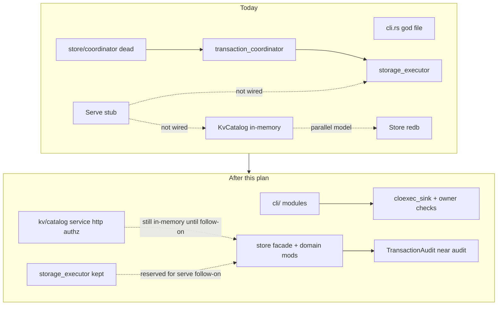

# Structural Decomposition - Plan

## Summary

Delete unused commit-boundary redundancy, collapse duplicated CLI unsafe surfaces, and split god-modules by concern — without changing behavior of already-working offline/CLI paths. Serve wiring and full durable-KV unification stay out of this plan; this plan records the persistence decision and stops after structure is landable.

## Problem Frame

A thermo-nuclear code-quality review of the whole repo found that the dominant problem is not “large files” alone. The runtime request path is not composed: `Command::Serve` validates config and returns, several stateful commands return `integration_pending`, and four commit/admission abstractions coexist while production does not start them together.

Meanwhile ten production files exceed 1000 lines (`store/mod.rs` 3401, `cli.rs` 3042, `keyring.rs` 1740, `kv.rs` 1619, `storage_executor.rs` 1594, `audit_export.rs` 1441, plus others). The unused `store/coordinator` module is `#[allow(dead_code)]`, and `KvCatalog` stores secrets in memory while redb encrypted-secret methods are dead in prod.

All charter beads are closed (113/113). Structural cleanup is now the highest-leverage work before a serve-compose follow-on.

## Requirements

- R1. Unused commit-boundary layers that nothing starts in production are removed or reduced to the minimal trait surface still required by live modules.
- R2. `storage_executor` remains the reserved admission seam for a future serve path; it is not deleted in this plan.
- R3. Duplicated `unsafe` FD-duplication and ownership checks in the CLI collapse to a single reviewed helper surface.
- R4. God-modules are split by concern until each new/remaining production module is under ~1000 lines (stretch: prefer under ~800 for new extract files).
- R5. Existing green offline/CLI/test behavior is preserved across pure moves (no intentional product behavior change in U1–U7).
- R6. Durable secrets are decided to live in `Store`; `KvCatalog` is documented as temporary in-memory state until a follow-on persistence unification plan.
- R7. Serve wiring (listener, store open, executor start, router mount) is explicitly deferred to a follow-on plan.
- R8. Intentional strengths are preserved: `Canonical`/`Sealed` codecs, existing `store/` submodule seams, secret hygiene / bounded-input constants.

## Scope Boundaries

### In scope

- Delete / collapse unused coordinator sandwich (with careful retention of any still-live trait used by audit).
- CLI unsafe helper extraction and `cli/` module split.
- `store/mod.rs`, `kv.rs`, `audit_export.rs`, `keyring.rs`, and rotation signature cleanup.
- Decision record for secret source of truth (implementation deferred).

### Out of scope

- Implementing `Command::Serve` composition / HTTP listen loop.
- Migrating `KvCatalog` onto redb (follow-on after U8 decision + splits).
- Crypto/codec redesign, serde replacement for `Canonical`.
- New Vault/KV features, auth policy changes, backup format changes.
- Drive-by refactors outside the named units.

### Deferred follow-ons (named, not this plan)

1. Persistence unification: `KvCatalog` as hydrated view over `Store`.
2. Serve compose: open store → start `storage_executor` → mount `kv`/`auth` routers → bind listener.
3. Reintroduce a typed transaction boundary only if the serve path proves direct `Store` methods insufficient.

## Key Technical Decisions

- KTD1. Structural-only plan: do not mix serve wiring into decomposition PRs. Rationale: structure + behavior changes in one PR hide regressions and inflate review risk.
- KTD2. Delete `src/store/coordinator.rs` entirely. Collapse `src/transaction_coordinator.rs` by removing `CoordinatorService` / factory sandwich that production never starts; retain or relocate only traits still implemented by live code (`TransactionAudit` on `AuditEvent` in `src/store/audit.rs`). Rationale: max complexity deletion; tests that only exercised the unused sandwich are retargeted or retired with explicit justification.
- KTD3. Keep `src/storage_executor.rs` as the single future admission seam. Rationale: bounded blocking execution is the useful abstraction; the second typed factory layer is not.
- KTD4. Durable secrets belong in `Store`; `KvCatalog` remains temporary until a dedicated follow-on. Rationale: decide now to stop dual-model drift; implement after module splits so persistence work is not entangled with file moves.
- KTD5. Prefer move/split over rewrite. Rationale: keep `Canonical` codecs and table semantics intact; this plan is surgical decomposition.
- KTD6. Target file-size budget: no production file pushed further over 1000 lines; each split lands below 1000 for newly extracted modules. Rationale: thermo-nuclear 1k rule as ongoing health bar.
- KTD7. One PR (or atomic commit series) per implementation unit below unless noted. Rationale: each unit must be independently revertable and reviewable.

## High-Level Technical Design



Sequence of landable units:

```text
U1 delete dead coordinator sandwich
 → U2 CLI unsafe helpers
 → U3 split cli/
 → U4 split store/mod.rs
 → U5 split kv.rs
 → U6 split audit_export.rs
 → U7 keyring + rotation cleanup
 → U8 persistence decision record (no migration)
 → follow-on plans: persistence unify, then serve compose
```

## Assumptions

- A1. Existing `tests/transaction_coordinator.rs` and fault gates that include it are verification of the unused sandwich, not of product-facing serve behavior. They may be retargeted to `storage_executor` + direct `Store` commits or deleted if they only assert the removed API.
- A2. `src/store/audit.rs`'s `impl TransactionAudit for AuditEvent` is the only production dependency that must survive the `transaction_coordinator` collapse.
- A3. Binary CLI surface (flags, subcommands, stdout/stderr contracts) must remain stable across U2–U3; only module layout changes.

## Implementation Units

### U1. Delete unused coordinator sandwich

- **Goal:** Remove dead commit-boundary complexity while keeping the live audit trait surface.
- **Requirements:** R1, R2, R5, R8
- **Dependencies:** none
- **Files:**
  - delete: `src/store/coordinator.rs`
  - modify: `src/store/mod.rs` (drop `#[allow(dead_code)] mod coordinator`)
  - modify: `src/transaction_coordinator.rs` (collapse) or replace with thin trait module
  - modify: `src/lib.rs` (module exports if needed)
  - modify: `src/store/audit.rs` (import path for `TransactionAudit`)
  - modify/delete: `tests/transaction_coordinator.rs`, `tests/fault/txn_crash.rs`, `tests/fault/core_recovery_gate.rs` (retarget or trim)
  - keep: `src/storage_executor.rs`, `tests/storage_executor.rs`
- **Approach:**
  1. Confirm no production call sites start `CoordinatorService` / `StoreCoordinatorFactory` (already verified: only self/tests).
  2. Delete `store/coordinator.rs` and its module declaration.
  3. Move `TransactionAudit` (and any tiny helpers still required by `AuditEvent`) next to audit — preferred home `src/store/audit.rs` or a tiny `src/store/transaction_audit.rs`.
  4. Delete `CoordinatorService`, `TransactionFactory`, `AtomicTransaction` orchestration if nothing live remains.
  5. Retarget fault/coordinator tests to remaining seams, or remove tests whose sole subject was deleted code.
- **Patterns to follow:** existing `store/audit.rs` trait impl style; do not invent a new generic framework.
- **Test scenarios:**
  - Happy path: `cargo test` suite still compiles; `tests/storage_executor.rs` still passes.
  - Edge: `AuditEvent` still implements whatever audit-commitment trait remains, and audit unit tests in `tests/audit.rs` still pass.
  - Failure: removing the module does not leave `allow(dead_code)` stubs for the deleted path.
- **Verification:** `store/coordinator.rs` gone; no `StoreCoordinator*` symbols; `storage_executor` still present; full test suite green (or intentionally updated).

### U2. Collapse CLI unsafe FD helpers

- **Goal:** One reviewed `unsafe` site for FD duplication / ownership checks.
- **Requirements:** R3, R5
- **Dependencies:** none (can parallelize with U1)
- **Files:**
  - modify: `src/cli.rs` (or early `src/cli/mod.rs` if U3 starts)
  - tests: `tests/signing_trust_cli.rs`, `tests/checkpoint_cli.rs`, `tests/recipient_rewrap.rs`, `tests/key_recovery.rs`, `tests/cli_coherence.rs` as applicable
- **Approach:** Extract helpers such as `cloexec_sink(fd) -> Result<File, String>` and `require_euid_owner(metadata) -> Result<(), String>`. Replace the repeated `F_DUPFD_CLOEXEC` / `from_raw_fd` / `geteuid` blocks. Keep SAFETY comments at the single helper.
- **Patterns to follow:** existing SAFETY comment style already present near those blocks.
- **Test scenarios:**
  - Happy path: CLI commands that write private material to an FD still succeed in existing CLI tests.
  - Error: invalid FD still fails closed with a string error (no panic).
  - Edge: owner-mismatch paths still refuse (doctor/key paths that check uid).
- **Verification:** grep shows a single `F_DUPFD_CLOEXEC` (or only inside the helper); CLI tests green.

### U3. Split `cli.rs` by command group

- **Goal:** Break the 3042-line CLI god file into a thin router + command modules.
- **Requirements:** R4, R5, A3
- **Dependencies:** U2 preferred first (helpers land before/at split)
- **Files:**
  - create: `src/cli/mod.rs`, `src/cli/args.rs`, and command modules (suggested: `key.rs`, `credential.rs`, `backup.rs`, `audit.rs`, `restore.rs`, `serve.rs`, `util.rs`)
  - modify: `src/main.rs` (`mod cli;` still works)
  - tests: `tests/cli_coherence.rs` and binary CLI tests above
- **Approach:** Move clap derive tree to `args.rs`. `run()` stays a thin match dispatching to `run_*` in group modules. No command renames. Keep `integration_pending` stubs as-is (do not implement serve here).
- **Output shape (suggested):**

```text
src/cli/
  mod.rs          # run() router
  args.rs         # clap tree
  util.rs         # cloexec_sink, hex, output helpers
  key.rs
  credential.rs
  backup.rs
  audit.rs
  restore.rs
  serve.rs        # validate_serve_shell only for now
```

- **Test scenarios:**
  - Happy path: `cli_coherence` and representative binary CLI tests still pass unchanged.
  - Edge: help text / subcommand names unchanged.
- **Verification:** no single `src/cli*.rs` file over 1000 lines; `main` still calls `cli::run()`.

### U4. Split `store/mod.rs` into facade + domain modules

- **Goal:** Make `store/mod.rs` a schema/re-export facade; move record codecs and `impl Store` methods by domain.
- **Requirements:** R4, R5, R8
- **Dependencies:** U1 (dead coordinator gone first)
- **Files:**
  - modify: `src/store/mod.rs`
  - create (suggested): `src/store/records.rs` (or `records/*.rs`), `src/store/secrets.rs`, `src/store/credentials.rs`, `src/store/lifecycle.rs`, `src/store/meta.rs`
  - tests: `tests/store.rs`, `src/store/versioned_secrets_tests.rs`, integrity/checkpoint related tests
- **Approach:** Keep table definitions and constants in `mod.rs`. Move `Canonical` record types with their encode/decode. Split `impl Store` methods by table/domain using `impl Store` blocks in submodules (`store/secrets.rs` etc.) — Rust allows this. Do not change on-disk format bytes.
- **Execution note:** Characterization-first if any encode/decode moves look risky — rely on existing store/crypto fixture tests before moving.
- **Test scenarios:**
  - Happy path: store open/read/write/audit chain tests still pass.
  - Integration: checkpoint / integrity / keyring fixture tests still pass.
  - Edge: format version constants remain single-sourced from the facade.
- **Verification:** `store/mod.rs` well under 1000 lines; no codec behavior drift; suite green.

### U5. Split `kv.rs` into catalog / service / http / authz

- **Goal:** Separate KV state model from HTTP adapter.
- **Requirements:** R4, R5, R6
- **Dependencies:** U4 helpful but not strictly required
- **Files:**
  - create: `src/kv/mod.rs`, `src/kv/catalog.rs`, `src/kv/service.rs`, `src/kv/http.rs`, `src/kv/authz.rs` (names flexible)
  - modify: `src/lib.rs` (`pub mod kv`)
  - tests: `tests/api_kv.rs`, `tests/vertical_slice.rs`, rotation/auth tests importing KV types
- **Approach:** Pure module move. Leave `KvCatalog` in-memory. Add a short module-level doc note pointing at KTD4 / follow-on persistence plan. Do not wire Store writes here.
- **Test scenarios:**
  - Happy path: `tests/api_kv.rs` passes unchanged at behavior level.
  - Edge: error mapping / Vault-shaped responses unchanged.
- **Verification:** no `src/kv.rs` monolith; each kv submodule under 1000 lines; API tests green.

### U6. Split `audit_export.rs`

- **Goal:** Separate audit query, export format, and export catalog concerns.
- **Requirements:** R4, R5, R8
- **Dependencies:** none (can follow U4)
- **Files:**
  - create: `src/audit_export/mod.rs` (or `src/audit/{query,export_format,export_catalog}.rs` if folding under audit naming — prefer minimal rename churn: keep `audit_export` path)
  - tests: existing audit export / backup-adjacent tests that import these types
- **Approach:** Mechanical split along the three already-visible concerns from the review. Preserve `Canonical` export codecs.
- **Test scenarios:**
  - Happy path: create/sign/verify/decrypt export flows still pass.
  - Edge: filter/cursor query behavior unchanged.
- **Verification:** no 1400+ line audit export monolith; tests green.

### U7. Keyring layout + rotation context cleanup

- **Goal:** Make `keyring.rs` scannable; remove rotation `too_many_arguments` waiver cluster via a shared context type.
- **Requirements:** R4, R5
- **Dependencies:** U4 preferred for keyring (store package churn settles first)
- **Files:**
  - modify: `src/store/keyring.rs` (split impl blocks / extract age-identity helpers if needed)
  - modify: `src/rotation.rs` (introduce `RotationContext` or equivalent; remove consecutive `too_many_arguments` allows where possible)
  - tests: `tests/keyring.rs`, `tests/rotation.rs`, `tests/recipient_rewrap.rs`
- **Approach:** Do not change key semantics. Collapse shared actor/endpoint/time/event envelope parameters into one struct passed through rotation methods. Resolve or quarantine `#[cfg_attr(not(test), allow(dead_code))]` helpers: either used by a near-term follow-on (document) or deleted.
- **Test scenarios:**
  - Happy path: rotation suite and keyring CLI tests pass.
  - Edge: recipient rewrap confirmation paths unchanged.
- **Verification:** fewer `too_many_arguments` allows in `rotation.rs`; keyring scannable; tests green.

### U8. Persistence decision record (no migration)

- **Goal:** Pin the secret source-of-truth decision in-repo without implementing the migration.
- **Requirements:** R6, R7
- **Dependencies:** U5 (kv split done so the note has a home)
- **Files:**
  - modify: `src/kv/catalog.rs` (or `src/kv/mod.rs`) module docs
  - modify: short note in `docs/plan-history.md` or a tiny ADR-style subsection linking this plan
  - optional: create follow-on stub plan filename reference only (do not write full serve/persistence plans unless asked)
- **Approach:** Document: durable ciphertext/metadata live in `Store`; `KvCatalog` is ephemeral/test/bootstrap state until persistence unification; serve compose is a separate plan after that.
- **Test expectation:** none — documentation / decision pinning only.
- **Verification:** decision is discoverable from `kv` module docs and this plan; no dual-model “both are canonical” language remains.

## System-Wide Impact

- **Developers / agents:** clearer module homes; less speculative framework code.
- **Tests / CI:** coordinator/fault tests may shrink or retarget; storage_executor and store/kv/cli suites remain load-bearing.
- **Runtime / ops:** no intentional user-visible change in this plan; serve remains non-functional until follow-on.
- **Security:** reducing duplicated `unsafe` is a net win; codec and auth semantics must not drift.

## Risks

| Risk | Mitigation |
|------|------------|
| Deleting `transaction_coordinator` breaks fault gates that charter still expects | Inventory gate file lists in U1; retarget assertions to `storage_executor` + `Store` rather than silently dropping coverage |
| Store splits break encoding determinism | Move-only; run store/crypto/fixture tests per U4; no format version bumps |
| CLI split changes help text / arg order | Keep clap derive structs byte-stable; run `cli_coherence` |
| Scope creep into serve wiring | R7 / KTD1 hard stop; open follow-on plan instead |
| Dead-code helpers deleted that a near-term feature needed | In U7, prefer “document + keep” only with a named follow-on; otherwise delete |

## Success Criteria

- Dead `store/coordinator` gone; no production `CoordinatorService` start path required for green builds.
- `storage_executor` retained.
- CLI FD `unsafe` consolidated.
- `cli`, `store` facade, `kv`, and `audit_export` no longer exist as 1k+ line monoliths in their pre-split shapes.
- Rotation no longer needs a cluster of argument-count lint allows for the shared envelope.
- Persistence + serve follow-ons are named and out of scope, with the Store-as-source-of-truth decision recorded.
- Full relevant test suite green after each unit.

## Execution Posture

Characterization-preserving refactor. Prefer green-before/after on existing tests over new feature tests. Add tests only when a unit introduces a real helper contract (U2) or when retargeting deleted-framework coverage (U1).

## Sources & Research

- Thermo-nuclear whole-repo code quality review (2026-07-17), agent `002fb005-db5f-414a-bebb-159fb1118e9b`.
- Confirmed runtime facts: `Command::Serve` stub at `src/cli.rs` ~1468; `StoreCoordinator*` only in `src/store/coordinator.rs`; `TransactionAudit` used by `src/store/audit.rs`; `KvCatalog.entries: BTreeMap` in `src/kv.rs`.
- Prior product plan: `docs/plans/2026-07-16-002-feat-ops-light-secrets-server-plan.md` (charter complete; this plan is structural follow-on, not a product supersession).
- Beads triage at plan time: 0 open issues.

## Follow-on Plans (not started here)

1. **Persistence unification** — hydrate/mutate secrets through `Store`; keep `KvCatalog` as cache or delete it.
2. **Serve compose** — validate → open store/keyring → start `storage_executor` → mount routers → bind TLS/listener; replace `integration_pending` stubs with real adapters only where required.
