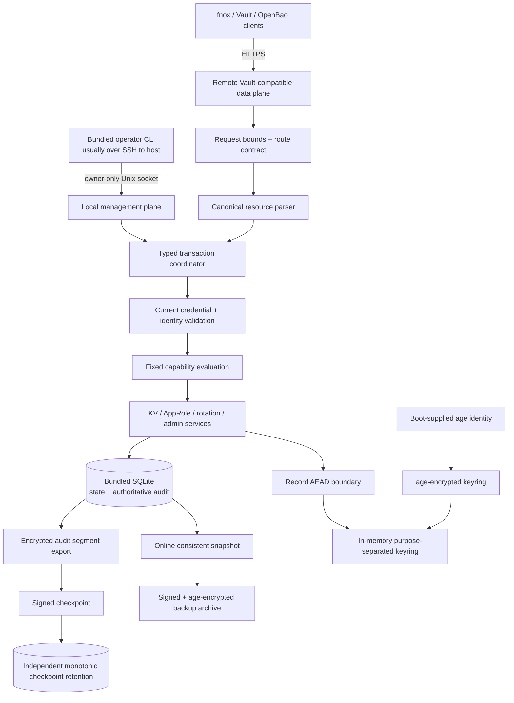

# Overall assessment

This is already an unusually strong plan. It has a crisp product wedge, explicit
exclusions, requirement-to-test traceability, realistic acceptance examples, and
several genuinely good fail-closed decisions. The plan also avoids the common
mistake of turning “Vault-compatible” into “reimplement all of Vault.”

I would **not implement it unchanged**, however. The most important gaps are
structural rather than cosmetic:

1. The proposed separation between the store and audit log cannot guarantee
   atomic state-plus-audit behavior for mutations.
2. The current per-record `age` design makes routine server-identity rotation
   unnecessarily expensive and lacks explicit ciphertext-to-record binding.
3. The token-verifier design is underspecified and could require either scanning
   verifiers or performing an expensive password KDF on the hot path.
4. The public Vault-compatible surface and the privileged management surface are
   insufficiently isolated.
5. “Consumers” currently means a mixture of “authorized identities” and “recent
   readers,” which is not the dependency inventory the rotation workflow
   actually needs.
6. Restore semantics can resurrect revoked credentials unless the plan
   explicitly prevents it.
7. The compatibility gate exercises Vault and OpenBao CLIs, but not fnox—the
   named primary client.
8. Several security claims are stronger than the server can actually guarantee,
   especially around client-side disk use, audit delivery, environment
   variables, and authorized read responses.

My recommended target is:

> **One Rust binary with two planes: a remote Vault-compatible data plane and a
> local control plane, backed by one transactional embedded database, with an
> `age`-wrapped keyring, record-level AEAD, atomic audit/state commits,
> structured opaque credentials, and a first-class rotation/consumer workflow.**

## Priority map

| Priority | Revision                                                                | Why it matters                                                                         |
| -------- | ----------------------------------------------------------------------- | -------------------------------------------------------------------------------------- |
| P0       | Add a threat model and tighten security claims                          | Prevents building against impossible or ambiguous guarantees                           |
| P0       | Add a fnox characterization unit                                        | The primary compatibility claim is not currently tested                                |
| P0       | Split data and management planes; initialize locally                    | Removes the highest-privilege unauthenticated remote path                              |
| P0       | Prefer bundled SQLite over redb                                         | Better fit for transactional audit, relational queries, migrations, backup, and repair |
| P0       | Make state and audit one transaction boundary                           | Required to make R26 true rather than aspirational                                     |
| P0       | Replace per-record `age` with an `age`-wrapped keyring                  | Improves rotation, recovery, performance, and record binding                           |
| P0       | Redesign token and SecretID verification                                | Makes lookup bounded and removes password hashing from the request hot path            |
| P0       | Formalize canonical paths and fixed capabilities                        | Closes the most dangerous authorization ambiguity                                      |
| P0       | Add CAS and a real rotation state machine                               | Prevents lost updates and makes rotation verification meaningful                       |
| P1       | Add declared consumers and rotation snapshots                           | Turns the product’s main differentiator into a reliable workflow                       |
| P1       | Strengthen audit assurance, confidentiality, and capacity behavior      | Clarifies what tampering is detectable and prevents audit-based DoS                    |
| P1       | Redesign backup, restore, and migrations                                | Prevents credential resurrection and enables safe upgrades                             |
| P1       | Add operational health, `doctor`, bounded resources, and safe key input | Makes “ops-light” measurable after first boot                                          |
| P1       | Re-sequence around a secure vertical slice and expand verification      | Reduces architectural rework and catches crash/concurrency failures                    |
| P1       | Make the operator CLI a first-class product surface                     | Makes the system substantially more useful without adding a web UI                     |

---

# 1. Add an explicit threat model and correct overbroad guarantees — P0

## Analysis and rationale

The plan contains many individual security requirements, but no single statement
of the attacker, trusted components, or unavoidable residual risks. That makes
several requirements appear stronger than the architecture can support.

Examples:

- F2 says the secret “never touches disk,” but the server cannot control whether
  fnox, the Vault CLI, the target process, swap, crash dumps, or shell tooling
  writes it.
- R25 says secret values never appear in any server output, but an authorized
  read response necessarily is server output.
- The audit design can detect offline tampering anchored by a prior checkpoint,
  but it cannot defeat an attacker who controls the running process and its
  signing key.
- An `age` identity protects against possession of the storage medium alone. It
  does not protect against root access to a running, unlocked server.
- R28 needs a defined concurrency/linearization rule. A scope revocation cannot
  retroactively stop a request that already passed authorization unless the
  request path is serialized with the revocation.

A concise threat model will make the design easier to review and will keep
documentation from becoming accidental security marketing.

## Proposed plan changes

```diff
@@
-artifact_readiness: implementation-ready
+artifact_readiness: design-review-ready
@@ Goal Capsule
-- **Open blockers:** None. Rotation semantics, auth surface, storage, transport,
-  and audit-chain design are settled in the Planning Contract...
+- **Open blockers:** The implementation may begin only after U0 characterizes
+  the pinned fnox client path and the storage/audit transaction prototype proves
+  the R26 atomicity invariant. The remaining product questions do not block
+  those validation units.
+
+### Threat Model and Security Invariants
+
+**Protected against in v0.1**
+
+- Theft or copying of the data directory or backup without an authorized
+  `age` identity or backup recipient.
+- Unauthenticated remote callers and authenticated callers attempting access
+  outside their fixed capabilities and path grants.
+- Accidental process termination, host restart, and power loss at documented
+  storage fault boundaries.
+- Offline editing, deletion, reordering, or truncation of audit history through
+  the last independently retained checkpoint.
+- Accidental operator misuse where the requested transition is invalid, stale,
+  or conflicts with a newer secret version.
+
+**Not protected against in v0.1**
+
+- A malicious host root, kernel compromise, debugger, or attacker controlling
+  the running unlocked process.
+- A malicious administrator possessing both the store and the boot-supplied key
+  material.
+- A client or application retaining, logging, swapping, or otherwise exposing a
+  secret after an authorized read.
+- Compromise of the upstream SaaS product or of the credential at its upstream
+  point of creation.
+- Single-node host loss between the most recent backup/checkpoint and failure.
+
+**Trusted dependencies and inputs**
+
+- The host OS, CSPRNG, filesystem durability and locking semantics, TLS private
+  key, boot key-delivery channel, independently retained audit checkpoint, and
+  operator-controlled system clock are explicit trust dependencies.
+
+**Cross-cutting invariants**
+
+- Every authorization decision uses one canonical resource representation.
+- No mutation becomes visible unless its audit event commits in the same
+  transaction.
+- No successful secret response begins transmission until its audit event has
+  committed.
+- Historical secret values require a capability distinct from current-value
+  reads.
+- Raw bearer credentials are never persisted.
+- Decryption occurs only after current identity and grant state has been checked.
@@ F2. Developer reads a secret
-- **Outcome:** The value reaches the process environment and never touches
-  disk.
+- **Outcome:** The server returns the value only after authorization and durable
+  audit commit. The server never intentionally persists the returned plaintext;
+  storage, swap, logging, and crash behavior after the value reaches the client
+  are outside the server's guarantee and are documented separately.
@@ R5
-- R5. Secret material in buffers the server allocates and controls is zeroized
-  once its lifetime ends...
+- R5. Plaintext secret material is held only in bounded server-owned secret
+  buffers for the minimum request lifetime and is zeroized on drop. The
+  guarantee excludes unavoidable copies inside the allocator, kernel, HTTP/TLS
+  stack, client, and platform crash machinery. The implementation documents
+  best-effort process-dump hardening separately from this guarantee.
@@ R25
-- R25. Secret values and credential material never appear in any server output
-  — audit entries, application and access logs, traces, metrics labels, error
-  responses, panic output, or crash diagnostics...
+- R25. Except for the body of an explicitly authorized successful secret-read
+  response, secret values and credential material never appear in server
+  output. They are prohibited from audit entries, application and access logs,
+  traces, metrics labels, error responses, panic output, crash diagnostics,
+  support bundles, and debug representations. Secret paths and identity names
+  are also prohibited from metrics labels.
@@ R28
-- R28. Disabling an identity or reducing its scope takes effect for every
-  outstanding credential before its next authorized request...
+- R28. Identity disable, grant reduction, token revocation, and authorized
+  requests are linearized through the storage transaction boundary. Any request
+  whose authorization transaction begins after the administrative change
+  commits observes the new state; an already-linearized in-flight request may
+  complete. Every rejection is audited.
```

---

# 2. Add a pre-implementation fnox compatibility characterization unit — P0

## Analysis and rationale

The plan’s primary success criterion is fnox compatibility, but the
compatibility unit drives only the `vault` and `bao` CLIs. AE8 likewise installs
the Vault CLI rather than invoking fnox. That means R2 can pass without the
named primary client ever running.

There is also version ambiguity. As of July 15, 2026, the fnox repository’s
current release is v1.30.0, while the published Vault provider page is labeled
v1.29.0. That page lists the Vault CLI as a prerequisite but also exposes
provider-level `address`, `token`, `namespace`, and `credential_command`
configuration. Even if the plan’s shell-out conclusion is correct for a
particular tag, the exact tag and observed request behavior need to be frozen as
evidence rather than left as a prose assumption. ([GitHub][1])

U0 should answer:

- Does the pinned fnox version invoke the Vault CLI, send HTTP directly, or use
  both paths?
- Which exact endpoints, headers, environment variables, and status shapes are
  exercised?
- How are TLS roots and tokens supplied?
- Does it issue mount discovery, seal status, token lookup, health, or namespace
  requests?
- What behavior changes between the two supported fnox versions?
- Can a fresh host use fnox without the BUSL Vault CLI?

This unit should run before finalizing R1, R2, AE8, or the public endpoint
matrix.

## Proposed plan changes

```diff
@@ Goal Capsule
-- **Execution profile:** Rust, single binary. Test-first on the authorization,
+- **Execution profile:** Rust, single binary. U0 first characterizes the exact
+  pinned fnox and Vault/OpenBao client behavior. Test-first on authorization,
   token-lifecycle, and audit-chain paths...
@@ R2
-- R2. fnox's existing Vault provider reaches the server with no change to fnox
-  beyond configuration.
+- R2. Every fnox version listed in the published compatibility matrix resolves
+  a secret through its unmodified Vault provider by configuration only. The
+  actual fnox binary, not merely a presumed underlying Vault CLI, is the
+  acceptance subject.
@@ Dependencies / Assumptions
-- **fnox's Vault provider does not speak HTTP — it shells out to the `vault`
-  CLI.** It runs `Command::new("vault")`...
+- **fnox transport behavior is versioned evidence, not a permanent
+  assumption.** U0 pins the target fnox tags, inspects their provider
+  implementation, captures their requests on the wire and at the process
+  boundary, and records whether each version invokes the Vault CLI or speaks
+  HTTP directly. Client prerequisites and the compatibility endpoint set are
+  derived from those observations.
+
+- **Compatibility is expressed as two artifacts:** a narrow wire-level endpoint
+  contract and a tested client matrix. The project does not claim that every
+  future Vault client will work merely because it uses KV v2.
@@ Implementation Units
+| U0   | Client characterization and contract capture | `research/compat/`, `tests/fixtures/client-traces/` | — |
@@ AE8. Clean-host onboarding
-- **When:** A developer follows the documented sequence — install the pinned
-  `vault` CLI, set `VAULT_ADDR`, authenticate.
-- **Then:** Their first secret read succeeds with no fnox change beyond
-  configuration.
+- **When:** A developer installs the pinned fnox binary, configures a Vault
+  provider and credential source exactly as documented, and runs `fnox get` and
+  `fnox exec` against the server. Any additional Vault CLI prerequisite is
+  included only when U0 proves that the pinned fnox version requires it.
+- **Then:** Both operations succeed with no fnox source change, fork, wrapper,
+  or patched provider.
+
+### U0. Client characterization and compatibility contract capture
+
+- **Goal:** Replace assumptions about fnox and Vault/OpenBao clients with
+  reproducible traces from pinned versions.
+- **Approach:** Run each client against a recording test server; capture method,
+  path, query, relevant headers, body shape, retry behavior, TLS configuration,
+  subprocess execution, and status/error handling. Commit normalized fixtures
+  and a human-readable compatibility matrix.
+- **Exit gate:** R1, R2, AE8, and U11 are updated from the captured behavior
+  before the production API router is implemented.
@@ U11
-- The harness starts a server instance and drives it with the actual `vault`
-  CLI at pinned versions (and `bao`...)
+- The harness starts a server instance and drives it with the actual pinned
+  `fnox`, `vault`, and `bao` binaries. `fnox get`, `fnox exec`, `vault kv
+  get/put/list`, and equivalent supported `bao` operations are all first-class
+  gates.
```

---

# 3. Split the Vault data plane from a local management plane, and initialize locally — P0

## Analysis and rationale

The current design puts bootstrap, AppRole login, KV access, identity
management, grant changes, credential issuance, audit access, backup, and
rotation management into one conceptual HTTP surface. Even with authorization,
this unnecessarily exposes high-impact parsers and routes to remote traffic.

The safest and simplest boundary is:

- **Remote data plane:** only the declared Vault-compatible endpoints needed by
  fnox and supported clients.
- **Local control plane:** Unix domain socket, owner-only permissions by
  default, reached through the bundled CLI or SSH to the host.
- **Offline commands:** initialization, restore, migration recovery, and
  break-glass administrator recovery while the server is stopped.

This is not a second service or deployment. It is still one process and one
binary. It simply creates two routers with different exposure and middleware.

The current server stack can support this without changing the Rust choice:
`axum-server` exposes Unix-listener construction, TLS reload, and
graceful-shutdown mechanisms. ([Docs.rs][2])

I would also remove the remote bootstrap exchange. A local `init` command should
create the schema, keyring, audit genesis, first management identity, and first
short-lived management token atomically. That removes the highest-privilege
unauthenticated route and the race between two bootstrap requests.

## Proposed plan changes

```diff
@@ F1. Operator brings the server up
-- **Steps:** Download the binary; supply the encryption key material and the
-  one-time bootstrap credential; start the server; create the first identity
-  and its credential through the bootstrap credential, which disables itself.
+- **Steps:** Download the binary; run `<binary> init` locally against an
+  exclusively locked empty data directory; supply public encryption recipients;
+  create the first management identity and receive its short-lived token once;
+  start `<binary> serve` with the private `age` identity supplied through an
+  approved credential channel; verify readiness; use the local control socket
+  to issue normal operator and workload credentials.
@@ R17
-- R17. The server's bootstrap credential has a documented handling story that
-  does not end in a plaintext file on disk.
+- R17. The first management token is generated by local initialization, shown
+  once through a TTY or caller-supplied file descriptor, stored only as a
+  verifier, and documented for immediate exchange or secure placement. It is
+  never accepted by the remote data-plane listener.
@@ R18
-- Unsafe configurations include, at minimum: no encryption key material
-  configured, no bootstrap credential configured on an uninitialized store...
+- `serve` refuses an uninitialized store. `init` refuses an initialized or
+  concurrently opened store. Unsafe configurations include missing key
+  material, an unreadable or mismatched keyring, unsafe data-directory
+  ownership or permissions, an unknown schema version, and a remote listener
+  without TLS.
@@ R30
-- R30. The bootstrap credential is single-use and short-lived...
+- R30. Initialization is local, exclusive, and one-time. Creation of the store
+  UUID, schema version, encrypted keyring, audit genesis, first management
+  identity, and initial token verifier occurs in one transaction. Concurrent or
+  repeated initialization attempts cannot create a second first administrator.
+
+- R33. The remote data-plane listener exposes only the declared Vault
+  compatibility surface. Identity management, capability management,
+  credential issuance and revocation, consumer declarations, rotation
+  transitions, audit query/export, key rotation, backup, restore preparation,
+  and diagnostic detail are available only through the owner-restricted local
+  control socket unless a later product phase defines a separately authenticated
+  remote administration listener.
+
+- R34. A break-glass administrator recovery command operates only while the
+  server is stopped, requires exclusive store access plus the normal decryption
+  key material, invalidates outstanding management tokens, and records a
+  recovery epoch and reason before the server can resume.
@@ KTD1
-- **HTTP surface: `axum` over rustls.**
+- **Two routers in one process:** an `axum` Vault-compatible data router over
+  rustls, and an owner-restricted Unix-domain control router. Both call the same
+  typed application services; neither handler accesses storage directly.
@@ KTD6
-- **Transport: bearer tokens over rustls TLS...**
+- **Data transport:** bearer tokens over rustls TLS. The public router never
+  carries bootstrap or management-only routes. The local control socket is
+  permission-restricted and still requires a management credential for
+  attributable, auditable operations.
@@ U4
-- **Bootstrap exchange:** on an uninitialized store, the one-time bootstrap
-  credential creates the first management identity...
+- Bootstrap is removed from the remote auth router. U1's local `init` command
+  creates the first management identity and verifier atomically. U4 implements
+  token auth and AppRole only.
```

---

# 4. Prefer bundled SQLite over redb for the authoritative state store — P0

## Analysis and rationale

`redb` is credible: its current documentation describes ACID transactions,
read/write transactions, savepoints, and repair facilities. This recommendation
is not based on redb being inherently unsafe. ([Docs.rs][3])

The issue is architectural fit. The proposed system is no longer merely a
versioned blob map. It has:

- identities,
- fixed capabilities,
- path grants,
- role and SecretID records,
- tokens and revocation state,
- version metadata,
- rotation runs and consumer snapshots,
- audit events and checkpoints,
- last-read observations,
- declared consumers,
- key versions,
- migrations,
- backup manifests.

That is a relational state machine. SQLite gives the project mature multi-table
transactions, constraints, indexes, schema migrations, integrity checks, and an
official online backup API that produces a consistent snapshot of a running
database. ([SQLite][4])

Bundled SQLite still satisfies the product thesis:

- one process,
- one server binary,
- one local database file,
- no database server,
- no platform team.

The cost is that the build includes SQLite’s C implementation rather than
remaining pure Rust. In a professional secrets server, I would accept that trade
in exchange for simpler transactional correctness, migration tooling, and
recovery procedures.

A reasonable alternate decision is to retain redb only after a short proof unit
demonstrates atomic state/audit commits, live consistent snapshots, migrations,
fault recovery, and the exact queries needed by rotation and audit. The current
plan declares redb settled before proving those load-bearing operations.

## Proposed plan changes

```diff
@@ KTD2
-- KTD2. **Storage: `redb` embedded ACID store.** ...
+- KTD2. **Storage: bundled SQLite through `rusqlite`.** SQLite runs in-process
+  and ships inside the single server binary; no database service is introduced.
+  The schema models identities, capabilities, credentials, secret metadata,
+  versions, rotation runs, consumer observations, audit events, checkpoints,
+  and key versions explicitly.
+
+  The storage boundary uses a dedicated blocking executor or storage actor
+  rather than running SQLite calls on Tokio worker threads. Foreign keys,
+  defensive connection settings, a documented journal/synchronous mode, bounded
+  busy handling, and application/schema identifiers are configured and verified
+  on every connection.
+
+  The data directory must be on a supported local filesystem. Network and
+  userspace filesystems are outside the supported durability contract unless a
+  later qualification suite explicitly admits them.
+
+  **Fallback gate:** retaining redb is acceptable only if a pre-implementation
+  prototype proves atomic state-plus-audit transactions, live consistent
+  snapshots, schema migration, crash recovery, lock exclusion, and the rotation
+  query workload. The backend choice is then recorded in an ADR with the proof
+  results.
@@ Assumptions
-- The data directory sits on a filesystem supporting POSIX file locks...
+- The data directory sits on a supported local filesystem with working file
+  locking and documented fsync/rename semantics. Startup checks ownership,
+  permissions, exclusivity, and obvious unsupported filesystem cases; the
+  fault-injection suite verifies the durability assumptions on supported
+  release targets.
@@ U2
-- **Goal:** A versioned key-value store persisting `age`-encrypted blobs to a
-  single redb file.
+- **Goal:** A versioned relational store in one bundled SQLite database,
+  persisting only authenticated ciphertext for secret values and confidential
+  audit payloads.
@@ U10
-- `backup` produces an encrypted, crash-consistent snapshot of the redb store
-  and audit log while the server runs...
+- `backup` uses the database's online snapshot mechanism to obtain one
+  transactionally consistent image containing state and authoritative audit
+  history, then packages it with a signed manifest and encrypted keyring.
```

---

# 5. Put state changes and authoritative audit events behind one transaction coordinator — P0

## Analysis and rationale

This is the most important correctness change.

The existing design says the audit append happens before the response. That is
enough for a pure read, but it is not enough for a mutation:

- **State first, audit second:** state may commit and the audit append may fail.
  R26 is violated.
- **Audit first, state second:** the audit may claim success and the mutation
  may fail. The log is false.
- **Separate files with attempted coordination:** a crash can land between
  durable commits.

The authoritative audit event for a write, delete, revocation, grant change,
rotation transition, or credential issue must commit in the **same database
transaction** as the state transition.

For reads, the server should:

1. Begin the authorization transaction.
2. Recheck current token, identity, and grants.
3. Read and decrypt the selected version.
4. Build the complete bounded HTTP response in a zeroizing buffer.
5. Insert the audit event and update the derived consumer observation.
6. Commit.
7. Only then begin sending response bytes.

The audit record can truthfully mean “authorized and response prepared.” No HTTP
server can guarantee that the remote process received or consumed the bytes.

This architecture also gives R28 a clean linearization point and prevents
handlers from accidentally bypassing audit behavior.

## Proposed plan changes

```diff
@@ High-Level Technical Design
-The request path is a middleware stack: TLS termination, then token
-authentication, then path-scope authorization, then the KV handler, with every
-terminal outcome written to the audit log before the response returns...
+The request path separates stateless transport middleware from a typed
+application transaction boundary:
+
+1. TLS, request bounds, and route selection.
+2. Token parsing and canonical resource construction.
+3. One `TxnCoordinator` call that revalidates authentication, evaluates fixed
+   capabilities, reads or mutates state, prepares any bounded response, writes
+   the authoritative audit event, updates derived observations, and commits.
+4. Response transmission only after commit.
+
+No API, auth, rotation, or management handler receives a raw database
+connection or a standalone audit writer.
@@ Audit write ordering
-- A read/write/auth outcome is committed to the audit log before the HTTP
-  response is sent. If the audit append fails, the operation fails...
+- For state-changing operations, business state and the corresponding
+  authoritative audit event commit in one database transaction or neither is
+  visible.
+
+- For successful reads, the response is fully prepared in bounded memory, the
+  exact served version is included in the audit event, and the audit transaction
+  commits before the first response byte is sent.
+
+- The audited outcome is `response_prepared`, not a claim that the client
+  received, retained, or acted on the value. A transport failure after commit is
+  recorded separately when observable.
@@ R26
-- R26. If an audit entry cannot be written, the audited operation fails...
+- R26. Every state mutation and its authoritative audit event are atomic. Every
+  successful secret response is withheld until its audit event commits. If the
+  transaction or audit insertion fails, no state transition becomes visible and
+  no secret response is released.
+
+- R35. Authorization-sensitive operations are linearized through the same
+  transaction coordinator as identity disable, grant changes, revocation, and
+  version writes. Direct store writes outside this boundary are prohibited by
+  module visibility and tested architecture rules.
@@ Implementation Unit dependencies
-| U5   | Vault KV v2 API surface          | ... | U2, U4     |
-| U6   | Tamper-evident audit log         | ... | U1         |
+| U5   | Vault KV v2 API surface          | ... | U2, U4, U6 |
+| U6   | Transaction and audit core       | ... | U2         |
@@ U6
-- **Dependencies:** U1.
+- **Dependencies:** U2.
@@ U6 Approach
-- Each entry's `blake3` hash chains to its predecessor...
+- U6 first implements the transaction coordinator and authoritative audit table.
+  Hashing, encryption, segment export, and checkpointing are layered on that
+  atomic core. Mutation services cannot be completed before their state-plus-
+  audit crash tests pass.
@@ New test scenarios
+  - Kill the process at every injected point around a secret write and restart:
+    either both the new version and its audit event exist, or neither exists.
+  - Kill the process around token revocation and restart: a surviving
+    revocation always has its matching audit event.
+  - Simulate audit insertion failure during a read: no response body is
+    released.
+  - Revoke an identity concurrently with reads: results conform to the
+    documented transaction linearization order.
```

---

# 6. Use `age` to wrap a compact keyring, not every database record — P0

## Analysis and rationale

The original choice uses `age` directly for every stored blob. That works for
confidentiality, but it creates several avoidable costs:

- Rotating the server’s `age` identity requires re-encrypting the entire store.
- Adding a recovery identity likewise requires touching every record.
- Each small secret pays a full age file/header cost.
- The record’s database location is not automatically authenticated. An attacker
  able to rewrite storage may be able to move valid ciphertext between paths
  unless the encrypted plaintext includes and verifies the path/version.
- Separate purposes—secret encryption, token verification, audit-payload
  encryption—need separate keys.

The better composition is:

1. Generate a small versioned keyring containing independent random keys.
2. Encrypt that keyring with `age` to one or more recipients.
3. Encrypt database records with a well-reviewed AEAD crate.
4. Bind every record to its context through associated data.

This remains faithful to the `age` recipient model. The age format itself
generates a symmetric file key and wraps that key independently to one or more
recipients; using it to protect a store keyring extends the same envelope
pattern rather than inventing a new asymmetric primitive. ([GitHub][5])

The current Rust `age` crate is 0.12.1 and interoperates with the age
specification and other implementations. Because it is still pre-1.0, the plan
should pin an exact compatible range and keep decryption fixtures across
upgrades. ([Docs.rs][6])

The keyring should contain at least:

- active record-encryption key and prior decrypt-only keys,
- credential-MAC key,
- audit-payload encryption key,
- key IDs and creation status.

The audit-checkpoint signing private key should remain independently supplied,
because conflating encryption recovery and audit-signing authority unnecessarily
joins two trust roles.

This does revise the original “no custom key hierarchy” position. The revision
is justified because it is a **minimal, fixed-purpose keyring**, not a
policy-driven Vault-style seal hierarchy.

## Proposed plan changes

```diff
@@ Key Decisions
-- **`age`'s recipient model over a hand-built key hierarchy.**
+- **`age` as the operator-facing root wrapper over a minimal fixed-purpose
+  keyring.** `age` remains the only asymmetric recipient mechanism and the
+  boot-time seal boundary. A compact encrypted keyring supplies independent
+  symmetric keys for record encryption, credential verification, and
+  confidential audit payloads. This is not a configurable Vault-style
+  KEK/DEK hierarchy or unseal state machine.
@@ KTD3
-- KTD3. **Encryption at rest: `age` v0.12 envelope under one boot-supplied
-  server recipient.** ... Every stored blob is `age`-encrypted...
+- KTD3. **Encryption at rest: an `age`-wrapped, versioned store keyring plus
+  record-level AEAD.**
+
+  Initialization creates independent random keys for:
+
+  - secret and confidential metadata record encryption;
+  - credential verifier MACs;
+  - audit-event payload encryption.
+
+  The keyring is encrypted to at least one active server recipient and may also
+  be encrypted to one documented offline recovery recipient. Database records
+  carry a key ID, random nonce, ciphertext, and format version.
+
+  Associated data binds each record to:
+  `store_uuid`, record type, mount, canonical path or entity ID, secret version,
+  schema version, and key ID. A ciphertext copied to another logical record
+  therefore fails authentication.
+
+  Routine server-recipient rotation rewraps only the keyring. Record-key
+  rotation creates a new active key for new writes and runs a resumable
+  background/offline re-encryption job before an old key can be destroyed.
@@ R4
-- R4. Secret material is encrypted at rest under a key that cannot be derived
-  from the storage medium alone.
+- R4. Secret values and confidential audit payloads are encrypted under
+  purpose-separated record keys unavailable from the storage medium alone.
+  Every ciphertext is authenticated against its immutable logical record
+  context to prevent substitution across paths, versions, stores, or entity
+  types.
@@ R21
-- R21. The server's `age` identity has a documented handling story...
+- R21. The active server `age` identity and any offline recovery identity have
+  distinct documented custody. The active private identity is supplied through
+  an approved credential channel at boot. The recovery private identity is not
+  present on the server host. Loss and compromise procedures distinguish
+  recipient rotation from record-key rotation.
@@ U2
-- each value is an `age`-encrypted, versioned record...
+- each value is an AEAD-encrypted, versioned record whose associated data binds
+  it to the store, record type, canonical path, version, schema, and key ID. The
+  encrypted keyring is opened once at startup into purpose-separated secret
+  key types.
@@ U8
-- **Goal:** rotate the server's `age` identity by re-encrypting the whole store.
+- **Goal:** support two distinct operations:
+  1. recipient rotation by atomically rewrapping the compact keyring; and
+  2. record-key rotation by introducing a new active key and resumably
+     re-encrypting affected records.
@@ U8 test scenarios
+  - Add a new server recipient and remove the old recipient without rewriting
+    database secret records.
+  - Recover the keyring using the offline recovery identity and rewrap it to a
+    fresh active server recipient.
+  - Copy valid ciphertext to a different path or version: decryption fails due
+    to associated-data mismatch.
+  - Interrupt record-key migration and resume without losing or ambiguously
+    keying a record.
```

---

# 7. Replace hot-path Argon2 token verification with structured opaque credentials — P0

## Analysis and rationale

The plan says tokens and SecretIDs are stored only as Argon2 verifiers, but it
does not say how a presented token selects its verifier.

Without an indexed identifier, the server would need to scan token records and
attempt Argon2 verification until one matches. Even with an identifier, Argon2
on every API read is intentionally memory-hard and gives unauthenticated callers
an expensive operation to trigger. Argon2 is a password-hashing KDF, which is
appropriate for low-entropy human passwords, not necessary for uniformly random
machine bearer secrets. ([Docs.rs][7])

Use structured opaque credentials:

```text
osv1.<public-accessor>.<random-secret>
```

The accessor is not secret and selects one row in O(1). The random secret should
be 32 random bytes. Store:

- accessor,
- keyed MAC of the secret,
- identity/role ID,
- expiry,
- revocation state,
- issuance epoch,
- use count where applicable.

Verification computes a keyed MAC with the credential-MAC key from the encrypted
keyring and uses a constant-time comparison. For an unknown accessor, compute
against a fixed dummy verifier so timing does not reveal whether an accessor
exists.

AppRole SecretIDs should get the same accessor pattern plus TTL and
number-of-uses controls. Vault’s own AppRole API exposes SecretID accessors,
SecretID TTL, and SecretID use counts, so this fits the compatibility model
instead of fighting it. ([HashiCorp Developer][8])

Argon2 can be removed entirely unless the product later introduces a genuinely
human-chosen recovery passphrase.

## Proposed plan changes

```diff
@@ KTD5
-- KTD5. **Credential verifiers: `argon2`; tokens are server-generated 128-bit
-  random.** Raw bootstrap credentials, secret_ids, and tokens are shown once and
-  stored only as `argon2` verifiers...
+- KTD5. **Structured opaque credentials with indexed accessors and keyed
+  verifiers.** Tokens and AppRole SecretIDs contain a versioned public accessor
+  and a server-generated 256-bit random secret. The accessor selects one record;
+  the secret is verified using a purpose-separated keyed MAC and constant-time
+  comparison.
+
+  Raw credential secrets are shown once and never persisted. Accessors may be
+  logged and used for lookup, revocation, and audit correlation. Unknown
+  accessors run the same MAC path against a dummy verifier.
+
+  Argon2 is not used for random bearer credentials. It is retained only if a
+  later feature introduces a human-chosen passphrase whose entropy requires a
+  password KDF.
@@ R24
-- validates them against cryptographically protected, non-recoverable
-  verifiers that support revocation and rotation.
+- validates them by indexed accessor against purpose-separated, keyed,
+  non-recoverable verifiers. The database alone is insufficient to validate or
+  mint credentials. Credential rows support expiry, revocation, issuance epoch,
+  and optional use limits.
+
+- R36. Tokens are opaque server-side references, not self-contained claims.
+  Current identity status and grants are checked on every request. v0.1 tokens
+  are non-renewable and responses advertise `renewable:false`; token renewal is
+  outside the declared API until explicitly implemented.
@@ U4 Approach
-- secret_ids and tokens are stored only as `argon2` verifiers...
+- token and SecretID strings are generated as
+  `<kind>.<accessor>.<32-byte-random-secret>`. Only the accessor and keyed
+  verifier persist. AppRole SecretIDs have configurable TTL and use count;
+  login decrements the use count atomically with token issuance and audit.
@@ U4 test scenarios
+  - Token lookup touches exactly one indexed credential row.
+  - Unknown and known-but-invalid accessors perform the same verifier operation.
+  - A malformed or invalid token never invokes a password KDF.
+  - SecretID use-count decrement, token issuance, and audit commit atomically.
+  - A one-use SecretID succeeds once under concurrent login and all other
+    attempts fail.
+  - Rotating the credential-MAC key invalidates or migrates verifiers according
+    to an explicit, tested epoch transition.
```

---

# 8. Formalize canonical resources and replace the broad management grant with fixed capabilities — P0

## Analysis and rationale

Authorization is the highest-risk code in the system, and “map every API form
back to a logical path” is not precise enough to implement safely.

The plan needs a single typed representation:

```text
Resource {
    mount,
    canonical_segments,
}
```

The router should construct it exactly once. The parser should reject rather
than normalize ambiguous forms:

- encoded slashes or backslashes,
- double decoding,
- `.` and `..`,
- empty middle segments,
- NUL/control characters,
- repeated separators,
- noncanonical percent encodings,
- paths outside the configured mount.

Grants should not be globs. A fixed record can say:

```text
Grant {
    mount,
    exact_or_subtree,
    prefix_segments,
    capabilities,
}
```

This remains much simpler than a policy DSL.

The plan should also separate ordinary current reads from historical reads.
Otherwise any compromised workload with `read` access can ask for a previous
version and retrieve a credential the operator considered retired. Likewise,
list, destroy, audit read, credential issuance, backup, and key management
should not all collapse into one “management” bit.

Recommended fixed capability set:

- `secret.read_current`
- `secret.read_history`
- `secret.list`
- `secret.write`
- `secret.soft_delete`
- `secret.undelete`
- `secret.destroy`
- `identity.manage`
- `grant.manage`
- `credential.issue`
- `credential.revoke`
- `consumer.manage`
- `rotation.manage`
- `audit.read`
- `audit.export`
- `backup.create`
- `backup.restore`
- `key.rotate`
- `diagnostic.read`

Built-in capability bundles can make this easy for operators without becoming a
language.

## Proposed plan changes

```diff
@@ R8
-- R8. An identity's access is scoped to a subset of secret paths...
-  A scope is defined over logical secret paths and governs every API form...
+- R8. Authorization operates on one canonical `Resource` composed of the
+  configured mount and a validated sequence of logical path segments. HTTP
+  aliases such as data, metadata, delete, undelete, destroy, list, and version
+  query forms are converted to that resource exactly once before authorization.
+
+  Path parsing rejects encoded separators, dot segments, repeated separators,
+  control characters, double-decoding opportunities, and prefix-boundary
+  ambiguity. Grants use exact or subtree prefixes over segments; v0.1 has no
+  glob, regular-expression, deny-rule, or policy-language semantics.
@@ R22
-- R22. Management capabilities ... require an explicit grant distinct from any
-  secret-path read or write grant.
+- R22. Authorization uses a closed, versioned capability enum. Current-value
+  read, historical read, list, write, soft delete, undelete, and destroy are
+  distinct secret capabilities. Identity, grant, credential, consumer,
+  rotation, audit, backup, key, and diagnostic operations each have distinct
+  management capabilities. Built-in role bundles are convenience aliases only;
+  they do not introduce a policy DSL.
@@ R29
-- a management-gated destroy operation irreversibly removes a version...
+- `secret.destroy` is required to irreversibly remove a version.
+  `secret.read_history` is required to read any non-current version, including
+  a retired or soft-deleted version after undelete. Neither capability is
+  implied by `secret.read_current` or `secret.write`.
+
+- R37. v0.1 supports one configured KV mount by default. The mount is part of
+  every grant and encrypted-record associated-data value. Requests naming an
+  unconfigured mount or nonempty unsupported Vault namespace fail explicitly.
@@ U3 Approach
-- A scope is a set of logical path patterns...
+- A grant is `{mount, exact_or_subtree, canonical_prefix_segments,
+  fixed_capabilities}`. One parser produces the canonical resource for every
+  endpoint form. Authorization code accepts only this type, never a raw URI or
+  string path.
@@ U3 test scenarios
+  - Property-test equivalent route forms to ensure they authorize the same
+    resource.
+  - Reject encoded slash, backslash, dot-segment, repeated-slash, NUL, invalid
+    UTF-8, and double-decode cases before grant evaluation.
+  - A current-read grant cannot request `?version=N`.
+  - A read grant cannot list parent names.
+  - A writer cannot destroy, inspect audit history, issue credentials, or
+    complete a rotation.
+  - Prefix grants operate on segment boundaries: `apps/foo` never reaches
+    `apps/foobar`.
```

---

# 9. Add KV CAS and replace “mark rotation complete” with a real rotation state machine — P0

## Analysis and rationale

The current version model is vulnerable to lost updates. Two operators or
applications can read the same current version, independently write
replacements, and silently overwrite one another’s intended cutover.

Vault KV v2 already defines the correct compatibility primitive:
compare-and-set. `cas=0` permits creation only when no version exists; a
positive CAS value must match the current version. Vault also defines
merge-patch behavior separately, so unsupported patching should be rejected
rather than approximated. ([HashiCorp Developer][9])

The rotation lifecycle should not be a boolean attached to a secret. It should
be an explicit state machine:

```text
Started
  -> Verifying
  -> Completed
  -> RetentionPending
  -> Closed

Started/Verifying
  -> Aborted
```

A rotation run should capture:

- prior version,
- target version,
- start time,
- actor,
- consumer snapshot,
- required confirmations,
- manual acknowledgements,
- upstream-revocation status,
- completion or abort reason.

Important invariants:

- Starting a rotation and writing its target version is atomic.
- Completion succeeds only if the target is still the current version.
- Every read audit event records the served version.
- Rollback creates a **new** version copied from the prior value; it never moves
  the “current version” pointer backward.
- A normal Vault `kv put` outside the rotation command remains compatible but
  marks the secret as `changed_since_last_completed_rotation`.
- Ordinary current-read identities cannot retrieve the prior version.
- Destruction remains a later explicit operation. Vault distinguishes soft
  deletion, undelete, version destruction, and permanent metadata deletion;
  permanent metadata deletion removes all history and therefore deserves the
  strongest capability. ([HashiCorp Developer][9])

## Proposed plan changes

```diff
@@ R1
-- The server serves the Vault KV v2 read, write, list, delete, and
-  versioned-read endpoints...
+- The server serves the exact endpoint/method matrix published in
+  `docs/compatibility.md`. Create/update implements Vault KV v2 `options.cas`
+  semantics. PATCH and less frequently used metadata operations are either
+  implemented exactly or rejected explicitly; they are never silently treated
+  as ordinary writes.
@@ R11
-- Writing the replacement cuts consumers over immediately...
+- R11. Secret writes are monotonically versioned and support compare-and-set.
+  `cas=0` is create-only; positive CAS must equal the current version. A
+  management rotation command atomically creates a `RotationRun`, snapshots its
+  expected consumers, and writes the target version.
+
+  Current-value reads switch to the target immediately. Historical rollback
+  access is capability-gated. Completing a rotation is valid only while its
+  target remains current and all required consumers are confirmed, manually
+  acknowledged, removed from the run with reason, or the operator uses an
+  explicitly audited force-complete transition.
+
+  Rollback copies a selected prior value into a new monotonically increasing
+  version and creates a linked rollback run. The current version number never
+  moves backward.
@@ R12
-- time since its last completed rotation...
+- The status reports time since last completed rotation, time since the current
+  content version was written, and whether content changed outside a completed
+  rotation. A secret changed after its last completed rotation is labeled
+  `changed_since_last_completed_rotation`; the age display must not imply that
+  the current value was verified by that older rotation.
@@ R29
-- Deleting a secret version is reversible and distinct from destruction...
+- Soft deletion, undelete, per-version destruction, and permanent
+  metadata-plus-all-versions deletion are distinct transitions. Permanent
+  metadata deletion requires `secret.destroy`, an explicit confirmation value,
+  and an audit reason. Automatic destruction is disabled by default.
+
+- R38. Secret values have a documented maximum encoded size, request bodies
+  have a larger but bounded maximum, and each secret has a bounded version
+  retention policy. Exceeding a bound fails before unbounded allocation or
+  transaction work.
@@ U5
+  - Implement and test `options.cas`.
+  - Publish a method/path/status/response table generated from contract tests.
+  - Treat PATCH, metadata mutation, and namespace behavior as explicit matrix
+    entries rather than implied compatibility.
@@ U7
-- Marking a rotation complete retires the prior version.
+- `rotation start`, `status`, `acknowledge`, `complete`, `force-complete`,
+  `abort`, and `rollback` operate on a persisted transition state machine.
+  Completion records upstream revocation as an operator assertion; it never
+  claims the server performed that upstream action.
@@ AE3
+  - A concurrent write with a stale CAS fails and cannot silently replace the
+    rotation target.
+  - Completion fails if a later version superseded the target.
+  - Each consumer confirmation names the exact version it read.
+  - Rollback creates a new version rather than resetting the latest pointer.
```

---

# 10. Replace the single “consumer list” with declared, authorized, and observed consumers — P1

## Analysis and rationale

R10 currently calls every identity with read scope a consumer and annotates it
with recent-read information. That is useful, but it conflates three different
facts:

1. **Authorized:** the identity can read the path now.
2. **Observed:** the identity actually read it, at a recorded time and version.
3. **Declared:** an operator or owner says this application depends on it.

None is a complete substitute for the others:

- An authorized identity may never consume the secret.
- A real consumer may cache a value and not read during the lookback window.
- A former identity may have read the old credential but no longer have access.
- Before migration, the actual consumer may not have a server identity at all.
- A broad operator identity may be observed but is not an application
  dependency.

This is the project’s primary product differentiator, so the plan should model
it explicitly.

Add a lightweight **Consumer Registry**. A consumer may exist before migration
and later be linked to an identity:

```text
Consumer {
    name,
    owner,
    environment,
    linked_identity_id?,
    declared_paths,
    required_for_rotation,
}
```

A rotation snapshot should freeze the relevant set at start, so a later grant
edit cannot silently change the completion criteria. The status should show:

- declared and observed,
- declared but not observed,
- observed but not declared,
- authorized but never observed,
- linked identity disabled,
- read target version,
- still on prior version,
- manually acknowledged,
- unresolved.

This directly solves the circular pre-migration problem that the current plan
defers.

## Proposed plan changes

```diff
@@ R10
-- R10. The server records which identities have read a given secret. A secret's
-  consumer list is every identity whose scope grants read on its path,
-  annotated with its last recorded read...
+- R10. Consumer status is the union of three separately labeled sources:
+
+  - **declared consumers:** operator-maintained dependency records, optionally
+    linked to an identity;
+  - **authorized identities:** identities whose current grants permit a
+    current-value read;
+  - **observed identities:** identities with audited reads, including the most
+    recent read time and served version retained by policy.
+
+  These sets are never collapsed into one unqualified "consumer" assertion.
+  Status reports drift among them.
@@ R23
-- R10's enumeration is computed over a documented lookback window...
+- The observed-recent view uses a documented lookback window, while the
+  declared registry and current authorization view do not expire. Audit
+  retention is at least as long as the maximum supported observation window.
+  Historical observations outside the active window may be summarized without
+  being represented as recent activity.
+
+- R39. Starting a rotation snapshots the declared, authorized, and recently
+  observed sets, together with the current grant and identity revisions. The
+  run records which expected consumers later read the target version. Changes
+  after the snapshot are shown as drift rather than silently rewriting the
+  run's completion criteria.
@@ F4
-- The operator enumerates the secret's consumers — every identity whose scope
-  grants read on the path, annotated with last-read recency...
+- The operator reviews declared dependencies, currently authorized identities,
+  observed readers, and their drift; resolves or acknowledges unknowns; starts
+  a rotation that freezes the expected set; writes the target version; watches
+  which linked identities read that exact version; records upstream revocation;
+  and completes or force-completes the run with an audit reason.
@@ Scope Boundaries / Deferred
-- **Pre-migration consumer inventory** ... remains post-v0.1...
+- **Automated environment discovery remains deferred.** v0.1 does include a
+  lightweight declared-consumer registry and CSV/JSON import so pre-server
+  dependencies can be represented and reconciled during migration. Scanning
+  repositories, password managers, process environments, or SaaS products is
+  post-v0.1.
@@ U7
+  - Implement consumer declare/link/unlink/import operations.
+  - Persist rotation snapshots and per-consumer target-version confirmations.
+  - Require a reason for manual acknowledgement, removal, or force completion.
@@ New acceptance example
+### AE9. Rotation dependency reconciliation
+
+- **Given:** one declared-and-observed consumer, one declared but not yet
+  migrated consumer, one observed-but-undeclared identity, and one broadly
+  authorized identity that has never read the secret.
+- **When:** a rotation starts and only the linked migrated consumer reads the
+  target version.
+- **Then:** each category is reported distinctly; the run cannot complete
+  normally until unresolved required consumers are confirmed or explicitly
+  acknowledged with an audited reason.
```

---

# 11. Make the audit design transactional, confidential, segmented, and explicit about assurance level — P1

## Analysis and rationale

The current hash-chain idea is sound as a starting point, but several important
details are unresolved:

### The log is confidential but not explicitly encrypted

R22 says audit records are confidential at rest. U6 currently describes hashes
and signatures but not encryption. Audit paths and identity names can reveal
service topology even without secret values.

### A signed checkpoint is only an anchor if its verifier trusts an independent key and location

A checkpoint copied to another file on the same writable host is not
independent. A sink that allows overwrite or rollback is also not sufficient.
The plan should distinguish:

- **Local chain verification:** catches accidental or unsophisticated edits.
- **Anchored verification:** detects rewriting or truncation through the latest
  checkpoint independently retained in a monotonic or append-only location.

### The signing key on the running host does not defeat a live-root attacker

The design should claim detection of offline or post-checkpoint tampering, not
prevention of forged future events by an attacker controlling the running
signer.

### “Audit every failed attempt” conflicts with bounded storage

An unauthenticated attacker can deliberately produce one durable audit entry per
request until the disk fills. Rate limiting does not solve this if each
rate-limited attempt still creates an individual row.

The better rule is:

- every authentication decision admitted to the verifier is individually
  audited;
- excess requests dropped by the rate limiter are accounted for in bounded
  aggregate events by source bucket and time window;
- counters are memory-bounded and saturating;
- low-space emergency operations have reserved capacity.

### Segments make retention and export manageable

Keep the authoritative events in the database for transactional atomicity, but
periodically seal ranges into immutable encrypted segments. Each checkpoint
signs:

```text
store_uuid
audit_epoch
first_sequence
last_sequence
chain_head
segment_digest
checkpoint_key_id
created_at
```

The verifier should report:

- first invalid sequence,
- last locally verified sequence,
- last independently anchored sequence,
- unanchored tail length,
- checkpoint-key trust result.

## Proposed plan changes

```diff
@@ KTD4
-- KTD4. **Audit chain: per-entry hash chain (`blake3`) with periodic
-  `ed25519-dalek`-signed checkpoints mirrored off-host.**
+- KTD4. **Transactional encrypted audit events, per-entry hash chaining,
+  immutable segment export, and independently anchored signed checkpoints.**
+
+  The authoritative event is inserted in the same database transaction as its
+  state effect. A versioned canonical encoding is encrypted under the
+  audit-payload key. The outer envelope contains sequence, epoch, previous
+  hash, ciphertext digest, encoding version, and key IDs; its BLAKE3 hash forms
+  the chain.
+
+  Contiguous event ranges are exported as immutable encrypted segments. An
+  Ed25519 checkpoint signs the store UUID, audit epoch, sequence range, chain
+  head, segment digest, timestamp, and signing-key ID.
+
+  A checkpoint is considered independently anchored only after a configured
+  sink or operator workflow has retained it somewhere the server cannot roll
+  back or overwrite. The public verification key/fingerprint is retained
+  independently. Signing-key rotation uses an old-key/new-key transition
+  checkpoint or an explicitly documented out-of-band trust reset.
@@ R13
-- Every read, write, delete, and authentication attempt...
+- Every read, write, delete, authorization decision, admitted authentication
+  attempt, and identity/grant/credential/rotation lifecycle transition is
+  individually audited. Requests rejected by the pre-verifier rate limiter are
+  accounted for in bounded, signed aggregate events containing a count and time
+  window rather than one durable row per excess packet.
@@ R14
-- The audit log is tamper-evident: a removed or edited entry is detectable.
+- The local chain detects edits, deletion, insertion, and reordering. An
+  independently retained signed checkpoint additionally detects re-chaining and
+  truncation through its anchored sequence. Verification reports the anchored
+  prefix and unanchored tail separately.
+
+  The claim excludes an attacker controlling the running process and its
+  signing key before events are anchored.
@@ R22
-- Audit records are confidential at rest...
+- Authoritative audit payloads and exported segments are encrypted at rest.
+  Query indexes contain only the minimum identifiers and timestamps needed for
+  bounded lookup; documented metadata leakage is included in the threat model.
@@ R27
-- audit-log capacity is monitored with a documented fail-closed response before
-  storage exhaustion.
+- Audit/database capacity has warning, stop-admitting, and emergency-recovery
+  thresholds. A preallocated or otherwise reserved recovery allowance permits
+  local checkpoint export, backup, diagnostic inspection, and orderly shutdown
+  after the data plane has failed closed. Those recovery actions remain
+  authenticated and audited into reserved capacity.
@@ U6 test scenarios
+  - Audit payload plaintext and canary paths do not appear in the database or
+    exported segment.
+  - Truncation before the latest independent checkpoint is detected.
+  - Truncation after that checkpoint is reported as an unanchored-tail loss,
+    not incorrectly described as anchored verification.
+  - Replacing the checkpoint verification key is detected.
+  - Signing-key transition verifies under both old and new trust roots.
+  - A rate-limit flood produces bounded aggregate audit volume.
+  - Low-space mode blocks the data plane while still allowing authenticated
+    checkpoint export and shutdown through reserved capacity.
```

---

# 12. Redesign backup, restore, and schema migration—especially credential behavior — P1

## Analysis and rationale

The current AE7 requires every identity to authenticate after restore. Taken
literally, that means old tokens and AppRole SecretIDs survive a restore.

That is dangerous. Restoring an older backup can resurrect:

- a token revoked after the backup,
- a SecretID destroyed after the backup,
- an identity disabled after the backup,
- a scope widened in the backup but narrowed later.

An off-host audit checkpoint can detect that the backup is stale, but it cannot
safely infer all missing current authorization state. The safe default is:

> **Restore identities, grants, roles, secrets, rotations, and audit history,
> but invalidate all outstanding bearer tokens and SecretIDs.**

The operator then issues fresh credentials. An expert-only preserve-credentials
mode could be considered later, but only when the snapshot audit head exactly
matches an independently trusted recovery point.

The backup format should include:

- encrypted database snapshot,
- encrypted keyring,
- store UUID,
- schema version,
- server build/version,
- active key IDs,
- audit epoch and chain head,
- latest included checkpoint,
- creation time,
- checksums and signature.

It should never include the server’s private `age` identity or audit-signing
private key.

SQLite’s online backup API is designed to produce a consistent snapshot while
the source database remains in use, making this substantially easier to specify
and test than ad hoc copying. ([SQLite][4])

Schema versioning should also ship in v0.1. Upgrade rollback can remain
deferred, but “no migration framework until later” creates needless risk at the
first post-v0.1 release.

## Proposed plan changes

```diff
@@ R32
-- A single operator can take an encrypted backup of the store and audit log
-  while the server runs, and restore it onto a fresh host...
+- A single operator can create a transactionally consistent encrypted backup
+  while the server runs and restore it onto a fresh host. The backup includes a
+  signed manifest naming the store UUID, schema version, build version, keyring
+  version, audit epoch, final included sequence and chain head, and checkpoint
+  relationship.
+
+  Private `age` identities and private audit-signing keys are never included.
+  Restore verifies archive authentication, manifest signature, database
+  integrity, schema compatibility, record-key availability, audit chain, and
+  checkpoint relationship before making the store startable.
+
+  Restore creates a new credential epoch and invalidates all pre-restore bearer
+  tokens and AppRole SecretIDs by default. Identities, grants, and roles remain,
+  but credentials must be reissued. Restore also starts a linked audit recovery
+  epoch rather than pretending an older snapshot is a continuous current tail.
+
+- R40. The store has an explicit schema version and ordered migration journal.
+  Startup refuses schemas newer than the binary. A migration first produces and
+  verifies a backup, runs transactionally where possible, and records its
+  version transition in the audit log. CI retains migration fixtures beginning
+  with the first released schema.
@@ AE7
-- **Then:** Every secret is readable, every identity authenticates, and the
-  audit chain verifies against the last off-host checkpoint.
+- **Then:** Every secret, identity, grant, role, rotation, and retained audit
+  event is restored; database integrity and the restored audit prefix verify;
+  all pre-restore tokens and SecretIDs are rejected; a newly issued credential
+  authenticates; and the new recovery audit epoch links to the restored head and
+  independently known checkpoint state.
@@ U10 Approach
-- `backup` produces an encrypted, crash-consistent snapshot...
+- `backup` obtains an online database snapshot, verifies it, packages it with
+  the encrypted keyring and signed manifest, and encrypts the archive to one or
+  more configured backup recipients. Backup recipients may differ from the live
+  server recipient.
+
+  `restore` always targets an empty directory, verifies before activation,
+  rotates the credential epoch, and writes a recovery marker that `serve`
+  consumes into the first new audit event.
@@ U10 test scenarios
+  - Restore a backup predating a token revocation: the old token remains invalid.
+  - Restore a backup whose head predates the latest supplied checkpoint:
+    ordinary restore refuses; explicit disaster-recovery mode records the
+    rollback and invalidates credentials.
+  - Remove or alter one archive member: verification fails before activation.
+  - Restore without a usable active or recovery `age` identity: fail without
+    partial initialization.
+  - Migrate an N-1 release fixture and verify secrets, grants, audit history, and
+    key IDs.
@@ Deferred / Open Questions
-- **Upgrade-with-rollback.** Backup/restore ships in v0.1; a supported in-place
-  version-upgrade path with rollback...
+- **Binary rollback after a successful schema migration remains deferred.**
+  Schema identification, forward migrations, verified pre-migration backup,
+  newer-schema refusal, and migration fixtures are v0.1 requirements.
```

---

# 13. Add operational resilience: safe secret input, `doctor`, readiness, graceful shutdown, and bounded resources — P1

## Analysis and rationale

“Single binary” is valuable, but “ops-light” is won or lost through lifecycle
behavior rather than packaging.

### Prefer file descriptors and credential mechanisms over environment variables

The plan currently accepts injected environment variables as a secret-delivery
mechanism. On Linux, the initial process environment is represented through
`/proc/<pid>/environ`, subject to ptrace-style access checks. Environment
variables are better than command-line arguments in some contexts, but they are
not equivalent to a dedicated credential channel. ([man7.org][10])

Recommended order:

1. caller-supplied inherited file descriptor,
2. systemd credential directory or equivalent memory-backed mechanism,
3. interactive TTY,
4. tightly permissioned temporary credential file where platform constraints
   require it,
5. environment variables only in explicit development mode.

Secret settings should not be accepted from ordinary config files or argv.

### Add a real `doctor`

A local command should check:

- data-directory owner and mode,
- store lock and local-filesystem support,
- schema and database integrity,
- keyring decryptability and store UUID match,
- audit-chain and checkpoint freshness,
- disk capacity and emergency reserve,
- most recent verified backup age,
- TLS certificate validity and expiry,
- configuration unknown keys and conflicting sources,
- system clock sanity,
- supported client matrix,
- disabled or expired critical operator credentials.

### Separate liveness and readiness

- **Liveness:** the process and event loop are alive; minimal information.
- **Readiness:** keyring opened, migrations complete, transaction/audit path
  writable, capacity above stop threshold, and data plane able to honor
  fail-closed guarantees.

### Reload certificates and shut down cleanly

TLS certificates should reload without restarting the unlocked process. Shutdown
should stop admission, drain bounded in-flight work, commit/flush, produce a
final local checkpoint, zeroize key material, and exit. The selected server
stack supports TLS configuration reload and graceful shutdown. ([Docs.rs][2])

### Bound every unauthenticated resource

Add limits for:

- header bytes and count,
- body bytes,
- JSON nesting,
- path length and segments,
- concurrent connections,
- in-flight requests,
- handshake and request timeouts,
- rate-limiter key count,
- credential parser work,
- list-result size,
- secret value size.

Secret responses should carry `Cache-Control: no-store` and should not use HTTP
compression.

## Proposed plan changes

```diff
@@ Assumptions
-- The deployment host provides a secret-delivery mechanism (systemd credentials
-  or injected environment)...
+- The deployment host provides an approved boot credential channel. Production
+  guidance prefers inherited file descriptors or systemd credentials.
+  Interactive TTY input is supported for attended restart. Environment-variable
+  key input is development-only, requires an explicit unsafe-development flag,
+  and is never the documented remote-host default.
@@ R18
-- The server refuses to start in an unsafe configuration...
+- The server refuses unknown configuration keys, secret material supplied on
+  argv, unsafe data-directory ownership or permissions, symlinked sensitive
+  paths, a mismatched store/keyring UUID, an unsupported schema, conflicting
+  secret sources, and any remote plaintext listener. Validation completes
+  before network bind.
@@ R20
+  Reverse-proxy deployment is supported only when the backend connection is
+  loopback or a Unix socket and the proxy trust boundary is explicitly
+  configured. Forwarded client identity or address headers are ignored by
+  default.
@@ R27
+  All unauthenticated and authenticated inputs have documented bounds:
+  connection count, in-flight requests, header bytes/count, body size, path
+  length/segments, JSON depth, list result size, and rate-limiter state. The
+  rate limiter has a global bound and cannot allocate one permanent entry per
+  attacker-supplied address.
+
+- R41. The server exposes minimal liveness and readiness states. Readiness is
+  false whenever the keyring, schema, transaction/audit path, or capacity state
+  cannot uphold the documented request guarantees. Detailed diagnostics are
+  available only on the local control plane.
+
+- R42. TLS certificate material can be reloaded without a server restart.
+  Graceful shutdown stops admission, drains bounded in-flight work, flushes the
+  authoritative database, writes a final local checkpoint where possible,
+  zeroizes key material, and exits with an outcome visible to the service
+  manager.
@@ U1
+  - Reject unknown config keys and ambiguous precedence.
+  - Load secret inputs only through typed secret-source descriptors.
+  - Verify data-directory owner, mode, no-follow behavior, lock exclusivity,
+    store UUID, and schema before bind.
@@ U9
+  - Support TLS certificate reload on a control command or signal.
+  - Add handshake, header, request, and graceful-drain timeouts.
+  - Add `Cache-Control: no-store` to secret-bearing responses and disable
+    compression for them.
+  - Expose minimal compatibility health endpoints and local detailed readiness.
@@ U12
+  - Document hardened systemd service settings and credential delivery.
+  - Document reverse-proxy deployment only through loopback/Unix socket.
+  - Add `<binary> doctor` and `<binary> config check --redacted`.
+  - Report backup age, checkpoint anchor age, credential expiry, TLS expiry,
+    capacity thresholds, and supported client versions without revealing
+    secret values or credential material.
```

---

# 14. Re-sequence implementation around a secure vertical slice and expand verification — P1

## Analysis and rationale

The current sequence builds substantial storage, identity, auth, and API code
before proving the full claim with fnox and atomic audit behavior. That risks
discovering a compatibility or transaction-boundary problem after several units
are already shaped around the wrong abstractions.

The first meaningful milestone should be a **secure vertical slice**:

1. local initialization,
2. encrypted keyring,
3. one transactional database,
4. one management identity and token,
5. TLS data plane,
6. one current-value put/get path,
7. atomic audit,
8. actual fnox read.

Only then should the plan expand to the full KV endpoint set, AppRole, rotation,
backup, and advanced audit export.

The verification program also needs process-kill and model testing. Ordinary
unit tests do not demonstrate crash consistency.

Recommended additions:

- property tests for canonical paths and grants,
- model-based tests for versions and rotation transitions,
- fuzzing for token, path, JSON, encrypted-record, and audit-segment decoders,
- process-kill tests around transaction, migration, backup, and key rotation,
- disk-full and short-write fault injection,
- concurrent CAS and SecretID-use tests,
- canary-secret scans over all logs and test artifacts,
- actual fnox/Vault/OpenBao binaries,
- benchmark baselines that acknowledge every successful read includes a durable
  write,
- locked dependency builds, SBOM, signed checksums, and release smoke tests.

Because the audit contract turns every successful read into a durable database
transaction, throughput should be measured honestly rather than inferred from
axum benchmarks. The plan does not need an invented request-per-second target
before the prototype; it does need a named reference host, workload, latency
percentiles, and a regression budget after the first baseline.

## Proposed plan changes

```diff
@@ Implementation Units
-| U1   | Scaffold, config, fail-closed startup      | ... | —          |
-| U2   | Encrypted single-node store                | ... | U1         |
-| U3   | Identity, scope, and token model           | ... | U2         |
-| U4   | Vault-compatible auth surface              | ... | U3         |
-| U5   | Vault KV v2 API surface                    | ... | U2, U4     |
-| U6   | Tamper-evident audit log                   | ... | U1         |
-| U7   | Rotation surfaces                          | ... | U5, U6     |
-| U8   | Server-identity rotation                   | ... | U2         |
-| U9   | TLS transport                              | ... | U1         |
-| U10  | Backup and restore                         | ... | U2, U6     |
-| U11  | Compatibility harness                      | ... | U5, U6, U7 |
-| U12  | Documentation and licensing                | ... | U1–U11     |
+| U0   | Client characterization + threat model     | `research/compat/`, `docs/threat-model.md`                  | —           |
+| U1   | CLI, local init, config, control socket     | `src/cli/`, `src/config.rs`, `src/control/`                 | U0          |
+| U2   | Keyring, SQLite schema, migrations          | `src/crypto/`, `src/store/`, `migrations/`                  | U1          |
+| U3   | Transaction coordinator + audit core        | `src/transaction/`, `src/audit/`                            | U2          |
+| U4   | Identity, fixed capabilities, credentials   | `src/identity/`, `src/auth/`, `src/authz/`                  | U3          |
+| U5   | Secure vertical slice + actual fnox read    | `src/api/`, `src/transport.rs`, `tests/vertical_slice/`     | U4          |
+| U6   | Full declared KV v2 + AppRole + CAS         | `src/api/kv/`, `src/api/auth/`, `tests/compat/`             | U5          |
+| U7   | Consumer registry + rotation state machine  | `src/consumer/`, `src/rotation/`                            | U6          |
+| U8   | Audit segments, checkpoints, key rotation   | `src/audit/segment.rs`, `src/crypto/rotation.rs`            | U3, U7      |
+| U9   | Backup, restore, recovery epochs            | `src/backup/`, `src/restore/`                               | U2, U3, U8  |
+| U10  | Operations, health, doctor, TLS reload      | `src/ops/`, `src/transport.rs`                              | U5, U9      |
+| U11  | Fault, fuzz, model, performance, CLI matrix | `tests/fault/`, `tests/model/`, `fuzz/`, `benches/`         | U5–U10      |
+| U12  | Operator docs, release, licensing           | `README.md`, `docs/`, `LICENSE`, release workflows          | U0–U11      |
@@ Sequencing
-U1 → U2 form the foundation. U3 → U4 → U5 build the request path; U6...
+U0 freezes evidence before API design. U1–U4 establish the local trust and
+transaction boundary. U5 is the first product milestone: a real fnox read over
+TLS with current authz and atomic audit. U6–U10 expand the proven slice. U11
+attacks the state machines and fault boundaries continuously rather than being
+left as a final compatibility phase.
@@ Verification Contract
-| Unit + integration tests | `cargo test` |
+| Unit + integration tests | `cargo test --locked --all-targets` |
 | Compatibility harness    | `cargo test --test compat --test acceptance` |
-| Lint                     | `cargo clippy -- -D warnings` |
+| Lint                     | `cargo clippy --locked --all-targets --all-features -- -D warnings` |
 | Format                   | `cargo fmt --check` |
 | License + advisories     | `cargo deny check` |
 | Audit tamper check       | `<binary> audit verify` ... |
+| Crash/fault suite        | child-process kill points, disk-full, short-write, checkpoint failure |
+| Property/model suite     | canonical path/authz and version/rotation reference models |
+| Fuzz suite               | scheduled fuzzing of untrusted parsers and encrypted formats |
+| Secret-output scan       | scan captured logs, traces, stderr, panic and test artifacts for canaries |
+| Performance baseline     | authenticated audited reads/writes on a named reference host and workload |
+| Migration fixtures       | restore and migrate every retained released schema fixture |
+| Release smoke            | init → serve → fnox read → rotate → backup → restore → verify |
+| Supply-chain artifacts   | locked build, SBOM, checksums, provenance/signature |
@@ Definition of Done
+ - The actual supported fnox binary completes `get` and `exec` in CI.
+ - No handler has direct access to both raw storage and response transmission;
+   the transaction coordinator is the only state/audit commit boundary.
+ - Crash tests prove atomic state-plus-audit behavior.
+ - Path, token, JSON, record, and audit decoders have fuzz targets.
+ - A benchmark report records the durability settings and cost of audited reads;
+   later releases cannot materially regress it without an explicit review.
+ - Release archives contain an SBOM, checksums, and a verified end-to-end smoke
+   transcript using the release binary.
+
+### Additional acceptance examples
+
+- AE10. Process death during a secret write leaves both state and audit committed
+  or neither committed.
+- AE11. Ambiguous path encodings cannot produce a resource different from the
+  one authorized.
+- AE12. A stale CAS write fails without creating a version or success audit.
+- AE13. Restore rejects every pre-restore token and SecretID.
+- AE14. Remote callers cannot reach management or initialization routes.
+- AE15. The pinned fnox binary, not only the Vault CLI, reads and injects a
+  secret against a TLS test deployment.
```

---

# 15. Make the bundled operator CLI a first-class product feature — P1

## Analysis and rationale

The plan has CLI subcommands scattered across units, but it does not define the
operator experience as a coherent interface. That misses an opportunity: a
high-quality CLI is the natural control plane for an ops-light, single-binary
system.

The CLI should expose task-oriented workflows, not raw database or API
terminology:

```text
server init
server serve
server config check
server doctor

server identity create|disable|show
server grant add|remove|list
server token issue|revoke|list
server approle create|secret-id issue|secret-id revoke

server secret put|get|status
server consumer declare|link|import|status
server rotation plan|start|status|acknowledge|complete|abort|rollback

server authz explain
server audit verify|query|export|checkpoint
server key recipient add|remove
server key record rotate|status
server backup create|verify
server restore
server admin recover
```

Important product rules:

- Every command has human-readable and stable JSON output.
- Secret input uses stdin, an inherited FD, or an interactive prompt—not argv.
- Raw credentials are emitted only to a TTY or caller-selected FD and are never
  repeated.
- `authz explain` reports the canonical resource, identity state, matching
  grants, and decision without returning secret content.
- `rotation plan` shows declared/authorized/observed drift before a write.
- `rotation status` shows exact target-version confirmations.
- No broad plaintext secret export command ships in v0.1.
- An encrypted backup/export command must not be repurposed as a plaintext dump.
- Destructive commands require exact identifiers, explicit confirmation, and a
  reason suitable for audit.

This feature set makes the product useful without adding a web application,
JavaScript build, browser authentication, or another process.

## Proposed plan changes

```diff
@@ Product Contract / Key Decisions
+- **The bundled CLI is the management product surface.** Vault compatibility is
+  the data-plane integration surface; it is not forced to carry every operator
+  workflow. The local CLI/control socket can expose richer rotation, audit,
+  recovery, and explanation operations without inventing incompatible Vault
+  endpoints.
@@ R16
-- A first-time operator reaches a first successful secret read by following one
-  documented sequence.
+- A first-time operator reaches a successful fnox read through one documented
+  sequence, and recurring operations use stable task-oriented CLI commands with
+  both human-readable and versioned JSON output.
+
+- R43. Commands accepting secret values or private key material read them from
+  stdin, an inherited file descriptor, a supported credential channel, or an
+  interactive hidden prompt. They do not accept secret values on argv.
+
+- R44. `authz explain` is management-gated and reports the canonical resource,
+  effective identity state, matching fixed grants, and allow/deny reason without
+  accessing or returning the secret value.
+
+- R45. No plaintext bulk-export feature ships in v0.1. Backup and audit export
+  formats are authenticated and encrypted by default. Any future plaintext
+  export requires a separate threat and product review.
@@ U12 Approach
+  Define and document the stable command families:
+  `init`, `serve`, `config`, `doctor`, `identity`, `grant`, `token`, `approle`,
+  `secret`, `consumer`, `rotation`, `authz`, `audit`, `key`, `backup`, `restore`,
+  and `admin recover`.
+
+  Every mutating command supports an idempotency or CAS mechanism where
+  meaningful, prints the affected stable ID, and returns a nonzero exit status
+  for partial or stale transitions.
@@ New test scenarios
+  - Secret values supplied by CLI never appear in process argv or shell-ready
+    examples.
+  - JSON command output remains schema-compatible across patch releases.
+  - `authz explain` matches the actual authorization decision for generated
+    grant/path cases.
+  - `rotation plan` identifies declared/authorized/observed drift before the
+    target value is accepted.
+  - Destructive commands fail without exact confirmation and an audit reason.
```

---

# Revised target architecture



The key architectural property is that **the transaction coordinator—not
middleware or individual handlers—owns authorization linearization, state
changes, response preparation, consumer observations, and authoritative audit
commit**.

---

# Recommended revised request paths

## Successful secret read

1. TLS and bounded request parsing.
2. Parse token accessor and canonical resource.
3. Open transaction.
4. Verify current token, identity, expiry, revocation, and current grants.
5. Select current or explicitly authorized historical version.
6. Decrypt and validate associated data.
7. Build the bounded Vault response.
8. Insert encrypted audit event naming the served version.
9. Update the derived observed-consumer record.
10. Commit.
11. Send response with `Cache-Control: no-store`.
12. Zeroize server-owned plaintext buffers.

## Secret write or rotation start

1. Canonicalize resource and verify write/rotation capabilities.
2. Open one transaction.
3. Check CAS.
4. Insert the encrypted version.
5. Create or update the rotation run and snapshot if applicable.
6. Insert the authoritative audit event.
7. Commit.
8. Return the new version metadata.

## Identity disable or grant reduction

1. Open one transaction.
2. Change identity/grant revision.
3. Optionally revoke associated credentials according to command semantics.
4. Insert audit event.
5. Commit.
6. Any subsequently linearized request sees the new state.

## Restore

1. Restore only into an empty directory.
2. Authenticate and decrypt archive.
3. Verify manifest, database integrity, keyring, audit prefix, and checkpoint
   relationship.
4. Create a new credential and audit epoch.
5. Invalidate tokens and SecretIDs.
6. Require fresh operator credential issuance.
7. Start the server only after all checks succeed.

---

# Significant tradeoffs introduced by these revisions

These recommendations improve the project, but they are not free.

### SQLite introduces C code into the build

That weakens the “pure Rust” aspect of the learning project. It does not weaken
the single-binary or no-external-database product position. Given the system’s
relational state and recovery needs, I consider the operational benefit more
important than pure-language consistency.

### The keyring is more architecture than per-record age

It adds key IDs, key rotation states, associated data, and migration behavior.
In return, routine recipient rotation becomes cheap, recovery recipients become
practical, tokens get a purpose-separated MAC key, audit payloads become
confidential, and ciphertext substitution becomes detectable.

### Local-only administration assumes host access

An operator needs SSH or equivalent access to the server for management. That is
consistent with the current small-team, single-operator positioning. A remotely
accessible management listener can be a later feature with its own stronger
authentication and threat review.

### Every successful read remains a durable write

Atomic audit and consumer observation mean a read must commit durable state
before responding. This intentionally caps throughput and makes latency
storage-dependent. For the stated small-team workload, that is the correct
trade. The benchmark suite should make the cost visible.

### Restore invalidates credentials

Disaster recovery requires reissuing workload SecretIDs and tokens. That adds
recovery work, but it prevents restored backups from resurrecting revoked bearer
credentials.

### Declared consumers create bookkeeping

Operators must maintain a small dependency registry. That is appropriate because
reliable rotation cannot be derived solely from authorization grants or recent
access logs. The registry is the minimum explicit information required to solve
the product’s central problem.

---

# Features I would deliberately keep out of v0.1

The proposed revisions do **not** justify expanding into:

- HA, clustering, leader election, or consensus;
- a general policy DSL;
- OIDC, SAML, LDAP, or human-directory integration;
- dynamic cloud/database credentials;
- automatic upstream SaaS credential rotation;
- a web administration UI;
- remote administrative APIs;
- auto-unseal or TPM/KMS integration;
- plaintext bulk export;
- AI-agent-specific authorization;
- a general secrets-plugin framework.

Those would dilute the wedge and substantially increase the attack and
operational surface.

---

# Final recommended decision set

I would approve implementation after the plan is revised around these decisions:

1. **Versioned, actual fnox compatibility evidence comes first.**
2. **The remote listener is data-plane-only; management and initialization are
   local.**
3. **Bundled SQLite is the authoritative store unless redb passes an explicit
   proof gate.**
4. **State and authoritative audit commit through one transaction coordinator.**
5. **`age` wraps a purpose-separated keyring; record AEAD protects database
   values.**
6. **Tokens and SecretIDs use indexed accessors plus keyed verifiers, not
   hot-path Argon2.**
7. **Authorization uses canonical typed resources and fixed capabilities.**
8. **Current reads and historical reads are separate capabilities.**
9. **KV writes support CAS and rotations are persisted state machines.**
10. **Consumers are declared, authorized, and observed—not one ambiguous list.**
11. **Audit assurance distinguishes local chaining from independently anchored
    verification.**
12. **Restore invalidates bearer credentials and creates a new recovery epoch.**
13. **The CLI, `doctor`, backup verification, and rotation status are core
    product features.**
14. **The first implementation milestone is a real fnox read through the
    complete secure transaction path.**

With those changes, the project becomes more than a small encrypted KV server.
It becomes a coherent single-node secrets control system whose most important
promises—authorization, audit atomicity, rotation knowledge, backup recovery,
and Vault-client compatibility—are represented directly in its architecture
rather than coordinated by convention.

[1]:
  https://github.com/jdx/fnox
  "GitHub - jdx/fnox: encrypted/remote secret manager · GitHub"
[2]: https://docs.rs/axum-server/latest/axum_server/ "axum_server - Rust"
[3]: https://docs.rs/redb/latest/redb/ "redb - Rust"
[4]: https://www.sqlite.org/backup.html "SQLite Backup API"
[5]: https://age-encryption.org/v1 "C2SP/age.md at main · C2SP/C2SP · GitHub"
[6]: https://docs.rs/age/latest/age/ "age - Rust"
[7]: https://docs.rs/argon2/latest/argon2/ "argon2 - Rust"
[8]:
  https://developer.hashicorp.com/vault/api-docs/auth/approle
  "AppRole - Auth Methods - HTTP API | Vault | HashiCorp Developer"
[9]:
  https://developer.hashicorp.com/vault/api-docs/secret/kv/kv-v2
  "KV - Secrets Engines - HTTP API | Vault | HashiCorp Developer"
[10]:
  https://man7.org/linux/man-pages/man5/proc_pid_environ.5.html
  "proc_pid_environ(5) - Linux manual page"
